# 在CGI中掌握3D光照的技巧和技术

了解3D光照以及如何创建可完全改变计算机生成场景的不同光照条件以及对象在其中的外观。

我们用我们的感官来感知周围的世界：我们听到，我们感觉，我们闻到，我们看到。 我们可以看到，因为我们的眼睛正在收集由称为光子的基本粒子带给我们的信息。 这些信息由我们的大脑处理以生成图像。 我们解释为物体颜色、光泽度、透明度或金属质量，都是光子与物体表面相互作用的产物。

计算机生成三维场景的光力学遵循光子散射的相同自然原理，通过光线追迹过程](https://en.wikipedia.org/wiki/Ray_tracing_(graphics))。 [射线会弹出形状并与其材质交互，从而有效地定义对象在最终图像中的显示方式。 光照显示3D场景中存在的任何内容的维度。

有些材料比其它材料对光照条件更敏感。 以金属为例：铬黄对象基本上反映了它周围的一切。 如果光被移动、变亮或变大，则所有这些信息在铬黄表面上都可以直接显示在几乎像镜子的细节中，因此它看起来可能与一种光照条件完全不同。

发出的霓虹LED的光照变化

## 如何使用3D光源创建有效的3D渲染

创建3D渲染的过程从来不是完全一样的，但这是最常见的步骤：

1. 对象创建或获取
1. 场景组件
1. 框住场景
1. **光照**
1. 材料创建或分配
1. 渲染

进入光照阶段后，在处理材料之前设置光线是理想的选择。 为此，可以为整个场景指定中性灰色遮罩材质。 这样，您将能够更清楚地看到和理解光线如何影响场景中的对象轮廓。 在材料完成后，照明可能需要进一步改进。

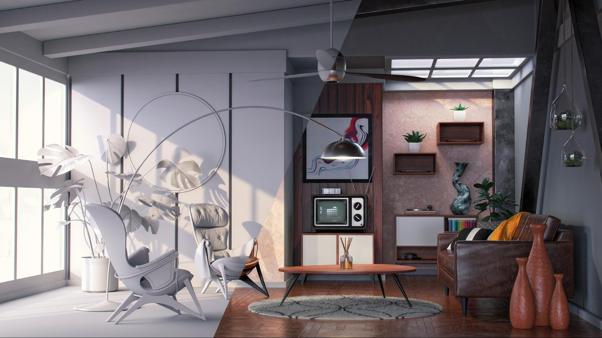

最好一次一次打开灯。 现用光应是场景中唯一可见的光，而所有其他光应暂时关闭。 这样，您将能够看到特定光对场景的影响，并通过处理其属性（如位置、方向、强度等）来更改。

另一个有用的技巧是用闪亮的金属材料（铬黄或镜子）创建球体。 这个“镜球”将有效地反射周围的整个场景，因此您可以轻松确定光的位置、方向或大小。 在环境光的情况下，您将能够在镜球中看到它的反射，这有助于在空间中设置它的方向。

## Adobe[!DNL Dimension]中的光源类型

### 环境光

环境光是等角形（球面）图像，它们包围在整个场景中。 正如名称所暗示的，这些光可以模拟整个环境，包括存储在它们中的光源。

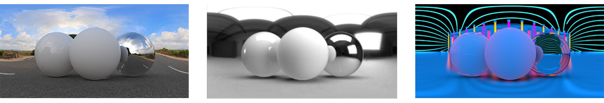

在[[!DNL Dimension]](https://www.adobe.com/products/dimension.html)中创建新场景时，将为您创建默认环境光。 这就是为什么你能立即看到现场的任何东西。 Adobe[!DNL Dimension]起始资源包含特定数量的环境指示灯，您可以立即尝试。 此外，[Adobe [!DNL Stock]](https://stock.adobe.com/search?filters[content_type:3d]=1&amp;filters[3d_type_id][0]=2&amp;load_type=3d+lp)提供了大量的、精选的环境光。

环境光可产生非常逼真的效果，并可节省大量时间。 为了手动实现类似的效果，您必须在3D（包括各种光源）中实际创建整个环境，这是相当大的工作量。

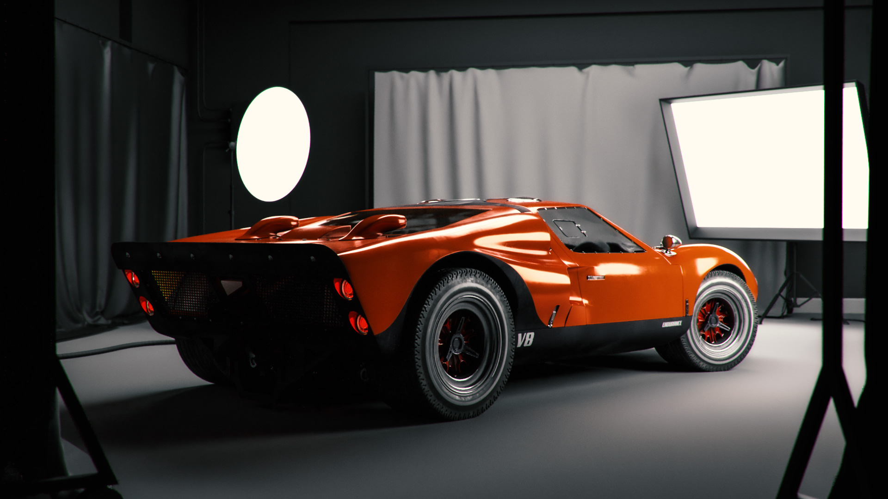

有多种方法可创建环境光，包括从3D场景捕捉、从照片捕捉和使用参数系统。 如果环境光是由3D场景制成的，则过程很简单。 输出图像需要为32位，这将捕获场景中所有光的光信息。 3D摄像机需要使用等角投影（以输出球面图像）。

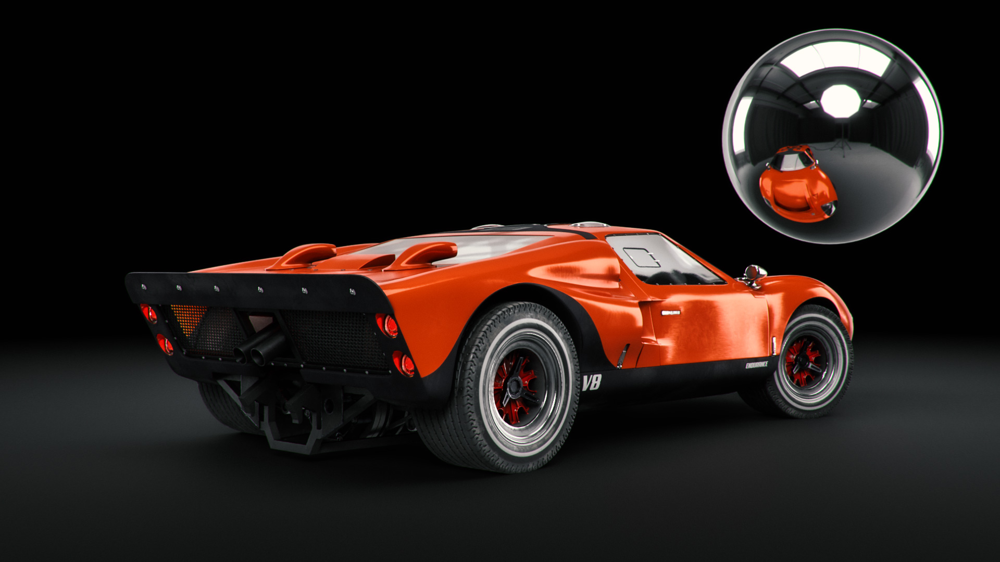

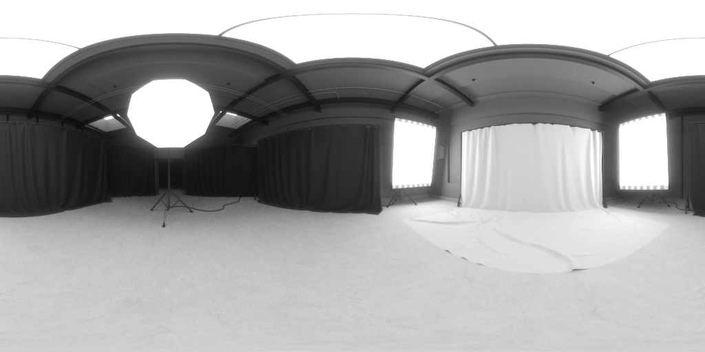

您还可以通过拍摄真实世界的照片来创建环境光。 对于此工作流，需要360摄像机（例如[Ricoh Theta Z1](https://theta360.com/en/about/theta/z1.html)）。 然后，相机用于包围曝光，或拍摄同一环境的多张照片，拍摄范围不同的曝光值（从曝光不足到曝光过度）。 然后，这些拍摄用于构建32位图像，通常称为HDR（高动态范围的简称）。 组合此类图像的一种方法是在Photoshop中使用“合并到HDR”功能。 嵌入的曝光范围将成为强度属性。

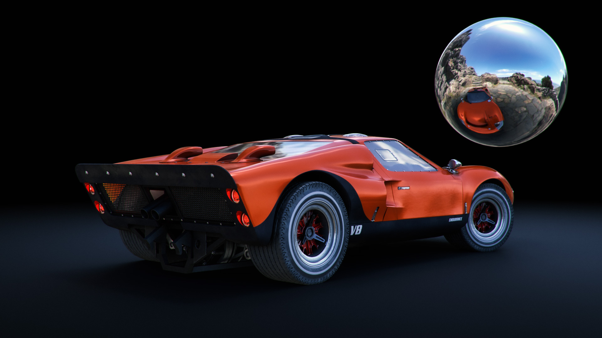

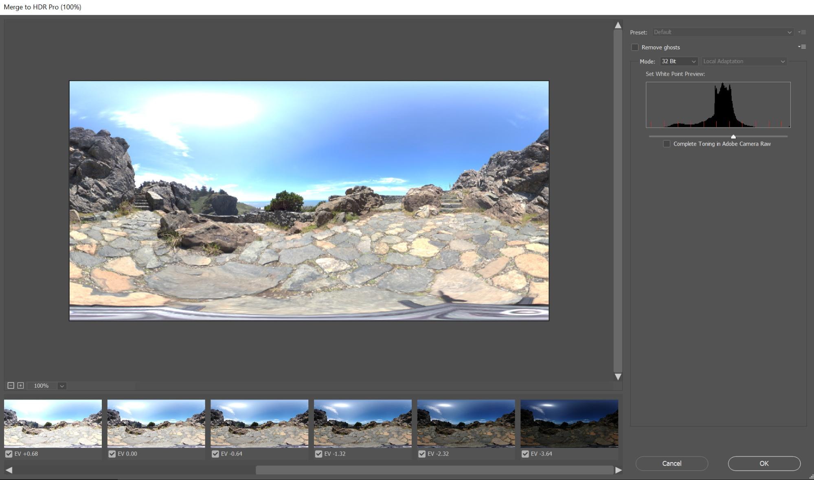

在这两种情况下，光源（及其强度）都“烘焙”到这些图像中，并在[!DNL Dimension]中使用它们后将发出光。

在这些方法中，您捕捉了所需的所有光照、反射和细节，但3D应用程序允许您在3D空间中继续编辑它们，因此您可以调整光照旋转以及更改整体强度和颜色。

### 平行光

除了从360度发射光的“环境光”之外，还有“定向光”，它们仅从一个方向发射光。 它们用于模拟闪光灯和来自定义明确的发射器的其他类型的光，并且它们可以形状为圆形或方形。

使用定向光可完全控制光照设置。 使用这些光源照明场景的方式与传统摄影中相同，在传统摄影中，每种光源都可以独立控制，从而允许您构建自己的虚拟摄影照明。 3点光系统是最常用的照明设置之一。

[!DNL Dimension] “点对准光源”(Aim Light at Point)具有一个便捷的操作，它允许您通过单击并拖过3D对象来控制旋转和高度。这样，您就可以动态地引导光线。 也可以手动调整这些参数。

您可以更改方向光的颜色和强度，并调整光源的形状 — 使其圆形或矩形、拉伸或放大。 最后，可以柔化光源的边缘。

![在Adobe中修改定向光的形状  [!DNL Dimension]](assets/Mastering3dlighting_12.gif)

如果使光源比对象小，则阴影将更清晰，轮廓更清晰，因为光线无法通过被照射的对象。 较大的光源会产生较柔和的阴影，因为在这种情况下，光线来自对象的所有边（在下图中标记为红色），从而创建阴影数组。 这些阴影被来自相反方向的光线柔化。

### 太阳与天空

阳光是一种特殊的定向光。 其设置过程与常规的定向光非常相似，但这种光会自动随高度改变颜色；当它接近地平线（低高度角值）时，模拟日落的温度将逐渐升高。 也可以使用预设来更改颜色。 同时，阴影柔和度也受到阴影的影响。

![3D汽车模型日光照明的Adobe  [!DNL Dimension]](assets/Mastering3dlighting_15.gif)

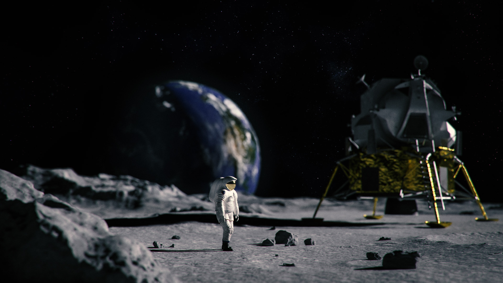

我们可以利用环境光来模拟天空，任何以天空为特征的环境光都可以被使用。 现在，我们必须将阳光（用[!DNL Dimension]制造）与在环境光中捕捉的太阳对齐。 一种快速的方法是创建一个球体，并给它分配一种金属材料；这将为我们提供对环境的实时反射，因此我们可以在点上使用Aim光来使阳光与太阳对齐。

如果环境光具有阴天，则可以使用cloudines属性更紧密地匹配这些条件。

![3D车模型天空环境照明的云彩特性Adobe  [!DNL Dimension]](assets/Mastering3dlighting_17.gif)

将阳光和天空环境光成对后，您可以使用“全局旋转”属性一起旋转它们。

### 基于对象的光源

通过打开对象材质的“发光”属性，可将对象转换为光源。 这样，就可以创建灯泡、霓虹灯、软框、各种屏幕和显示器等对象。

使用这种照明的主要好处是强度衰减，它产生非常自然的结果。 这对于产品可视化或基于工作室的其他场景非常有用。

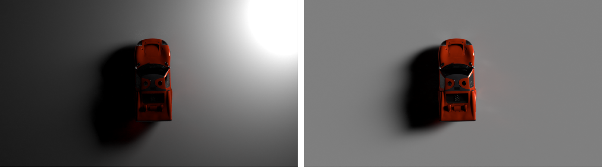

通过使用变换工具，可以上下缩放发光对象来控制阴影的柔和度。 使其变大也会增加光强。

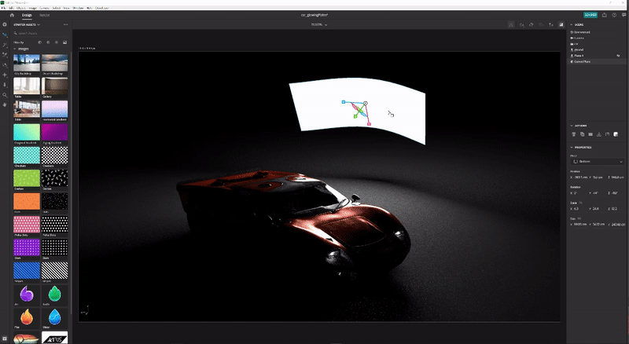

与我们之前所覆盖的光类型不同，这些光除了使用纯色外，还可以使用纹理。 纹理可以附着到其材质的基色上，并且光强通过发光滑块控制。

## 有效3D光照示例

### 产品照明

为产品拍摄设置光照的摄影技术有很多。 我们使用最常用的设置，即3点光系统。

此设置由三个光源组成：

1. **抠像光：** 用作主源，这从摄像机方向大致照射

   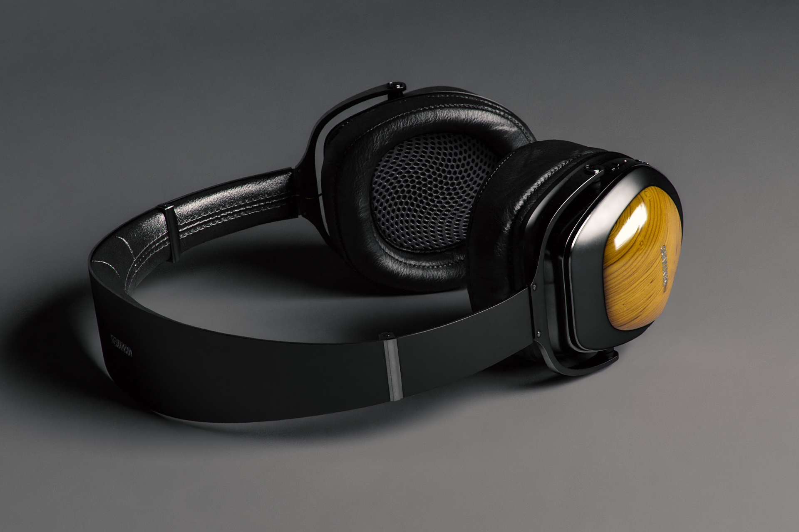

1. **边缘光：** 朝向与键相对的一侧，这用于显示主体的轮廓。

   

1. **填充光：** 强度较小，用于填充较暗的区域，这用于前两种光无法到达的区域。

   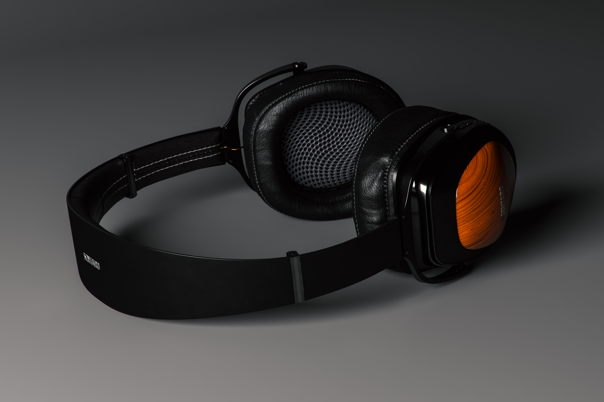

在[!DNL Dimension]中创建3点光有两种方式 — 使用定向光（单独将其添加到场景中或使用3点光预设）或通过发光对象创建3点光。

### 创意光照

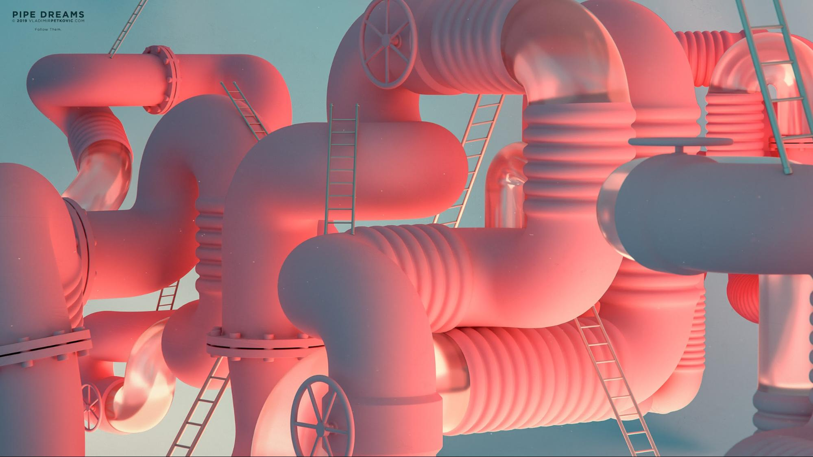

在物理精度不是主要目标的情况下，使用创意光照。 这包括各种抽象和超现实的场景，因此，我们的想象力并没有真正的界限。

在上例中，其理念是描绘一个梦想般的环境：糖果、蜡笔颜色和平滑的表面。 照明系统由三个发光板组成（两个在侧面，主要从底部照射）。 所有发光的板都不现实地大，这会产生非常平滑的阴影和高光。 光源被着色，该颜色被转移到指定给场景中对象的材料中。

场景的主体（管道）完全被壁几何形状包围。 这会使光线来回反弹并以有趣的方式混合在一起。 播放凉爽的VS暖色调通常可产生良好的对比度（此技术有时用于肖像摄影）。

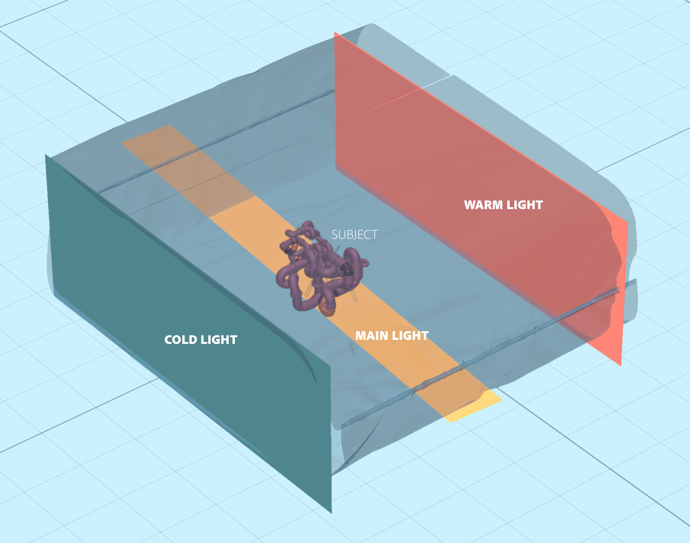

### 内部可视化

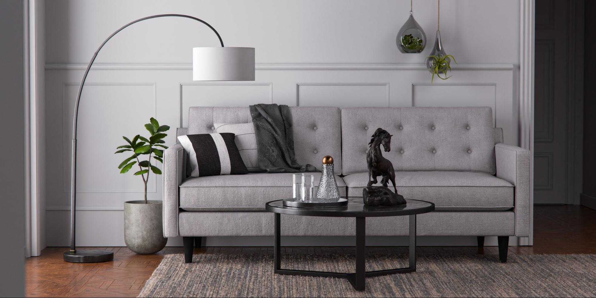

创建3D内部的可视化遵循一组特定规则，这几乎总能保证良好的结果。 对于此用例，我们只考虑自然光（不考虑像灯这样的人工光源）。

首先，这种场景需要在封闭的环境中。 就像在现实生活中一样，室内需要墙壁、地板、天花板和窗户。 这将确保光线穿过窗户，然后在周围反射（通过称为光线跟踪的过程）。 此行为会产生非常自然的光照(例如，遮住的区域（如角）将变暗)。

由于场景几乎完全被建筑几何形状所包围，因此我们将看到很少的光照并且几乎没有来自环境光的反射。 然而，在这个例子中，我们实际上是在建造我们自己的环境，即内部环境。 因此，光线会与场景中的物体产生反应，通过反射它们和周围的墙壁。 这些对象将仅彼此反射，并且围绕它们的墙壁。 不过，最好添加以天空为特征的“环境光”。 这将添加一些漫射蓝色填充。

设置此光的最简单方法是使用含发光材料的平面。 在这个用例中，我们有三个平面，它们覆盖了内部的所有开口。

光的强度由平面材料上的发光特性控制。 您可以添加颜色，甚至可以添加纹理，以用于投影有趣的阴影。 使用发光材料也会提供光强衰减，这对于室内照明非常重要。

### 户外照明

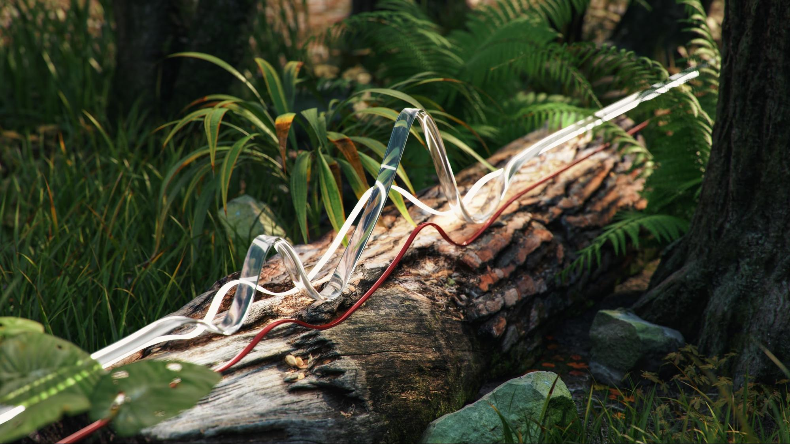

创建室外照明相当简单，具体到使用太阳和天空照明系统（请参阅上文）。 正确匹配太阳光与天基环境光是非常重要的 — 同时兼顾方向和云度值。

这个场景本身就扮演了重要角色。 要产生引人注目的结果，请将场景中的对象用作与光线相互作用的催化剂。 在上面显示的森林渲染中，对象（各种植物、日志和树）彼此靠近。

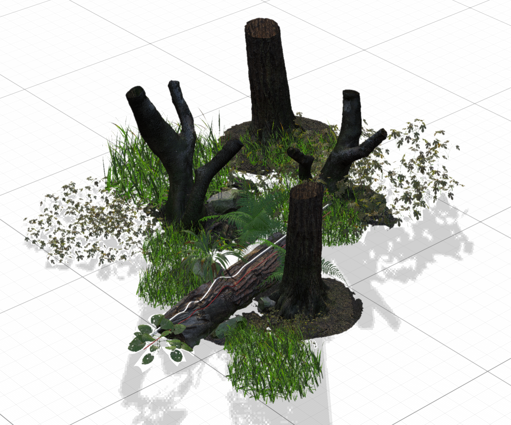

这意味着，当光在对象之间反弹时，将会发生许多复杂的光线追踪交互作用。 阴影点将显示为暗（如预期），而曝光区域仍为亮。

![使用Adobe中的全局 [!DNL Dimension] 旋转重新定向3D场景中的太阳和天空光系统](assets/Mastering3dlighting_34.gif)

我希望此概述能说明掌握3D光照在各种情况下的重要性。 您应该准备好开始产生更引人注目的结果。

照明快乐！ 立即下载Dimension的[最新版本](https://creativecloud.adobe.com/apps/download/[!DNL Dimension])。
