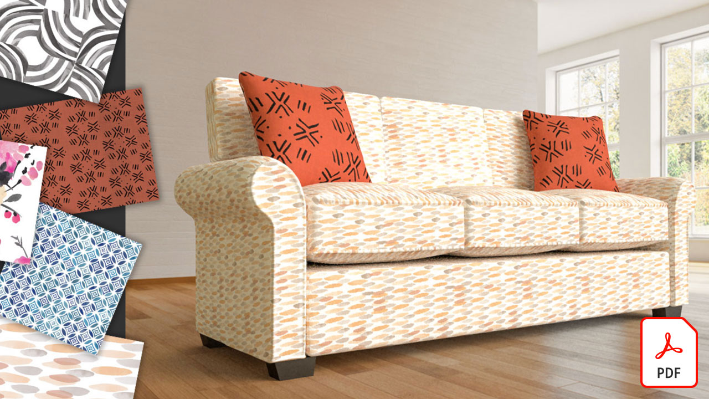
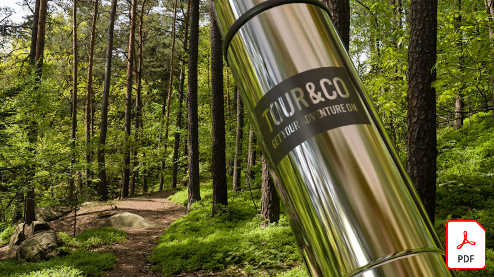
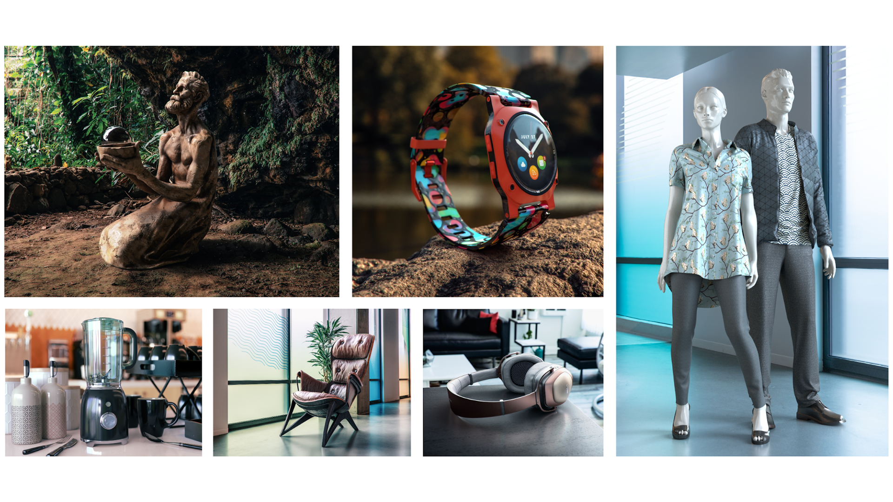

# Adobe3D和VR教程

使用高质量的模型、素材和光源，更快地3D创建引人入胜的内容。 [!DNL Dimension] 可以轻松构建品牌可视化效果、插图、产品模型、包装设计和其他创意作品。 选择一个图像以查看教程。

<table>
<tr>
 <td>
   
    

   <a href="substance-3d-stager.md"><strong>3D设计和渲染</strong></a>
    

    <em>导入内容、安排场景、应用材质和纹理、调整基于图像和物理的光照、保存具有不同分辨率的相机以及渲染逼真的图像</em>
     
  </td>
  <td>
   
    

   <a href="assets/CreateRealistic3DMockupswithAdobeStockandDimension.pdf"><strong>使用Adobe创建逼真的3D模型 [!DNL Stock] 和 [!DNL Dimension] (PDF)</strong></a>
    

    <em>使用Adobe轻松将2D设计与3D模型相结合 [!DNL Stock] 并将图形置入Adobe中 [!DNL Dimension]</em>
     
  </td>
  <td>
   
    

   <a href="assets/VisualizeTextileDesignsorPatternson3DObjectswithAdobeDimension.pdf"><strong>使用Adobe显示3D对象上的衣料设计或图案 [!DNL Dimension] (PDF)</strong></a>
    

    <em>在几分钟内为最终产品创建超逼真的呈现效果</em>
     
  </td>
  <td>
   
    

   <a href="../cce/assets/VisualizeyourProductinaRealisticEnvironment.pdf"><strong>在真实环境中显示您的产品(PDF)</strong></a>
    

    <em>如果您想了解产品在真实世界中的外观，请Adobe [!DNL Dimension] 是您的首选应用程序</em>
     
  </td>
</tr>
<tr>
  <td>
   
    

   <a href="mastering3dlighting.md"><strong>掌握CGI中3D光照的提示和技术</strong></a>
    

    <em>了解3D光照、如何创建不同的光照条件来完全改变计算机生成的场景，以及对象在这些光照环境下的呈现方式</em>
     
  </td>
  <td>
   
    

   <a href="photorealistic.md"><strong>通过3D渲染和合成创建逼真的虚拟摄影</strong></a>
    

    <em>了解如何使用Adobe中的3D图像合成和渲染，来创建具有极强迷惑性、极其逼真的虚拟摄影 [!DNL Dimension]</em>
     
  </td>
  <td>
   
    

   <a href="3ddimensionstock.md"><strong>使用以下工具自定义和标记3D模型 [!DNL Dimension] 和Adobe [!DNL Stock]</strong></a>
    

    <em>在中自定义和标记3D模型 [!DNL Dimension] 使用材质、环境属性、光照和摄影为任何设计项目创建照片级逼真图像</em>
     
  </td>
  <td>
    
    

     
  </td>
</tr>
</table>