# 通过3D渲染和合成创建逼真的虚拟摄影

![几个使用Adobe设计的逼真的虚拟照片示例 [!DNL Dimension]](assets/Photorealistic_1.png)

看着上面的图片，如果您认为自己看到的一切都是真实的，那也是情有可原的。 随着逼真的3D图像渲染技术的进步，准确判断什么是真实的，什么是虚拟的，这比以往任何时候都更加困难。 在这种情况下，图像融合了真实事物、摄影技术和经过渲染的3D内容 — 而这正是各家公司正在大力投入的一种3D设计类型。

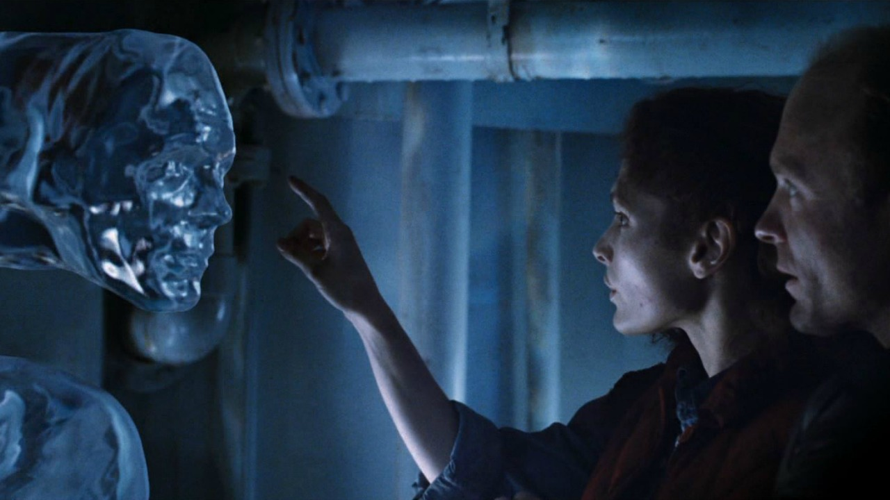

这种将3D模型分层或“合成”到图像或视频中的技术并不新奇，实际上，它的起源可以追溯到早年使用视觉特效(VFX)的时代（最早可追溯到上世纪80年代）。 令人感到新奇和高兴的是，这项技术已经成为一项强大的工具， [Adobe [!DNL Dimension]](https://www.adobe.com/products/dimension.html) 以及一个有趣的摄影师新工作流程。

## 在Adobe中创建合成图像的技术 [!DNL Dimension]

![在Adobe中编辑金属球体模型的平面 [!DNL Dimension] 复合](assets/Photorealistic_3.png)

Adobe [!DNL Dimension] 允许用户使用Adobe Sensei支持的匹配图像功能，直接在应用程序中将2D和3D元素无缝组合在一起。 以这种方式合成元素的主要好处是，它可以用现实中拍摄的背景图像来替换完全由3D实现的场景，从而加速推进创建逼真图像的过程。

![Adobe中的“匹配图像”功能 [!DNL Dimension] 分析背景图像，并估计拍摄背景图像时，相机的焦距和位置](assets/Photorealistic_4.gif)

“匹配图像”功能可以分析背景图像，并估算拍摄背景图像时，相机的焦距和位置。 然后在中创建3D相机 [!DNL Dimension] 场景中的元素，渲染3D元素的视角与背景图像相同，因此它们会合成在一起

但相机画面中未能捕捉到的所有东西呢？  图像拍摄的完整环境非常重要，因为它定义了其中所有内容的显示方式。 图像中的对象在反射其周围世界的光线，也包括相机后面的一切。 因此，要使分层的3D元素真正与图像的背景融合在一起，就需要充分反射拍摄该图像时的环境光照。

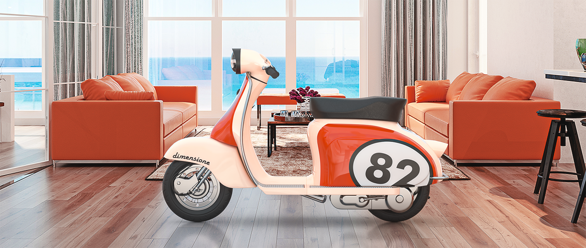

“匹配图像”将尝试使拍摄背景图像时的光照环境“幻化”。 尽管这样可以快速生成很棒的效果，确实令人印象深刻，但是如果将拍摄背景图像时的环境也拍摄下来，则会产生更加逼真的效果。 甚至这还是一种训练Adobe Sensei功能的方法，使其能够自己完成这样的操作。

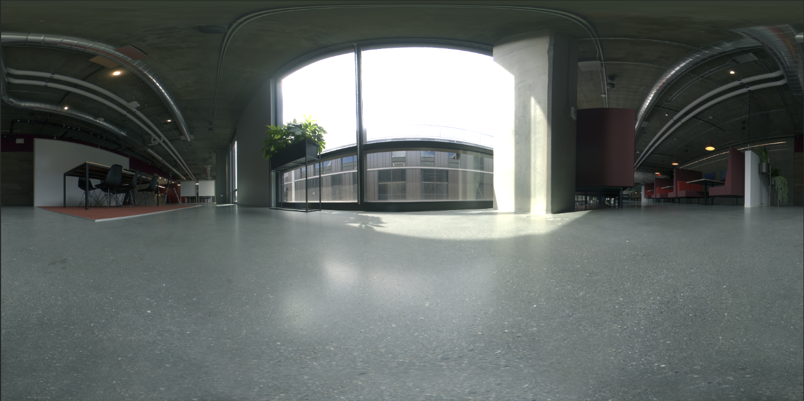

进入360度HDR全景图像的世界。 为了强化真实世界整个光照环境的光效，这类图像长期以来一直用于3D图形中。 过去拍摄这些照片的过程非常复杂，因为它们的制作需要高水平的知识和专业设备。 随着360度相机的出现，现在比以往任何时候都更有可能创建这些图像。

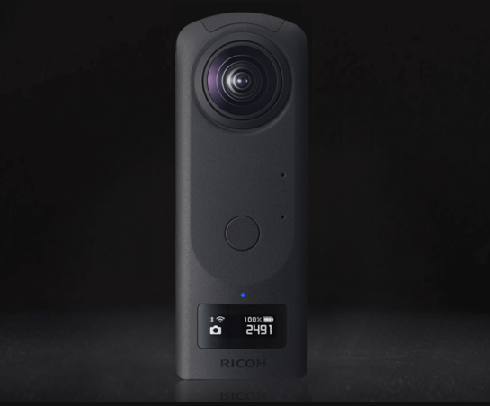

Ricoh Theta、Gopro MAX和Insta 360等相机可以拍摄360度全景照片。 Ricoh Theta内置的自动包围曝光功能，是拍摄过程中的一个关键环节。 这减少了拍摄HDR图像所需的时间和精力，使摄影师更容易上手。

## 创建逼真合成图像的过程

### [!DNL Capture]

要开始拍摄环境以进行合成，您需要两个主要元素：高质量的一副或多幅背景图像，以及拍摄背景图像时所处环境的360度HDR全景图。

拍摄此类内容最重要的方面之一，是充分利用摄影师现有的技能和工具。 要创建一张精美的背景图像，需要有构图的视角和对细节的关注。 为了创造出可以将3D元素融合到其中的内容，背景图像还需要一种特殊的思维方式。

### 选择位置

寻找适合背景和光照的位置。 在构思背景时，想象一个场景的潜在用途可能会有所帮助。 例如，一条空旷的道路可用来摆放一辆3D汽车，而咖啡店里的一张桌子则可用来 [显示包装](https://www.adobe.com/products/dimension/packaging-design-mockup.html) 食物的。

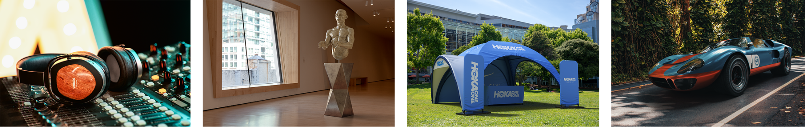

在拍摄背景图像时，请务必牢记，3D元素将会合成到其中。 应留出空白焦点区域，以便为这些对象留出空间。 3D内容通常是最终合成图像中的主要焦点，因此背景本身不要过于突出，这一点非常重要。

同样重要的还有图像中的光照情况，因为这将对合成后的3D内容产生重大影响。 光线应该从肩部以上或侧面射入镜头中 — 这将会产生最佳的效果，因为将3D对象放入该场景中时，这道光线将充当主光的角色。 当视野中没有焦点元素时，可能很容易朝着光线方向进行拍摄，但请记住，这样会导致拍摄内容始终背光。 向场景中添加一个临时的对象作为“替身”，可能会有助于合成和评估光照效果。

## 拍摄HDR全景图

### 相机放置

360度相机放置的位置，应该位于您在拍摄背景时，大多数背景图像所聚焦的区域的中心。 如果背景显示的场景更宽广，理想的做法是用独脚架将相机抬离地面，否则相机可以直接放在地面上。

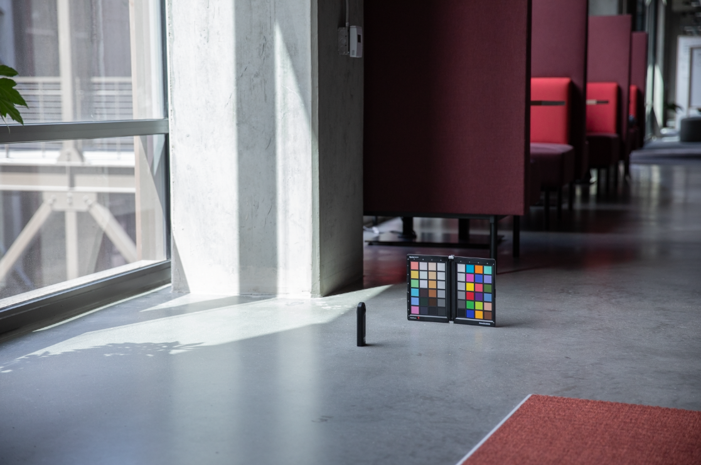

### 颜色

由于环境图像和背景图像将会同时使用，因此，保持拍摄环境的相机和拍摄背景的相机之间的色彩非常重要。 这里，我们将两台相机的色温都设置为5000k，并使用两台相机拍摄了色表的照片，以便在后期处理中进一步对齐。

### 包围曝光值

要使用360度相机创造HDR环境，需要拍摄多个EV，然后在后期处理中将其组合到一个HDR图像中。 EV的数量没有固定标准，但通常而言，可以将曝光范围的上限调至阴影中没有更多信息的程度，而将曝光范围的下限调至高光中没有更多信息的程度。

理想情况下，360度相机将具有自动包围功能，使相机可以批量处理各种曝光。 理想的设置是使用最低的ISO值来避免出现噪点，并使用高光圈值来提高清晰度。 然后可以使用快门速度改变曝光值，并通过光圈级数将其分解；可以将曝光减半或加倍。

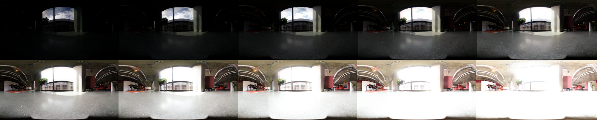

以下是用于在户外拍摄IBL的EV示例：

01 - F 5.6，ISO 80，快门速度1/25000，WB 5000 K

02 - F 5.6，ISO 80，快门速度1/12500，WB 5000 K

03 - F 5.6，ISO 80，快门速度1/6400，WB 5000 K

...

16 - F 5.6，ISO 80，快门速度1，WB 5000 K

如果使用的360度相机能够输出RAW图像，就可以用2-4个递增级数的光圈对EV进行分割，这是因为它们可以比8位图像(如JPEG)保留更多信息。

对EV进行颜色调整后，即可将它们临时分别导出到单个文件中，然后在Photoshop中进行合并。 文件类型应取决于其来源，但在任何情况下都不要使用像JPEG这样的压缩格式。 在Photoshop中，使用“文件”>“自动”>“合并到HDR Pro...” ，并选择所有导出的EV。

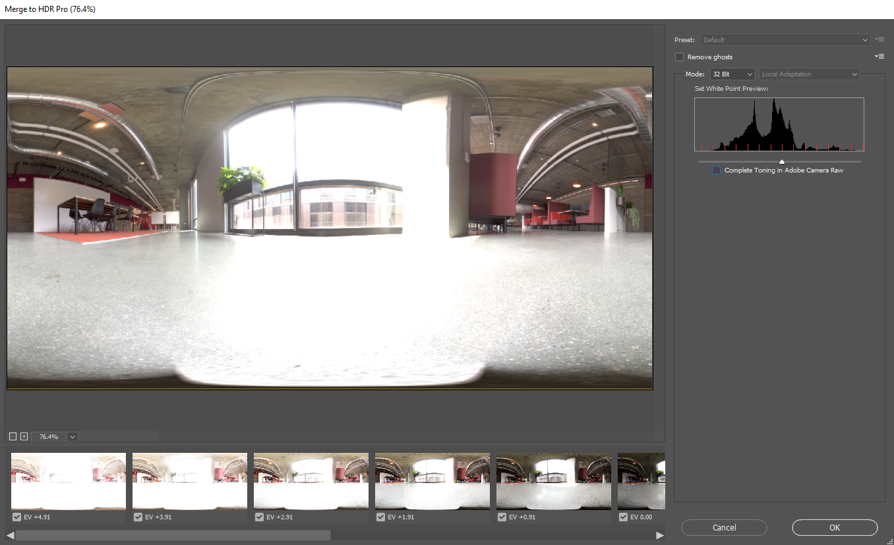

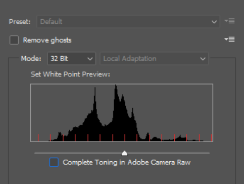

确保将“模式”设置为32位。 使用“去除重影”有助于去除EV之间变化的细节，但若无必要，请不要使用这一功能。 直方图下面的滑块只会影响预览曝光度，因此可以忽略不计。 取消选中“在Adobe Camera Raw中完成色调调整”，然后按“确定”。

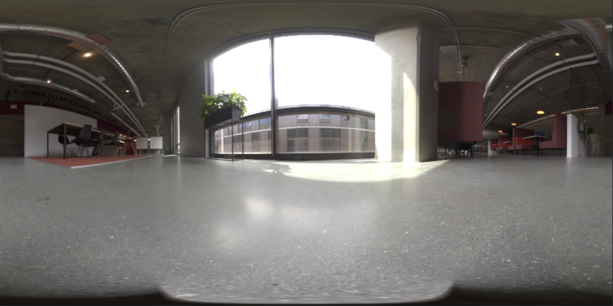

结果是可以用于照亮3D场景的HDR图像。

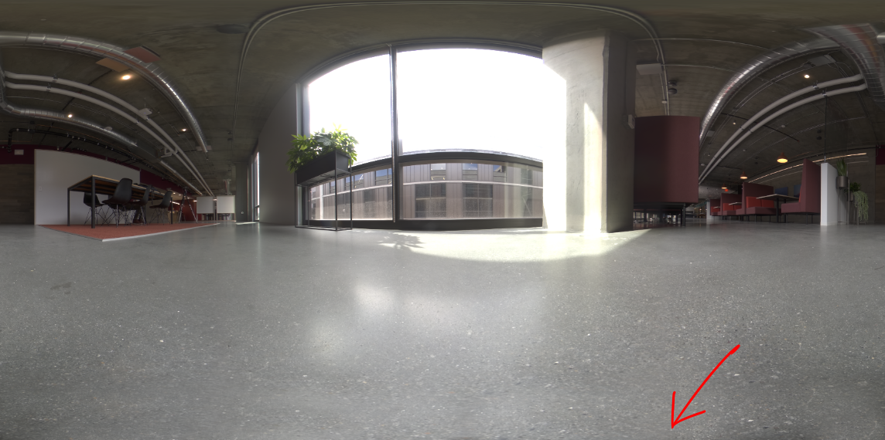

最后，移除图像最低点处可见的阴影和三脚架腿，并调整图像的默认曝光以正确照亮场景。 可以使用Photoshop中的克隆工具删除细节。 调整曝光应与背景结合使用，具体操作如下： [!DNL Dimension]，因为HDR IBL的曝光值是3D对象的光照值。

### 拍摄背景

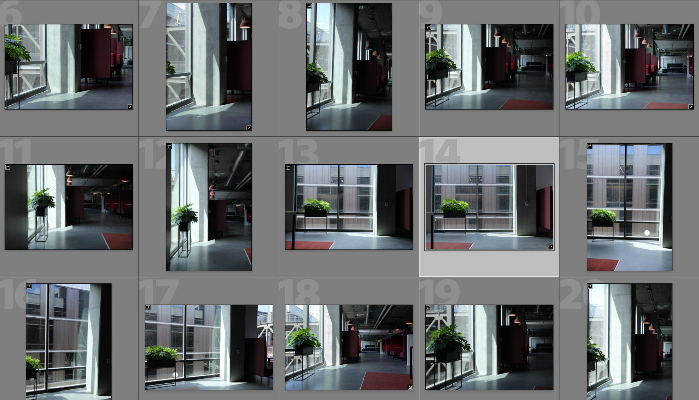

拍摄环境后，您现在可以使用自己选择的相机拍摄背景。 图像质量越高，分辨率越高，图像质量越好。 这与摄影师的构图视角一起成为这一过程的主要优势。 上面的图像是用Canon 5D MK IV拍摄的。

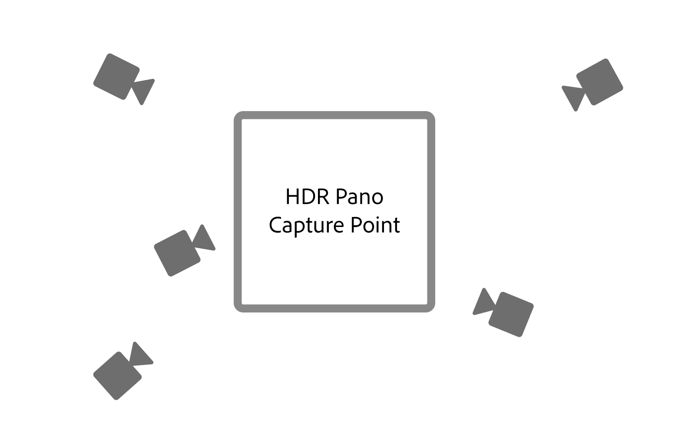

结合背景设计画面和构图时，有很大的空间。 相机可以使用不同景深的高光圈或低光圈，可以使用长焦距或短焦距，还可以上下倾斜。 主要要求相机对准使用360相机拍摄环境照片的中心点。

拍摄完成后，应对图像进行后期处理，使其尽量接近环境的颜色。 颜色和曝光应尽量保持中性且自然。 在使用Adobe将3D元素合成到图像之后，应应用任何风格化的外观 [!DNL Dimension].

## 在中组合合成图像 [!DNL Dimension]

随着这些元素的收集和完成，现在可以在Adobe中将它们组合到场景中 [!DNL Dimension]. 这非常简单，只需要将背景拖到场景中，而场景又将接着应用到背景中；然后，将HDR全景图添加到环境光图像位置。

将背景图像拖放到画布的空白区域，或者在“场景”面板中选择“环境”，然后将图像添加到“背景”选项中。

![可以从Adobe的“属性”菜单中选择虚拟照片的背景图像 [!DNL Dimension]](assets/Photorealistic_20.png)

选择“环境光”并将其添加到“图像”输入中，以添加HDR全景图。

![可以从Adobe中的“场景”菜单将环境光源添加到虚拟照片的背景图像中 [!DNL Dimension]](assets/Photorealistic_21.png)

然后，您可以在背景上使用“匹配图像”来匹配分辨率和长宽比以及相机视角。 由于我们使用拍摄的HDR全景图像来照亮场景，而不是从背景图像生成环境，因此可以取消选中“创建光线”选项。

![在Adobe中使用“匹配图像”功能 [!DNL Dimension] 使用HDR全景中的环境光渲染3D金属球体图像](assets/Photorealistic_22.png)

现在，添加到场景中的对象将合成到背景中并产生逼真的效果，因为它们是由拍摄图像的环境所照亮的。

为了快速评估HDR全景相对于背景的方向和曝光度，可使用免费资源面板中获取的一种金属材质的球体 [!DNL Dimension]，可以放置在场景中。 然后可以定位环境光的旋转，使反射看起来正确。 如果来自HDR全景的光照使球体曝光过度或曝光不足，则应增加或减少HDR全景的曝光以进行补偿。

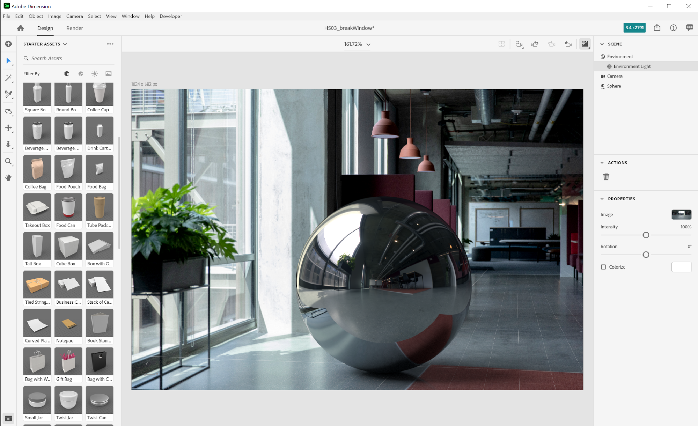

为了快速评估HDR全景相对于背景的方向和曝光度，可使用免费资源面板中获取的一种金属材质的球体 [!DNL Dimension]，可以放置在场景中。 然后可以定位环境光的旋转，使反射看起来正确。 如果来自HDR全景的光照使球体曝光过度或曝光不足，则应增加或减少HDR全景的曝光以进行补偿。

## 最终结果：一张逼真的合成图像

![Adobe中虚拟产品照片的3D合成和渲染的延时摄影图像 [!DNL Dimension]](assets/Photorealistic_24.gif)

场景制作完成后，最终用户的工作流程就变得简单了。 只需拖放您自己的模型或 [Adobe [!DNL Stock] 3D](https://stock.adobe.com/3d-assets) 将内容直接放入图像中进行渲染，使渲染效果与拍摄照片时的一模一样。 这开辟了创作高度逼真的广告内容的新途径，或提供了在许多不同背景下迭代设计的新功能。

最终，现实与3D的融合取得了令人信服的效果，从而帮助最终用户轻而易举地实现目标，创作出极为逼真的图像。 你自己试试看 [免费 [!DNL Dimension] 场景](https://assets.adobe.com/public/3926726a-2a17-43d4-4937-6d84a4d29338) 我们创建此项目是为了演示工作流。

[下载最新版本](https://creativecloud.adobe.com/apps/download/dimension) 的 [!DNL Dimension] 立即，开始创作逼真的图像。
