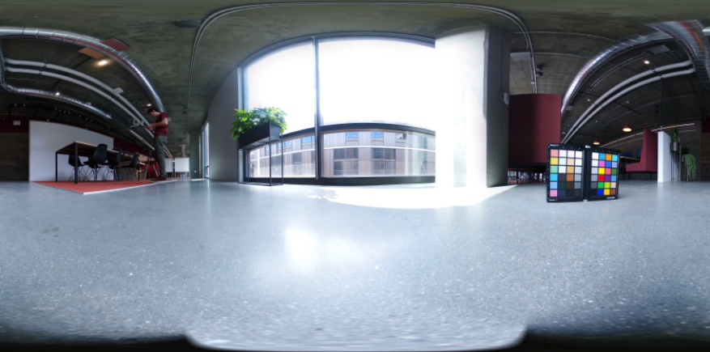
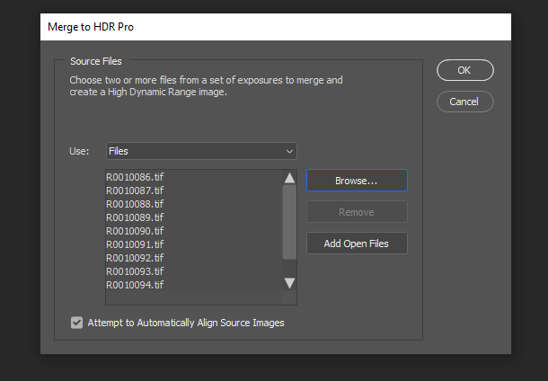

# 通过3D渲染和合成创建逼真的虚拟摄影

![几个使用Adobe设计的逼真的虚拟照片示例 [!DNL Dimension]](assets/Photorealistic_1.png)

看着上面的图片，如果您认为自己看到的所有内容都是真实的，那也是情有可原的。 然而，随着逼真的3D图像渲染技术的进步，确定哪些是真实的、哪些是虚拟的，难度比以往任何时候都大。 在这种情况下，图像将混合使用真实、摄影和渲染的3D内容，而这正是公司正在投入的3D设计类型。

这种将3D模型分层或“合成”到图像或视频中的技术并不新奇，实际上，它的起源可以追溯到早年使用视觉特效(VFX)的时代（最早可追溯到上世纪80年代）。 令人感到新奇和高兴的是，这项技术已经成为一种非常强大的工具， [Adobe [!DNL Dimension]](https://www.adobe.com/products/dimension.html) 以及面向摄影师的有趣的新工作流程。

## 在Adobe中创建合成图像的技术 [!DNL Dimension]

![在Adobe中编辑金属球体模型的平面 [!DNL Dimension] 复合](assets/Photorealistic_3.png)

Adobe [!DNL Dimension] 允许用户使用Adobe Sensei支持的“匹配图像”功能，直接在应用程序中将2D和3D元素无缝组合在一起。 以这种方式合成元素的主要好处是，它可以用现实中拍摄的背景图像来替换完全实现的3D场景，从而加速推进创建逼真图像的过程。

![“匹配图像”功能Adobe [!DNL Dimension] 分析背景图像并估算拍摄背景图像时相机的焦距和位置](assets/Photorealistic_4.gif)

“匹配图像”功能可分析背景图像，并估算拍摄背景图像时相机的焦距和位置。 然后，在 [!DNL Dimension] 场景可用于在与背景图像相同的透视中渲染3D元素，以便将它们合成到一起。

但是相机画面中未能拍摄到的所有东西呢？  拍摄图像的完整环境非常重要，因为它决定了其中所有内容的外观。 图像中的对象反射着周围世界的光，也包括相机后面的一切。 因此，要使分层的3D元素真正与图像的背景融合在一起，就需要充分反射拍摄该图像时的环境中的光照。

“匹配图像”将尝试使拍摄背景图像时的光照环境“幻化”。 尽管这样可以快速生成很棒的效果，给人留下深刻印象，但拍摄背景图像时的环境效果将更加逼真。 甚至这还是用于训练Adobe Sensei功能的方法，使其能够自己完成这样的操作。

进入360° HDR全景图像的世界。 为了加速实现真实世界光照环境的光照效果，这些图像长期以来一直用于3D图形中。 过去拍摄这些照片的过程相当复杂，因为制作它们需要高水平的知识和专业设备。 随着360°摄像机的出现，现在创建这些图像比以往任何时候都更加可能。

Ricoh Theta、Gopro MAX和Insta 360等相机可以拍摄360度全景照片。 Ricoh Theta内置的自动包围曝光功能，是拍摄过程中的一个关键环节。 这减少了拍摄HDR照片所需的时间和精力，让摄影师更容易上手。

## 创建逼真的合成图像的过程

### [!DNL Capture]

要开始捕获环境以进行合成，您需要两个主要元素；高品质的背景图像和拍摄背景图像时所在环境的360° HDR全景图。

拍摄此类内容最重要的方面之一是充分利用摄影师现有的技能和工具。 要创建一张精美的背景图像，需要有构图的视角和对细节的关注。 背景图像还需要一种特殊的思维方式，以便创建能将3D元素合成到其中的内容。

### 选择位置

寻找适合背景和光照的位置。 考虑上下文时，想象一个场景的潜在用途可能会有所帮助。 例如，一条空旷的道路可用来摆放一辆3D汽车，而咖啡店里的一张桌子则可用来摆放一幅画面 [显示打包](https://www.adobe.com/products/dimension/packaging-design-mockup.html) 食物制品的

在拍摄背景图像时，请务必记住3D元素将会合成到其中。 应留出空白焦点区域，以便为这些对象留出空间。 3D内容通常是最终合成的主要焦点，因此背景本身不要过于突出，这一点非常重要。

同样重要的还有图像中的光照情况，因为这将对合成的3D内容产生极大影响。 光线应该从肩部以上或侧面射入镜头中 — 这将会产生最佳的效果，因为将3D对象放入场景中时，这道光线将充当主光的角色。 当视野中没有焦点元素时，可能很容易朝着光线方向进行拍摄，但是请记住，这样会导致拍摄内容始终背光。 向场景中添加一个临时的对象作为“替身”，可能会有助于合成和评估光照效果。

## 拍摄HDR全景图

### 摄像机位置

将360°相机放在要拍摄背景的区域的正中心。 如果背景显示的场景更宽广，理想的做法是用独脚架将相机抬离地面，否则相机可以直接放在地面上。

### 颜色

由于环境图像和背景图像将会同时使用，因此保持拍摄环境的相机和拍摄背景的相机之间的颜色非常重要。 这里，我们将两台相机的色温都设置为5000k，并用两台相机拍摄了同一张色表的照片，以便在后期处理中进一步对齐。

### 包围曝光值

要使用360°相机创建HDR环境，需要拍摄几个EV，以便在后期处理中将其合并为HDR图像。 EV的数量没有固定标准，但通常而言，可以将曝光范围的上限调至阴影中没有更多信息的程度，而将曝光范围的下限调至高光中没有更多信息的程度。

理想情况下，360°相机将具有自动包围功能，使各种曝光照片可由相机拍摄。 理想的设置是使用最低的ISO值来避免出现杂色，并使用高光圈值来提高清晰度。 然后可以利用快门速度来改变曝光值，并通过光圈来分解；将曝光减半或加倍。

以下是用于在户外拍摄IBL的EV示例：

01 - F 5.6,ISO 80，快门速度1/25000,WB 5000 K

02 - F 5.6,ISO 80，快门速度1/12500,WB 5000 K

03 - F 5.6,ISO 80，快门速度1/6400,WB 5000 K

...

16 - F 5.6,ISO 80，快门速度1,WB 5000 K

如果使用的360°能够输出RAW图像，那么EV可以按2-4个停止增量分割，因为它们保留的信息比8位图像(如JPEG)更多。

对这些EV进行颜色调整后，即可将它们临时导出到单个文件中，然后在Photoshop中合并。 文件类型应该取决于源，但在任何情况下都不使用像JPEG这样的压缩格式。 在Photoshop中，使用“文件”>“自动”>“合并到HDR Pro...” ，然后选择所有导出的EV。

确保将“模式”设置为32位。 使用“移去重影”有助于删除EV之间变化的细节，但若无必要，请不要使用这一功能。 直方图下面的滑块只会影响预览曝光，因此可以忽略它。 取消选中“在Adobe Camera Raw中完成色调”，然后按“确定”。

结果将生成一个HDR图像，可用于照亮3D场景。

最后，移除图像最低点处可见的阴影和三脚架腿，并调整图像的默认曝光以正确照亮场景。 可以使用Photoshop中的克隆工具删除细节。 调整曝光度的操作应该与 [!DNL Dimension]因为HDR IBL的曝光值是3D对象的光照值。

### 拍摄背景

拍摄环境后，您现在可以使用选择的相机拍摄背景。 品质越高，分辨率越高。 这与摄影师的构图视角是这一过程的主要优势。 上面的图像是用Canon 5D MK IV拍摄的。

结合背景设计画面和构图时，有很大的空间。 该相机可以具有高或低孔径以适应不同的景深，使用长或短焦距，并且可向上或向下倾斜角度。 主要要求是，相机对准使用360相机拍摄环境的中心点。

拍摄完成后，应对图像进行后期处理，使其尽量接近环境的颜色。 颜色和曝光应尽量显得中性和自然。 在将3D元素合成到图像中并添加Adobe后，应应用所有风格化的Look [!DNL Dimension]的

## 组合复合图像 [!DNL Dimension]

随着这些元素的收集和完成，它们现在可组合在Adobe的场景中 [!DNL Dimension]的 这非常简单，只需将背景拖到场景中，然后场景就会应用到背景中；然后，将HDR全景图添加到环境光照图像插槽。

将背景图像拖放到画布的空白区域，或者在“场景”面板中选择“环境”，然后将图像添加到背景输入。

![虚拟照片的背景图像可从Adobe的“属性”菜单中选择它 [!DNL Dimension]](assets/Photorealistic_20.png)

通过选择“环境光”并将其添加到“图像”输入来添加HDR全景图。

![环境光源可以从Adobe中的“场景”菜单添加到虚拟照片的背景图像中 [!DNL Dimension]](assets/Photorealistic_21.png)

然后，您可以在背景上使用“匹配图像”来匹配分辨率和长宽比以及相机视角。 由于不是从背景图像生成环境，而是使用拍摄的HDR全景图像来照亮场景，因此可以取消选中“创建光线”选项。

![在Adobe中使用“匹配图像”功能 [!DNL Dimension] 使用HDR全景中的环境光渲染3D金属球体图像](assets/Photorealistic_22.png)

现在，添加到场景中的对象将合成到背景中并产生非常逼真的效果，因为它们是由拍摄图像的环境所照亮的。

要快速评估HDR全景相对于背景的方向和曝光，需从 [!DNL Dimension]可放入场景中。 然后可以定位环境光的旋转，以使反射看起来正确。 如果来自HDR全景的光照使球体曝光过度或曝光不足，则应增加或减少HDR全景的曝光以进行补偿。

要快速评估HDR全景相对于背景的方向和曝光，需从 [!DNL Dimension]可放入场景中。 然后可以定位环境光的旋转，以使反射看起来正确。 如果来自HDR全景的光照使球体曝光过度或曝光不足，则应增加或减少HDR全景的曝光以进行补偿。

## 最终结果是：逼真的合成图像

![虚拟产品照片的3D合成与渲染的Adobe [!DNL Dimension]](assets/Photorealistic_24.gif)

场景制作完成后，最终用户的工作流程就变得简单了。 只需拖放自己的模型或任何模型 [Adobe [!DNL Stock] 3D](https://stock.adobe.com/3d-assets) 将内容直接置入图像中，以呈现该图像，就像在拍摄照片时一样。 这开辟了创作高度逼真的广告内容的新途径，也提供了在许多不同背景下进行迭代设计的新功能。

最终，现实与3D的融合取得了令人信服的效果，有助于最终用户轻松实现创建逼真图像的目标。 亲自尝试一下 [免费 [!DNL Dimension] 场景](https://assets.adobe.com/public/3926726a-2a17-43d4-4937-6d84a4d29338) 我们创建是为了演示这个工作流程。

[下载最新版本](https://creativecloud.adobe.com/apps/download/dimension) 的 [!DNL Dimension] 立即开始制作逼真的图像。
