# 企业教程Creative Cloud

作为企业创意人员，您必须与分散的团队协作，建立可扩展的流程，并遵守公司系统和指导原则。 这些教程帮助您从企业角度了解Creative Cloud的新功能。

## 单击以查看产品教程（按字母顺序列出）

### Adobe Acrobat

<table style="table-layout:fixed">
<tr>
 <td>
   
    

   <a href="acrobat-content-creators.md"><strong>适用于内容创作者的Acrobat</strong></a>
    

    <em>了解有助于简化创意工作流程的Acrobat工具</em>
     
  </td>
  <td>
    
    

     
  </td>
  <td>
    
    

     
  </td>
  <td>
    
    

     
  </td>
</tr>
</table>

### Adobe Express(前身为Adobe Spark)

<table style="table-layout:fixed">
<tr>
 <td>
   
    

   <a href="adobe-express-content-that-stands-out.md"><strong>Adobe Express：突出显示的内容</strong></a>
    

    <em> 使用Adobe Express在几分钟内创建精美的图形、网页和视频故事</em>
     
  </td>
  <td>
   
    

   <a href="assets/CreatingYourBrandinAdobeSpark.pdf"><strong>在Adobe Spark中创建品牌(PDF)</strong></a>
    

    <em>Adobe Spark可让您轻松定义品牌</em>
     
  </td>
  <td>
   <a href="assets/AddingaGlideshowtoyourSparkPageAdobeBlog.pdf">
      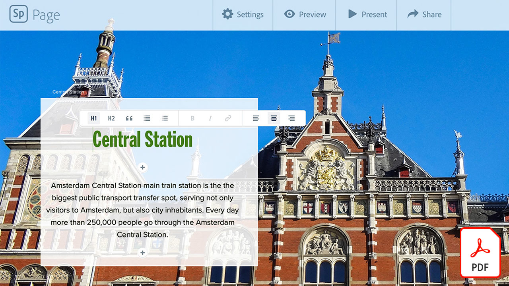
   </a>
    

   <a href="assets/AddingaGlideshowtoyourSparkPageAdobeBlog.pdf"><strong>向Spark Page添加幻灯片放映(PDF)</strong></a>
    

    <em>Adobe Spark提供了一些令人惊叹且易于使用的布局组件，让您的Web故事栩栩如生</em>
     
  </td>
  <td>
   
    

   <a href="assets/CreatingYourBrandinAdobeSpark.pdf"><strong>在Adobe Spark中创建品牌(PDF)</strong></a>
    

    <em>Adobe Spark可让您轻松定义品牌</em>
     
  </td>
  <td>
   <a href="assets/MeetYourNewProductionArtistAdobeSparkPost.pdf">
      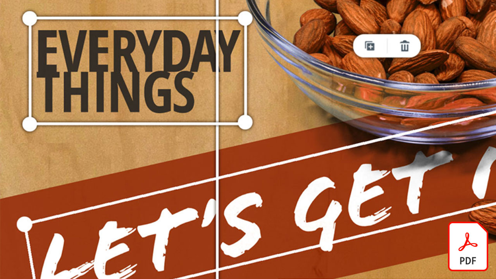
   </a>
    

   <a href="assets/MeetYourNewProductionArtistAdobeSparkPost.pdf"><strong>认识您的新制作艺术家：Adobe Spark Post(PDF)</strong></a>
    

    <em>Adobe Spark会在您创建布局、定义颜色、导入图稿和排列合成中的元素时向您学习</em>
     
  </td>
</tr>
</table>

### Adobe Portfolio

<table  style="table-layout:fixed">
<tr>
   <td>
   <a href="assets/GettingStartedWithAdobePortfolio.pdf">
      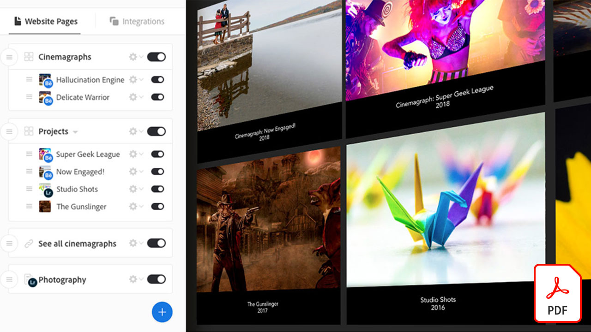
   </a>
    

   <a href="assets/GettingStartedWithAdobePortfolio.pdf"><strong>Adobe Portfolio快速入门(PDF)</strong></a>
    

    <em>与Adobe Portfolio分享您的优秀作品是分享您的成功和吸引新的创意人才的有效方式</em>
     
  </td>
  <td>
   <a href="assets/ConnectingLightroomandBehancetoYourAdobePortfolio.pdf">
      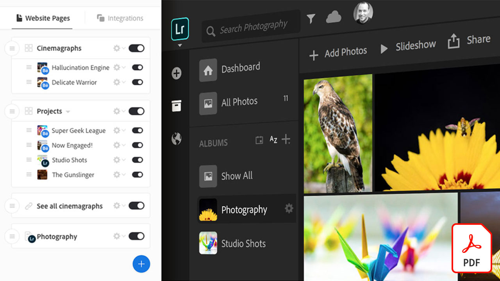
   </a>
    

   <a href="assets/ConnectingLightroomandBehancetoYourAdobePortfolio.pdf"><strong>将Lightroom和Behance连接到您的Adobe Portfolio(PDF)</strong></a>
    

    <em>将Behance项目用作作品集中的页面</em>
     
  </td>
  <td>
   
    

   <a href="assets/ShowYourBestWorkwithAdobePortfolio.pdf"><strong>使用Adobe Portfolio展示您的最佳作品(PDF)</strong></a>
    

    <em>通过Adobe Portfolio，您可以上传、整理您的作品并与世界各地的潜在员工和客户共享您的作品</em>
     
  </td>
  <td>
    
    

     
  </td>
 </tr>
 </table>

### CC Libraries

<table  style="table-layout:fixed">
<tr>
  <td>
   
   

   <a href="cc-workflows-cc-libraries.md"><strong>使用CC库改进CC工作流</strong></a>
    

    <em>了解Creative Cloud库如何将设计元素汇集到一起，确保设计人员和团队的项目一致性</em>
     
  </td>
  <td>
   
   

   <a href="ccteamlibraries.md"><strong>为团队创建Creative Cloud库</strong></a>
    

    <em>了解如何使用适用于团队的Creative Cloud库在组或团队中共享资源</em>
     
  </td>
  <td>
   <a href="sharecclibraries.md">
      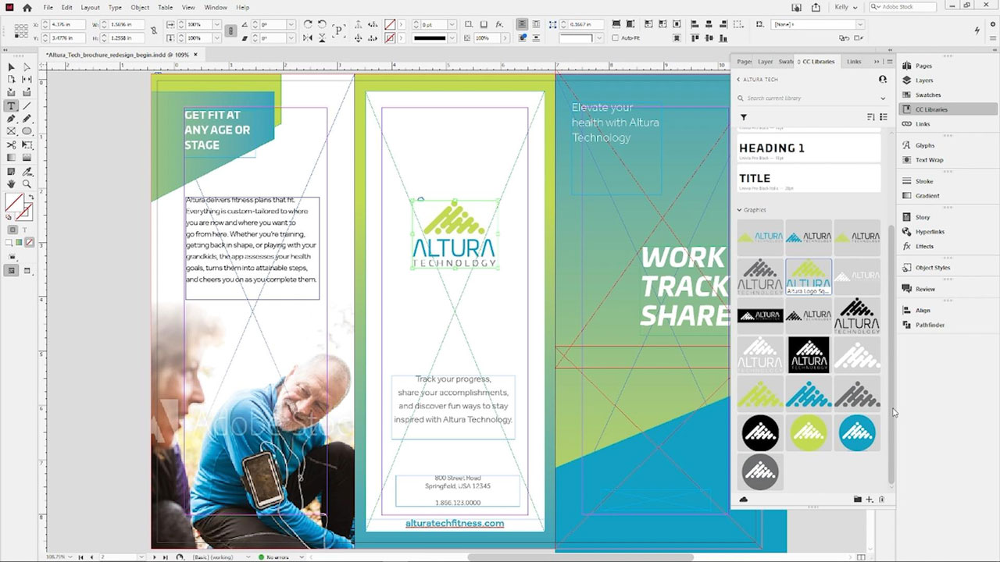
   </a>
   

   <a href="sharecclibraries.md"><strong>与Creative Cloud库团队版共享品牌资源</strong></a>
    

    <em>了解如何使用团队版Creative Cloud库为组或团队创建、使用和共享品牌推广资源</em>
     
  </td>
  <td>
   
    

   <a href="assets/CreateAddandShareYourBrandAssetswithCreativeCloudLibraries.pdf"><strong>使用Creative Cloud库(PDF)创建、添加和共享您的品牌资源</strong></a>
    

    <em>Creative Cloud库提供了一个内置的品牌系统，设计人员可以通过该系统在创意团队之间共享品牌资源</em>
     
  </td>
  </tr>
  <tr>
  <td>
   <a href="assets/ShareTextStylesFromIllustratorwithCreativeCloudLibraries.pdf">
      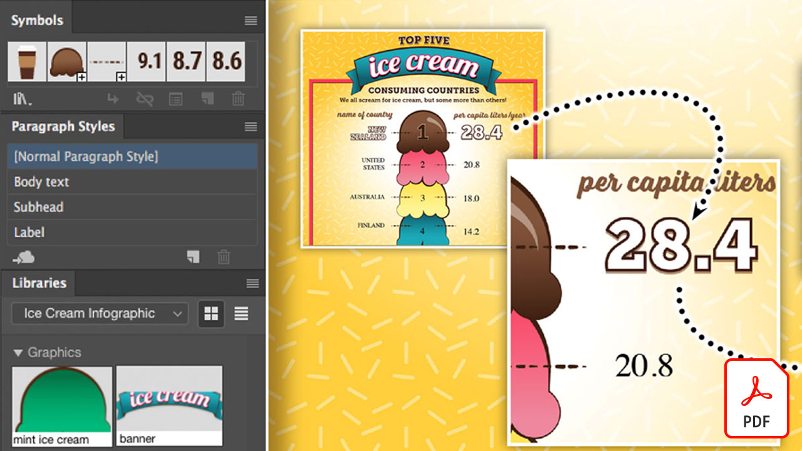
   </a>
    

   <a href="assets/ShareTextStylesFromIllustratorwithCreativeCloudLibraries.pdf"><strong>从Illustrator与Creative Cloud库共享文本样式(PDF)</strong></a>
    

    <em>在Illustrator中更聪明地工作，而不是更努力</em>
     
  </td>
  <td>
    
    

     
  </td>
  <td>
    
    

     
  </td>
  <td>
    
    

     
  </td>
</tr>
</table>

### Creative Cloud 企业版

<table style="table-layout:fixed">
<tr>
 <td>
   
    

   <a href="collaboration-the-future-of-creativity.md"><strong>协作：创造力的未来</strong></a>
    

    <em>Adobe Creative Cloud订阅的众多好处之一是可以免费访问Adobe Fonts提供的超过20,000种专业设计和精选的字体</em>
     
  </td>
  <td>
   <a href="assets/FromHandLetteringtoIllustratorviaCreativeCloud.pdf">
      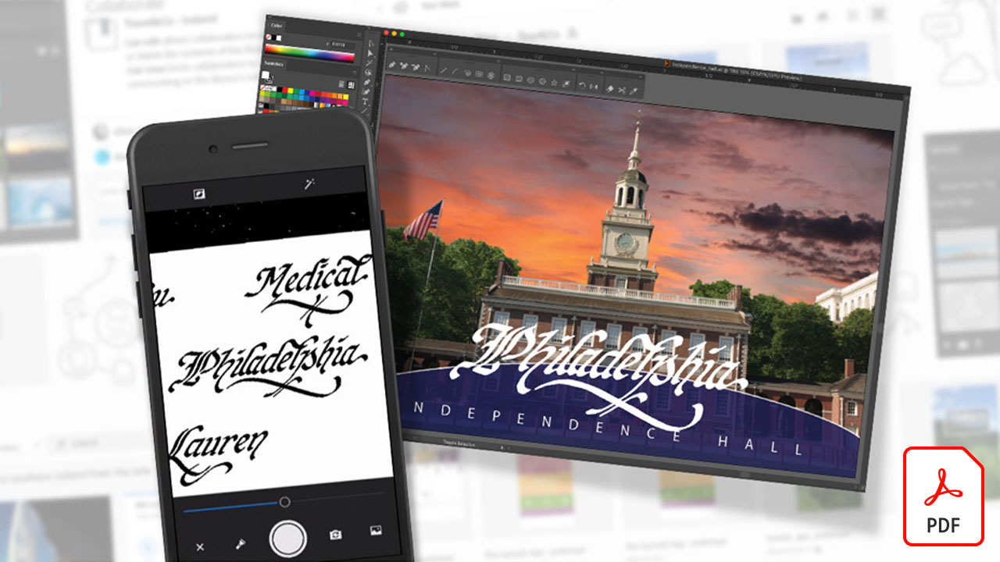
   </a>
    

   <a href="assets/FromHandLetteringtoIllustratorviaCreativeCloud.pdf"><strong>通过Creative Cloud(PDF)将手写字体转换为Illustrator</strong></a>
    

    <em>借助Creative Cloud为企业提供的强大功能，Adobe移动和桌面应用程序让您能够从任何位置（在任何设备上）进行捕捉、转换和创建</em>
     
  </td>
  <td>
   <a href="assets/FromLightroomWebtoInDesignviaCreativeCloud.pdf">
      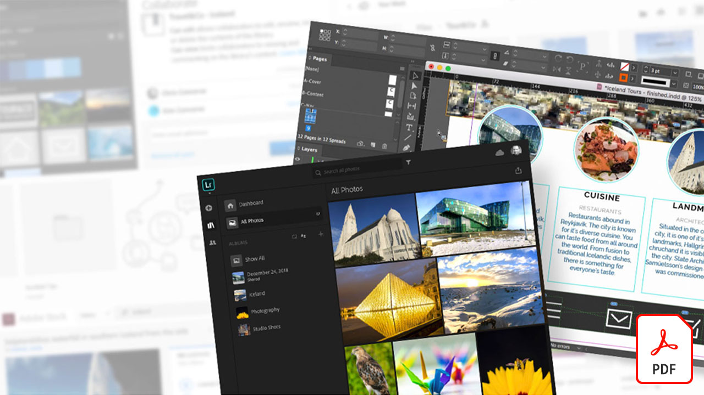
   </a>
    

   <a href="assets/FromLightroomWebtoInDesignviaCreativeCloud.pdf"><strong>从Lightroom Web到InDesign(通过Creative Cloud)(PDF)</strong></a>
    

    <em>通过Creative Cloud文件和图库，将您的创意从相机带到最终设计作品中</em>
     
  </td>
</tr>
</table>

### [!DNL Dimension]

<table  style="table-layout:fixed">
<tr>
   <td>
   
    

   <a href="assets/VisualizeyourProductinaRealisticEnvironment.pdf"><strong>在真实环境中显示您的产品(PDF)</strong></a>
    

    <em>如果您想查看产品在真实世界中的外观，请Adobe [!DNL Dimension] 是您的首选应用程序</em>
     
  </td>
  <td>
    
    

     
  </td>
  <td>
    
    

     
  </td>
  <td>
    
    

     
  </td>
</tr>
</table>

### Fresco

<table>
<tr>
 <td>
   <a href="frescoworkshop.md">
      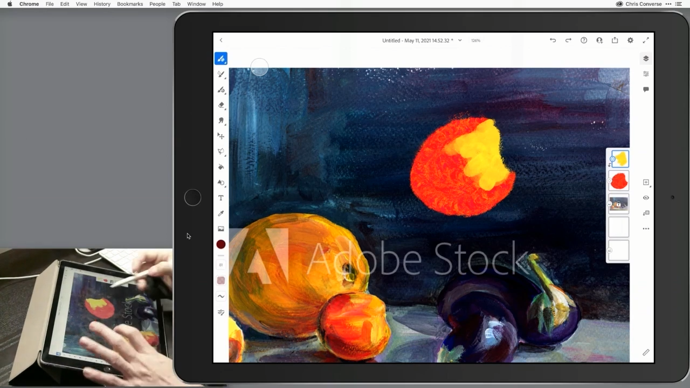
   </a>
    

   <a href="frescoworkshop.md"><strong>试试iPad(和iPhone)上的Fresco</strong></a>
    

    <em>在这个15分钟的动手研讨会中，使用Adobe Fresco探索数字绘图和绘画的整个新世界</em>
     
  </td>
  <td>
    
    

     
  </td>
  <td>
    
    

     
  </td>
  <td>
    
    

     
  </td>
</tr>
</table>

### Fonts

<table  style="table-layout:fixed">
<tr>
<td>
   
    

   <a href="taming-type-anxiety.md"><strong>驯服型焦虑</strong></a>
    

    <em>了解如何在Creative Cloud中访问和使用20,000多种专业设计的字体</em>
     
  </td>
  <td>
   <a href="assets/CreatingBeautifulTypographywithCreativeCloud.pdf">
      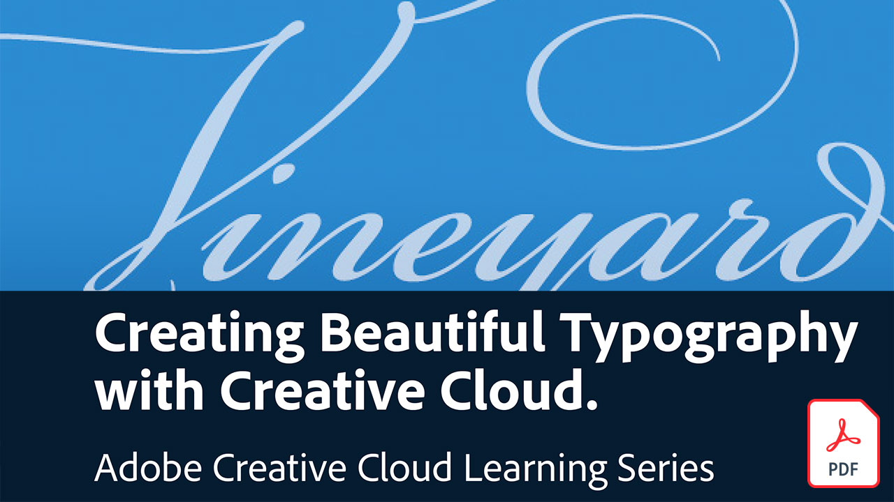
   </a>
    

   <a href="assets/CreatingBeautifulTypographywithCreativeCloud.pdf"><strong>使用Creative Cloud创建精美的排版(PDF)</strong></a>
    

    <em>了解如何利用您最喜爱的设计工具中的最先进排版控件</em>
     
  </td>
   <td>
   
    

   <a href="assets/DiscoveringFontswithCreativeCloud.pdf"><strong>使用Creative Cloud发现字体(PDF)</strong></a>
    

    <em>有时，为项目找到合适的字体似乎会让人不知所措。 借助各种Creative Cloud应用程序和服务，找到合适的字体现在变得有趣且鼓舞人心</em>
     
  </td>
  <td>
   <a href="assets/UnleashHiddenGemsinOpenTypefonts.pdf">
      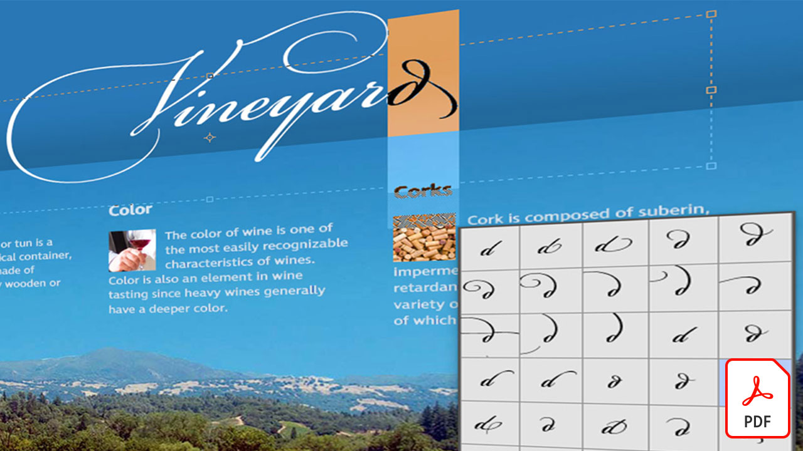
   </a>
    

   <a href="assets/UnleashHiddenGemsinOpenTypefonts.pdf"><strong>在OpenType字体中释放隐藏的Gem(PDF)</strong></a>
    

    <em>OpenType格式允许字体最多包含65,536种字形</em>
     
  </td>
</table>

### Illustrator

<table  style="table-layout:fixed">
<tr>
   <td>
   <a href="assets/GettoKnowGraphicStylesinIllustrator.pdf">
      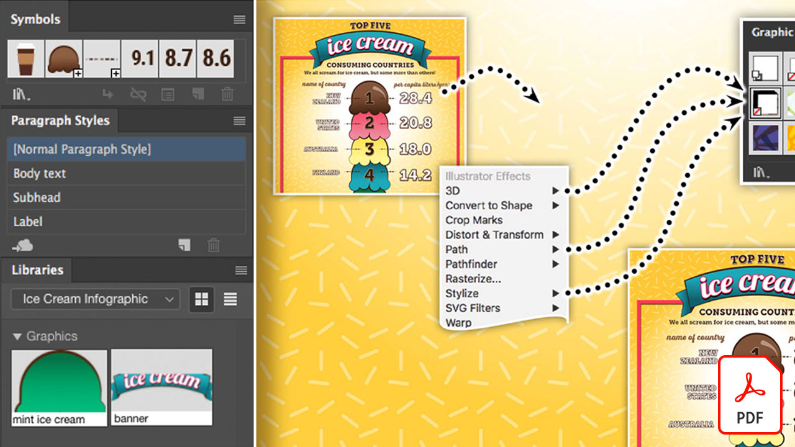
   </a>
    

   <a href="assets/GettoKnowGraphicStylesinIllustrator.pdf"><strong>了解Illustrator中的图形样式(PDF)</strong></a>
    

    <em>Illustrator可让您按照设置文本样式的方式设置图稿样式</em>
     
  </td>
   <td>
   <a href="assets/WorkSmarterNotHarderwithIllustrator.pdf">
      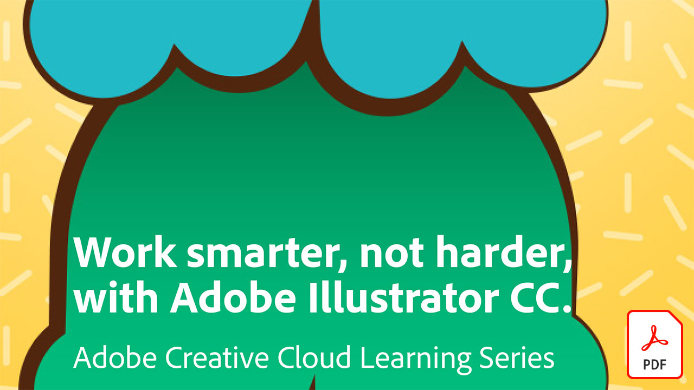
   </a>
    

   <a href="assets/WorkSmarterNotHarderwithIllustrator.pdf"><strong>使用Adobe Illustrator CC(PDF)，更智能地工作，而不是更努力</strong></a>
    

    <em>在Illustrator中加快矢量绘图速度</em>
     
  </td>
  <td>
   <a href="assets/IllustratorSymbolsandLayersequalsPerfectStructureforResponsiveSVG.pdf">
      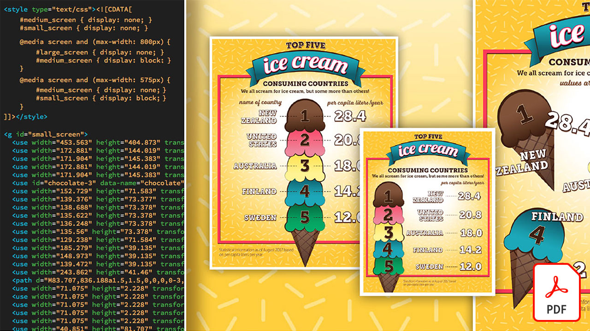
   </a>
    

   <a href="assets/IllustratorSymbolsandLayersequalsPerfectStructureforResponsiveSVG.pdf"><strong>Illustrator符号+图层=响应式SVG的完美结构！ (PDF)</strong></a>
    

    <em>Illustrator为SVG格式提供无与伦比的支持，包括创建图稿的符号、组、ID和精确的矢量定义的功能</em>
     
  </td>
  <td>
    
    

     
  </td>
</tr>
</table>

### InDesign

<table  style="table-layout:fixed">
<tr>
  <td>
   <a href="assets/CreatingInteractivePDFsfromInDesign.pdf">
      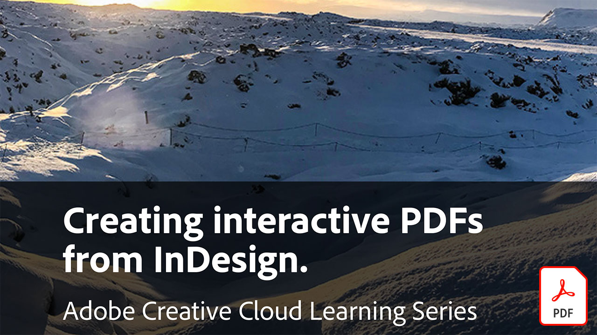
   </a>
    

   <a href="assets/CreatingInteractivePDFsfromInDesign.pdf"><strong>从InDesign创建交互式PDF(PDF)</strong></a>
    

    <em>InDesign包含许多功能，可帮助您设置文档的格式、样式、管理和跟踪内容</em>
     
  </td>
   <td>
   <a href="assets/EasilyGatherandIncorporateDesignFeedbackwithAdobeAcrobatandInDesign.pdf">
      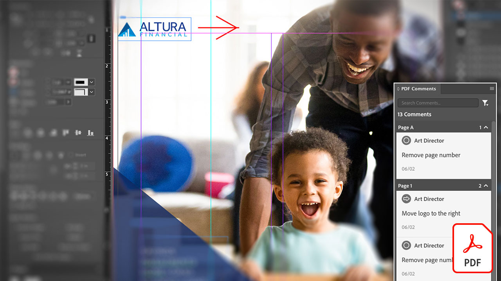
   </a>
    

   <a href="assets/EasilyGatherandIncorporateDesignFeedbackwithAdobeAcrobatandInDesign.pdf"><strong>使用Adobe Acrobat和InDesign轻松收集并纳入设计反馈(PDF)</strong></a>
    

    <em>利益相关者可以使用Acrobat添加详细的注释和批注，然后您可以快速将这些标记带回Adobe InDesign以在版面上下文中查看它们</em>
     
  </td>
  <td>
   <a href="assets/StyleWebContentwithInDesign.pdf">
      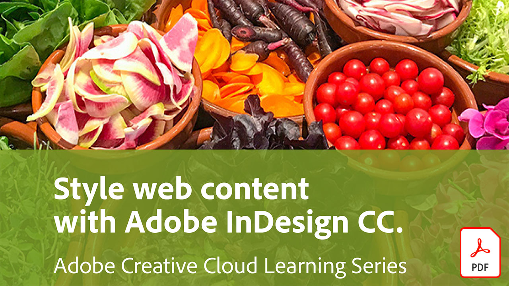
   </a>
    

   <a href="assets/StyleWebContentwithInDesign.pdf"><strong>使用Adobe InDesign CC设置Web内容样式(PDF)</strong></a>
    

    <em>您是否知道可以充分利用InDesign的强大功能来输出HTML和Web图形？</em>
     
  </td>
  <td>
   <a href="assets/InteractivePDFBookmarksandLinkedTOCsfromInDesign.pdf">
      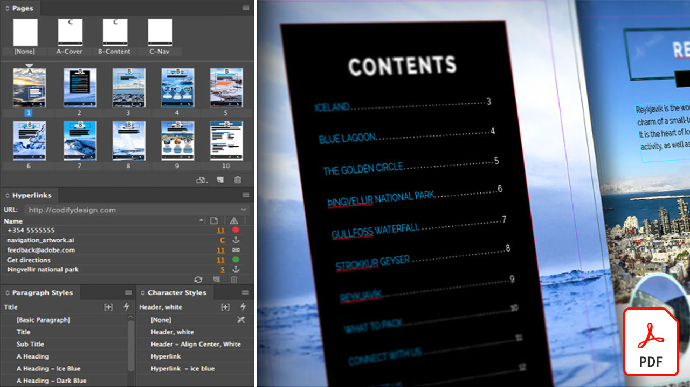
   </a>
    

   <a href="assets/InteractivePDFBookmarksandLinkedTOCsfromInDesign.pdf"><strong>交互式PDF：InDesign中的书签和链接目录(PDF)</strong></a>
    

    <em>了解如何使用InDesign中的目录功能来生成书签和超链接，帮助读者快速查找PDF文件中的信息</em>
     
  </td>
</tr>
<tr>
  <td>
   <a href="assets/InteractivePDFGraphicalHyperlinksandNestedMasterPagesinInDesign.pdf">
      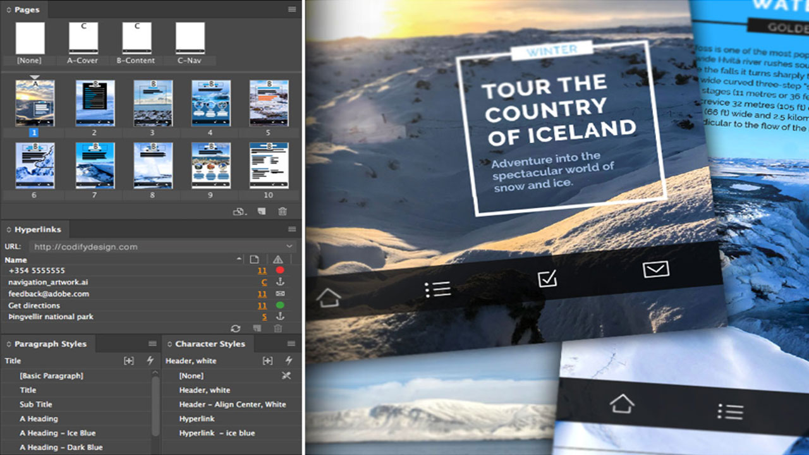
   </a>
    

   <a href="assets/InteractivePDFGraphicalHyperlinksandNestedMasterPagesinInDesign.pdf"><strong>交互式PDF：InDesign中的图形超链接和嵌套主页(PDF)</strong></a>
    

    <em>通过在主页上应用超链接，您可以在所有页面上快速管理导航系统</em>
     
  </td>
  <td>
    
    

     
  </td>
  <td>
    
    

     
  </td>
  <td>
    
    

     
  </td>
</tr>
</table>

### Photoshop

<table style="table-layout:fixed">
<tr>
  <td>
    <a href="alphabetsoup.md">
      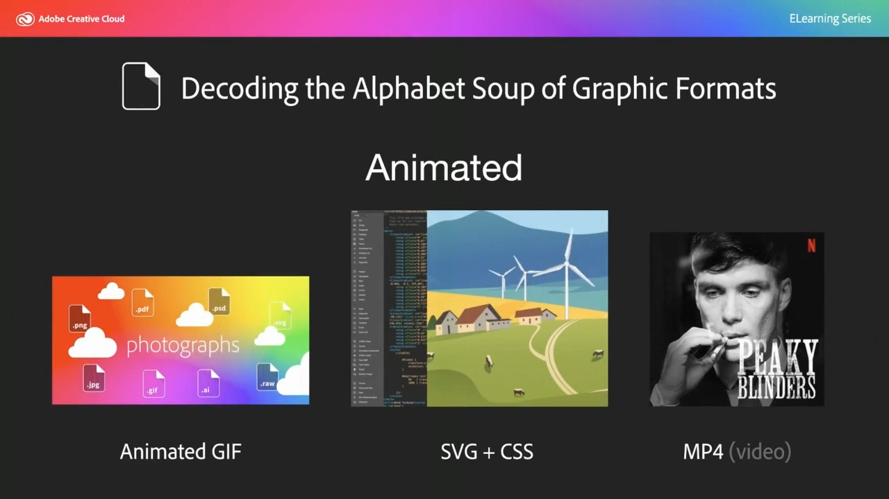
    </a>
    

    <a href="alphabetsoup.md"><strong>解码图形格式的字母汤</strong></a>
    

    <em>JPG、PNG、SVG、GIF和EPS文件通常用于设计，有些用于网页，有些用于演示文稿、出版物和创意项目。 但是它们是什么意思，你该选哪个？</em>
     
  </td>
  <td>
    <a href="compositepsipad.md">
      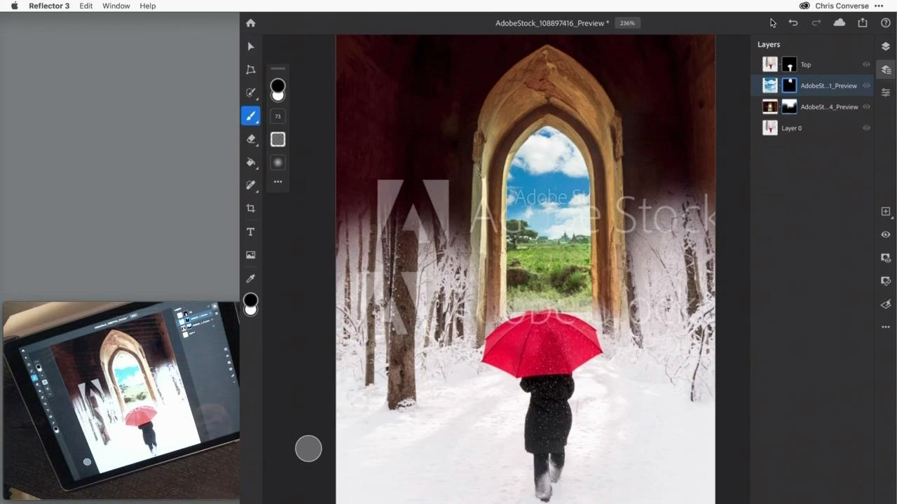
    </a>
    

    <a href="compositepsipad.md"><strong>使用Adobe创建独特的复合图像 [!DNL Stock] 和Photoshop for iPad</strong></a>
    

    <em>触手可及的Photoshop功能。 通过重新设计的触控界面，学习以全新的方式使用您最喜欢的Creative Cloud应用程序之一</em>
     
  </td>
  <td>
    
    

    <a href="cinemagraphps.md"><strong>使用Photoshop创建影院</strong></a>
    

    <em>在本研讨会分步视频教程中，您将结合来自Adobe的视频制作一张生动的照片 [!DNL Stock] 在Photoshop中使用巧妙的蒙版技术</em>
     
  </td>
  <td>
    
    

    <a href="assets/AddRemarkableLightingtoaPhotowithPhotoshopandAfterEffects.pdf"><strong>使用Photoshop和After Effects为照片添加引人注目的光照(PDF)</strong></a>
    

    <em>了解如何在Adobe After Effects中使用“光暴增”效果来大幅增强照片</em>
     
  </td>
</tr>
<tr>
  <td>
    
    

    <a href="assets/CreateCinemagraphsinaSnapwithPhotoshopandAdobeStock.pdf"><strong>使用Photoshop和Adobe快速创建影院 [!DNL Stock] (PDF)</strong></a>
    

    <em>在Adobe上搜索无缝循环视频 [!DNL Stock] 在Photoshop中快速组装引人注目的影院</em>
     
  </td>
  <td>
    
    

    <a href="assets/CreatingaLivingPhotographwithPhotoshopPart1.pdf"><strong>使用Photoshop创建生动的照片 — 第1部分(PDF)</strong></a>
    

    <em>Adobe Photoshop可让您快速将短视频转变为生动的照片，让您的受众在任何社交平台上沉浸其中</em>
     
  </td>
  <td>
    
    

    <a href="assets/CreatingaLivingPhotographwithPhotoshopPart2.pdf"><strong>使用Photoshop创建生动的照片 — 第2部分(PDF)</strong></a>
    

    <em>将照片与视频相结合，可以在不牺牲原始图像信息或色调的情况下，为照片增添迷人的视觉效果</em>
     
  </td>
  <td>
    
    

    <a href="assets/PhotoshopAfterEffectsAwesomenessAdobeMAX2018LabRecap.pdf"><strong>Photoshop + After Effects =出色的性能：Adobe MAX 2018实验室回顾(PDF)</strong></a>
    

    <em>在这个分步实验动手操作中，将Photoshop与After Effects相结合，创造出适合在任何介质中使用的令人惊叹的图像和效果</em>
     
  </td>
</tr>
<tr>
  <td>
    <a href="assets/QuicklyBrandYourInstagramPhotoswithAdobePhotoshopActions.pdf">
      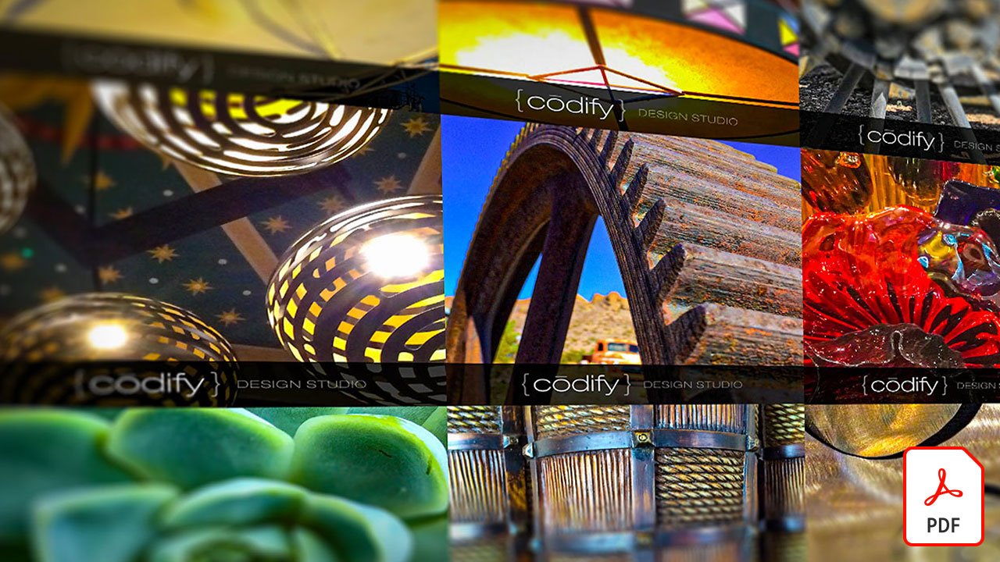
    </a>
    

    <a href="assets/QuicklyBrandYourInstagramPhotoswithAdobePhotoshopActions.pdf"><strong>使用Adobe Photoshop动作(PDF)快速为Instagram照片添加品牌标记</strong></a>
    

    <em>使用Photoshop中的“动作”消除沉闷感，节省大量时间</em>
     
  </td>
  <td>
    <a href="assets/WorkSmarterNotHarderwithPhotoshop.pdf">
      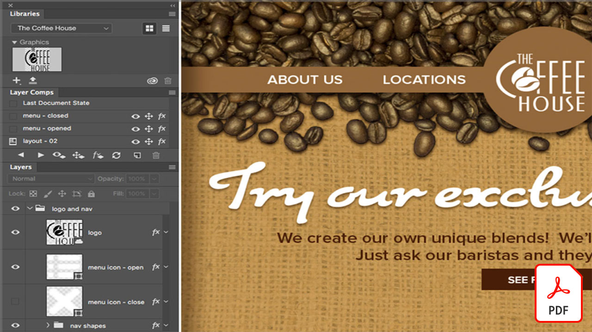
    </a>
    

    <a href="assets/WorkSmarterNotHarderwithPhotoshop.pdf"><strong>使用Photoshop(PDF)，更智能地工作，而不是更辛苦</strong></a>
    

    <em>在Photoshop中进行更改可能很耗时，但并不一定要</em>
     
  </td>
  <td>
    <a href="assets/AnyoneCanBeCreativewithAdobeCreativeCloud.pdf">
      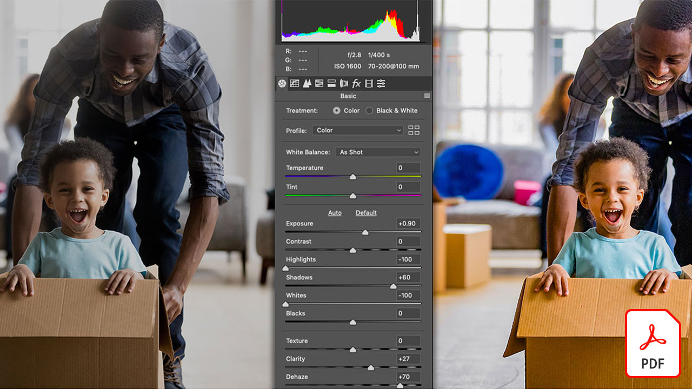
    </a>
    

    <a href="assets/AnyoneCanBeCreativewithAdobeCreativeCloud.pdf"><strong>将少许Adobe Photoshop添加到您的创意技能集中(PDF)</strong></a>
    

    <em>将少许Adobe Photoshop添加到您的创意技能集中</em>
     
  </td>
  <td>
    <a href="assets/GreenScreenisNotJustforVideo.pdf">
      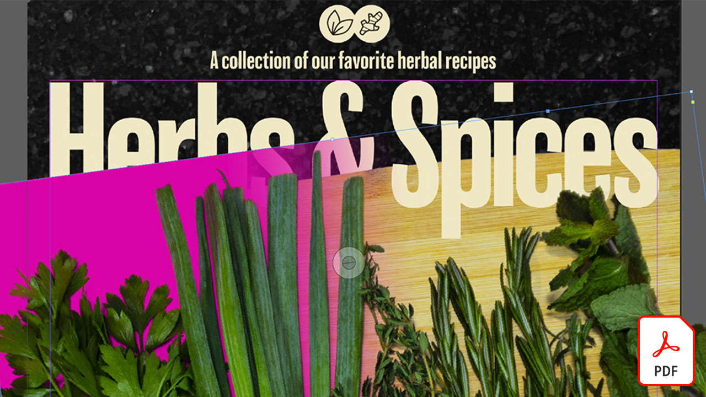
    </a>
    

    <a href="assets/GreenScreenisNotJustforVideo.pdf"><strong>绿屏不仅仅适用于视频(PDF)</strong></a>
    

    <em>您可以在摄影工作室中使用绿幕，然后使用After Effects准备在Photoshop中使用照片</em>
     
  </td>
</tr>  
</table>
