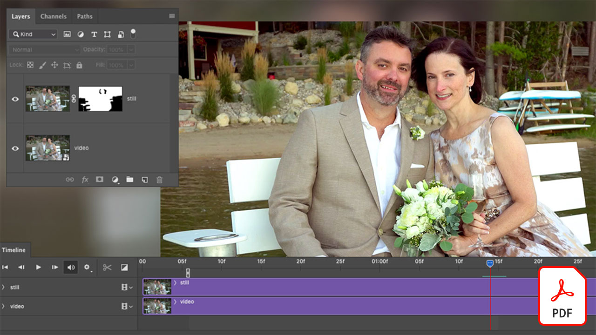

# Creative Cloud企业教程

作为企业创意，您必须与分布式团队协作，建立可扩展的流程，并遵守公司系统和准则。 这些教程可帮助您从企业角度学习Creative Cloud中的新功能。

## 单击可查看产品教程

### Creative Cloud 企业版

<table style="table-layout:fixed">
<tr>
 <td>
   
    

   <a href="assets/FromHandLetteringtoIllustratorviaCreativeCloud.pdf"><strong>从手写到Illustrator(通过Creative Cloud)(PDF)</strong></a>
    

    <em>借助企业版Creative Cloud的强大功能，Adobe移动和桌面应用程序允许您随时随地在任何设备上进行捕捉、转换和创建</em>
     
  </td>
  <td>
   
    

   <a href="assets/FromLightroomWebtoInDesignviaCreativeCloud.pdf"><strong>通过Lightroom Web到InDesign(PDF)</strong></a>
    

    <em>借助Creative Cloud文件和库，将您的创意从相机转变为最终设计</em>
     
  </td>
  <td>
    
    

     
  </td>
</tr>
</table>

### Spark

<table style="table-layout:fixed">
<tr>
 <td>
   
    

   <a href="assets/AddingaGlideshowtoyourSparkPageAdobeBlog.pdf"><strong>向Spark页面添加滑动画面(PDF)</strong></a>
    

    <em>Adobe Spark Page提供一些令人惊叹且易于使用的布局组件，可让您的Web故事栩栩如生</em>
     
  </td>
  <td>
   
    

   <a href="assets/CreatingYourBrandinAdobeSpark.pdf"><strong>在Adobe Spark中创建您的品牌(PDF)</strong></a>
    

    <em>Adobe Spark使您能轻松定义品牌</em>
     
  </td>
  <td>
   
    

   <a href="assets/MeetYourNewProductionArtistAdobeSparkPost.pdf"><strong>与您的新制作艺术家会面：Adobe Spark Post(PDF)</strong></a>
    

    <em>Adobe Spark在您创建布局、定义颜色、导入图稿和排列合成中的元素时会从您那里学习</em>
     
  </td>
</tr>
</table>

### Photoshop

<table style="table-layout:fixed">
<tr>
   <td>
    
    

    <a href="alphabetsoup.md"><strong>解码图形格式的字母汤</strong></a>
    

    <em>JPG、PNG、SVG、GIF和EPS文件都在设计中常用，有的用于网页，有的用于演示文稿、出版物和创意项目。但是，它们是什么意思，你应该选哪个？</em>
     
  </td>
  <td>
    
    

    <a href="compositepsipad.md"><strong>使用Adobe [!DNL Stock]和Photoshop for iPad创建独特的复合</strong></a>
    

    <em>将Photoshop的强大功能触手可及。了解如何以全新方式使用您最喜爱的Creative Cloud应用程序之一，具有经过重新设计的基于触摸的界面</em>
     
  </td>
  <td>
    
    

    <a href="cinemagraphps.md"><strong>使用Photoshop创建Cinemagraphs</strong></a>
    

    <em>在此分步研讨会视频教程中，您通过将来自Adobe [!DNL Stock]的视频与Photoshop中的巧妙蒙版技术相结合，创建出生动的照片</em>
     
  </td>
</tr>
<tr>
   <td>
    
    

    <a href="assets/AddRemarkableLightingtoaPhotowithPhotoshopandAfterEffects.pdf"><strong>使用Photoshop和After Effects为照片添加引人注目的光照(PDF)</strong></a>
    

    <em>学习在Adobe After Effects中使用光爆效果以显着增强照片</em>
     
   </td>
   <td>
    
    

    <a href="assets/CreateCinemagraphsinaSnapwithPhotoshopandAdobeStock.pdf"><strong>使用Photoshop和Adobe [!DNL Stock](PDF)快速创建Cinemagraph</strong></a>
    

    <em>在Adobe [!DNL Stock]上搜索无缝循环视频，以在Photoshop中快速组合引人注目的电影</em>
     
  </td>
   <td>
    
    

    <a href="assets/CreatingaLivingPhotographwithPhotoshopPart1.pdf"><strong>使用Photoshop创建活动照片 — 第1部分(PDF)</strong></a>
    

    <em>Adobe Photoshop允许您快速将短视频转换为生动的照片，在任何社交平台上吸引受众</em>
     
  </td>
</tr>
<tr>
   <td>
    
    

    <a href="assets/CreatingaLivingPhotographwithPhotoshopPart2.pdf"><strong>使用Photoshop创建活动照片 — 第2部分(PDF)</strong></a>
    

    <em>将照片与视频结合是一种强大的方法，可在不牺牲原始图像信息或色调的情况下，为照片添加引人入胜的品质</em>
     
  </td>
  <td>
    
    

    <a href="assets/PhotoshopAfterEffectsAwesomenessAdobeMAX2018LabRecap.pdf"><strong>Photoshop + After Effects =棒极了：Adobe MAX 2018 Lab Recap(PDF)</strong></a>
    

    <em>在这个实践的分步实验中，将Photoshop与After Effects结合在一起，创建出适合在任何媒体中使用的令人瞠目结舌的图像和效果</em>
     
  </td>
  <td>
    
    

    <a href="assets/QuicklyBrandYourInstagramPhotoswithAdobePhotoshopActions.pdf"><strong>使用Instagram Actions快速品牌化Adobe Photoshop照片(PDF)</strong></a>
    

    <em>使用Photoshop中的Actions，消除烦琐和节省大量时间</em>
     
  </td>
</tr>
<tr>
    <td>
    
    

    <a href="assets/WorkSmarterNotHarderwithPhotoshop.pdf"><strong>使用Photoshop(PDF)更智能、更轻松地工作</strong></a>
    

    <em>Photoshop中的更改可能很费时，但不一定</em>
     
  </td>
   <td>
    
    

    <a href="assets/AnyoneCanBeCreativewithAdobeCreativeCloud.pdf"><strong>向您的创意技能集添加一点Adobe Photoshop(PDF)</strong></a>
    

    <em>将一点Adobe Photoshop添加到您的创意技能集</em>
     
  </td>
  <td>
    
    

    <a href="assets/GreenScreenisNotJustforVideo.pdf"><strong>绿屏不仅用于视频(PDF)</strong></a>
    

    <em>您可以在照片工作室中使用绿屏，并使用After Effects准备在Photoshop中使用照片</em>
     
  </td>
</tr>  
</table>

### Fresco

<table>
<tr>
 <td>
   
    

   <a href="frescoworkshop.md"><strong>在iPad（和iPhone）上的Fresco上尝试一下</strong></a>
    

    <em>在这个15分钟的实践研讨会中，利用Adobe Fresco探索数字绘图和绘图的全新世界</em>
     
  </td>
  <td>
    
    

     
  </td>
  <td>
    
    

     
  </td>
</tr>
</table>

### Adobe Portfolio

<table  style="table-layout:fixed">
<tr>
   <td>
   
    

   <a href="assets/GettingStartedWithAdobePortfolio.pdf"><strong>Adobe Portfolio入门(PDF)</strong></a>
    

    <em>与Adobe Portfolio分享您的最佳作品是分享您的成功并吸引新创意人才的有效方式</em>
     
  </td>
   <td>
   
    

   <a href="assets/ConnectingLightroomandBehancetoYourAdobePortfolio.pdf"><strong>将Lightroom和Bēhance连接到Adobe Portfolio(PDF)</strong></a>
    

    <em>将Bēhance项目用作作品集中的页面</em>
     
  </td>
  <td>
   
    

   <a href="assets/ShowYourBestWorkwithAdobePortfolio.pdf"><strong>显示您使用Adobe Portfolio的最佳作品(PDF)</strong></a>
    

    <em>Adobe Portfolio允许您上传、组织和与世界各地的潜在员工和客户共享您的作品</em>
     
  </td>
 </tr>
 </table>

### CC库

<table  style="table-layout:fixed">
<tr>
  <td>
   
   

   <a href="ccteamlibraries.md"><strong>创建团队Creative Cloud库</strong></a>
    

    <em>了解如何使用团队版Creative Cloud库在组或团队内共享资源</em>
     
  </td>
  <td>
   
   

   <a href="sharecclibraries.md"><strong>使用团队版Creative Cloud库共享品牌资源</strong></a>
    

    <em>了解如何使用团队版Creative Cloud库为您的组或团队创建、使用和共享品牌资源</em>
     
  </td>
  <td>
   
    

   <a href="assets/CreateAddandShareYourBrandAssetswithCreativeCloudLibraries.pdf"><strong>使用Creative Cloud库创建、添加和共享您的品牌资源(PDF)</strong></a>
    

    <em>Creative Cloud库提供了一个内置的品牌系统，使设计人员能够跨创意团队共享品牌资产</em>
     
  </td>
</tr>
<tr>
  <td>
   
    

   <a href="assets/ShareTextStylesFromIllustratorwithCreativeCloudLibraries.pdf"><strong>使用Illustrator库共享来自Creative Cloud的文本样式(PDF)</strong></a>
    

    <em>在Illustrator更智能地工作</em>
     
  </td>
  <td>
    
    

     
  </td>
  <td>
    
    

     
  </td>
</tr>
</table>

### Fonts

<table  style="table-layout:fixed">
<tr>
  <td>
   
    

   <a href="assets/CreatingBeautifulTypographywithCreativeCloud.pdf"><strong>使用Creative Cloud创建精美的排版(PDF)</strong></a>
    

    <em>了解如何充分利用您喜爱的设计工具中提供的最新排版控件</em>
     
  </td>
   <td>
   
    

   <a href="assets/DiscoveringFontswithCreativeCloud.pdf"><strong>使用Creative Cloud发现字体(PDF)</strong></a>
    

    <em>有时，为项目找到合适的字体可能显得势不可挡。借助各种Creative Cloud应用程序和服务，现在找到正确的字体既有趣又鼓舞人心</em>
     
  </td>
  <td>
   
    

   <a href="assets/UnleashHiddenGemsinOpenTypefonts.pdf"><strong>充分利用OpenType字体中的隐藏功能(PDF)</strong></a>
    

    <em>OpenType格式允许字体包含最多65,536种字形</em>
     
  </td>
</tr>
</table>

### InDesign

<table  style="table-layout:fixed">
<tr>
  <td>
   
    

   <a href="assets/CreatingInteractivePDFsfromInDesign.pdf"><strong>从InDesign创建交互式PDF(PDF)</strong></a>
    

    <em>InDesign包含许多可帮助您设置、设置样式、管理和跟踪文档中内容的功能</em>
     
  </td>
   <td>
   
    

   <a href="assets/EasilyGatherandIncorporateDesignFeedbackwithAdobeAcrobatandInDesign.pdf"><strong>使用Adobe Acrobat和InDesign轻松收集和合并设计反馈(PDF)</strong></a>
    

    <em>利益相关方可以使用Acrobat添加详细的注释和批注，然后您可以快速将这些标记放回Adobe InDesign中，在版面的上下文中查看它们</em>
     
  </td>
  <td>
   
    

   <a href="assets/StyleWebContentwithInDesign.pdf"><strong>使用Adobe InDesign CC设置Web内容的样式(PDF)</strong></a>
    

    <em>您是否知道可以利用InDesign的强大功能输出HTML和Web图形？</em>
     
  </td>
</tr>
<tr>
   <td>
   
    

   <a href="assets/InteractivePDFBookmarksandLinkedTOCsfromInDesign.pdf"><strong>交互式PDF:来自InDesign的书签和链接的目录(PDF)</strong></a>
    

    <em>学习在InDesign中使用目录功能生成书签和超链接，帮助读者快速查找PDF文件中的信息</em>
     
  </td>
   <td>
   
    

   <a href="assets/InteractivePDFGraphicalHyperlinksandNestedMasterPagesinInDesign.pdf"><strong>交互式PDF:InDesign中的图形超链接和嵌套主页(PDF)</strong></a>
    

    <em>通过将超链接应用于主页，您可以快速管理整个页面的导航系统</em>
     
  </td>
  <td>
    
    

     
  </td>
</tr>
</table>

### Illustrator

<table  style="table-layout:fixed">
<tr>
   <td>
   
    

   <a href="assets/GettoKnowGraphicStylesinIllustrator.pdf"><strong>了解Illustrator中的图形样式(PDF)</strong></a>
    

    <em>Illustrator使您能够以与文本样式大致相同的方式设置图稿样式</em>
     
  </td>
   <td>
   
    

   <a href="assets/WorkSmarterNotHarderwithIllustrator.pdf"><strong>使用Adobe Illustrator CC(PDF)更智能、更轻松地工作</strong></a>
    

    <em>在Illustrator中加快矢量绘图</em>
     
  </td>
  <td>
   
    

   <a href="assets/IllustratorSymbolsandLayersequalsPerfectStructureforResponsiveSVG.pdf"><strong>Illustrator符号+图层=响应式SVG的完美结构！(PDF)</strong></a>
    

    <em>Illustrator对SVG格式提供了无与伦比的支持，包括能够创建符号、组、ID以及精确的矢量图定义</em>
     
  </td>
</tr>
</table>

### [!DNL Dimension]

<table  style="table-layout:fixed">
<tr>
   <td>
   
    

   <a href="assets/VisualizeyourProductinaRealisticEnvironment.pdf"><strong>在逼真的环境中使产品可视化(PDF)</strong></a>
    

    <em>当您想了解产品在真实世界中的显示效果时，Adobe [!DNLDimension]是您的首选应用程序</em>
     
  </td>
  <td>
    
    

     
  </td>
  <td>
    
    

     
  </td>
</tr>
</table>
