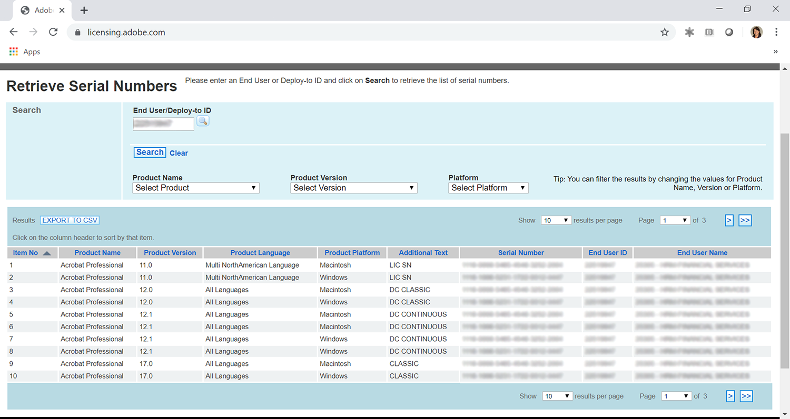
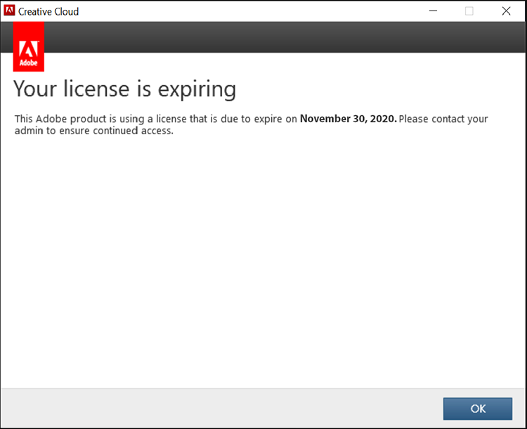
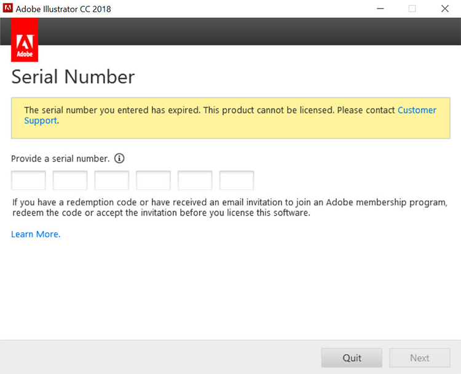
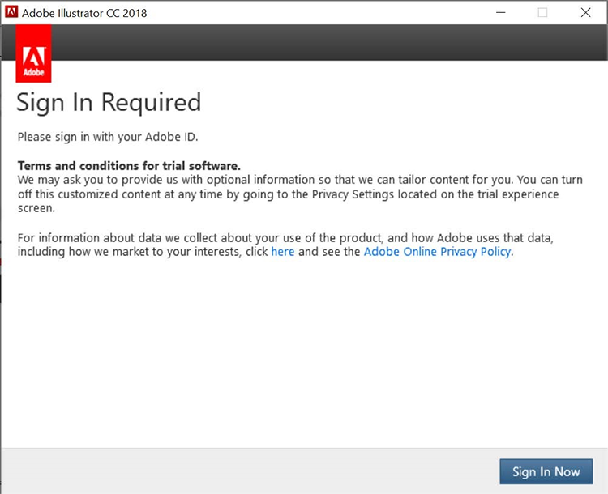
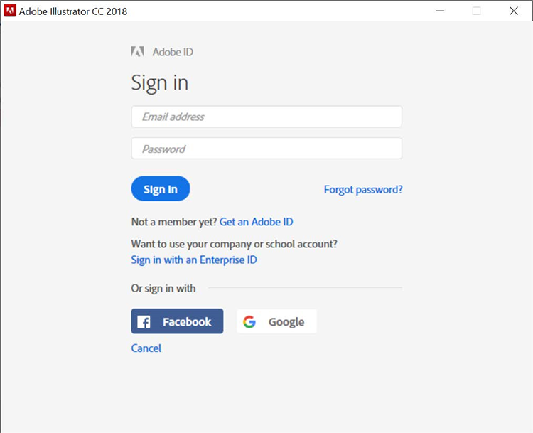
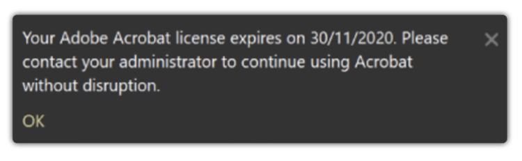
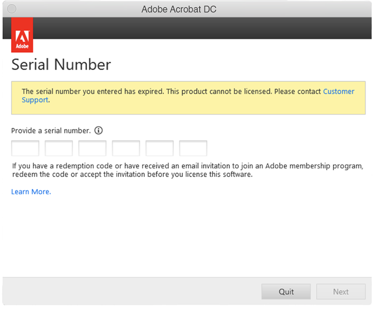
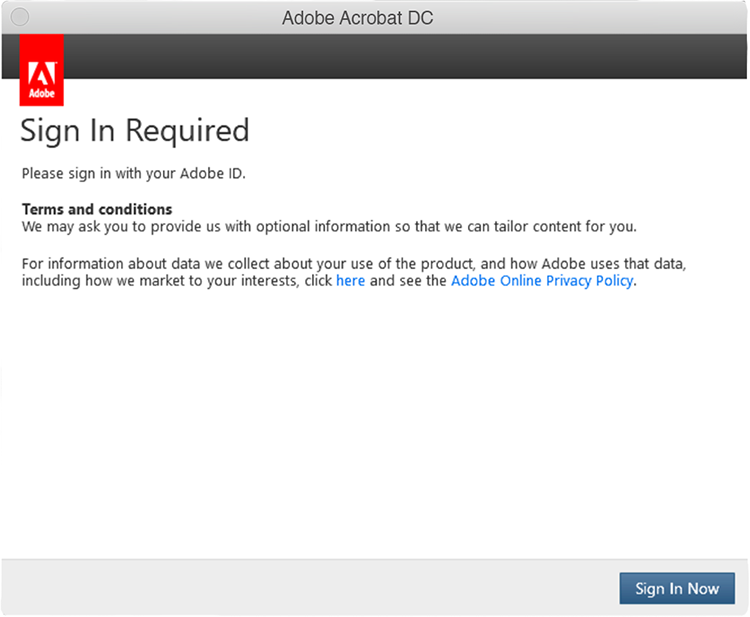
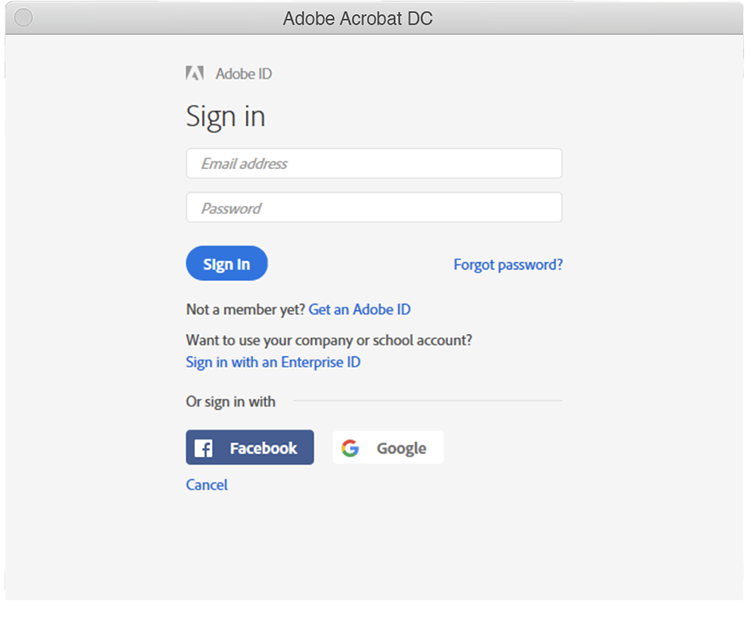

# 了解Creative Cloud企业和Acrobat序列号过期

以往，Adobe使用我们的应用程序(例如Creative Suite、Creative Cloud企业版、Acrobat XI和Acrobat DC)向采用企业定期许可协议的客户(ETLA)颁发序列号。 这些序列号的确具有过期日期。 过期日期过后，产品将不再工作，因此务必要在序列号过期前规划您的迁移。 本页面概述确保您的最终用户可继续访问其Adobe应用程序和服务的必要步骤。

## 检查序列号是否过期

### 查找您的序列号

可通过 [Adobe许可网站](https://licensing.adobe.com/) (LWS)。 按照以下说明显示和下载：

1. 登录到 [Adobe许可网站](https://licensing.adobe.com/) (LWS)以及您的Adobe ID和密码。
1. 选择 **许可证>检索序列号**&#x200B;的
1. 输入您的 **最终用户ID** 或 **部署到ID**&#x200B;的
1. （可选）选择 **产品名称**, **产品版本**&#x200B;或 **平台** 以筛选结果。
1. 单击“搜索”。
1. 此时会显示产品名称和序列号。
1. （可选）选择“导出至CSV”以下载序列号列表。

### 检查过期日期

在 [AdobeExpiryCheck](https://helpx.adobe.com/enterprise/kb/volume-license-expiration-check.html) 是一个命令行实用程序，供IT管理员检查计算机上的Adobe产品使用的序列号是否已过期或即将过期。 该工具将显示产品许可标识符(LEID)、加密序列号和到期日期等信息。 此 [页面](https://helpx.adobe.com/enterprise/kb/volume-license-expiration-check.html) 包含有关在Mac或Windows计算机上下载和使用该工具的说明。

## 了解序列号到期前后的最终用户体验

Acrobat和适用于企业的Creative Cloud版应用程序将于过期前60天开始在应用程序中显示消息。 序列号过期后，产品停止工作，并提示用户执行操作。

### Creative Cloud企业体验

以下信息概述了最终用户体验。 下面是一个简短的视频，其中回顾了最终用户体验。

>[!VIDEO](https://video.tv.adobe.com/v/331746?hidetitle=true)

**过期前**

自序列号过期前60天开始，所有企业版应用程序的Creative Cloud都会向最终用户显示产品内对话框。 此消息每周显示，直到过期前30天，然后每天显示，直到过期日期 *您的许可证即将过期。 此Adobe产品使用的许可证将于2020年11月29日到期。 请联系您的管理员以确保继续访问*&#x200B;的

**过期后**

序列号过期后，用户将无法再访问适用于企业应用程序的Creative Cloud。 到期后的首次启动时，用户将收到一个对话框，其中显示 *您输入的序列号已过期。 无法许可此产品。 请联系客户支持*&#x200B;的

对于后续启动应用程序的所有尝试，系统将提示最终用户 **立即登录** 然后可以选择创建自己的Adobe ID并进入试用模式。 但是，最终用户创建的任何新Adobe ID都不会与您组织的许可证相关联，并将导致用户产生更多混淆。 为避免出现业务中断和/或不必要的混淆，请在序列号到期之前将用户迁移到指定用户许可。

### Acrobat experience

以下信息概述了最终用户体验。 下面是一个简短的视频，其中回顾了最终用户体验。

>[!VIDEO](https://video.tv.adobe.com/v/331749?hidetitle=true)

**过期前**

从序列号过期前60天开始，Acrobat将向最终用户显示产品内弹出消息。 该图标将每周显示一次，直到过期前7天为止。 然后，它将开始每天显示声明 *您的Adobe Acrobat许可证将于2020年11月30日到期。 请联系您的管理员，以继续使用Acrobat而不中断。*

**过期后**

序列号过期后，用户将无法再访问Acrobat。 到期后的首次启动时，用户将收到一个对话框，其中显示 *您输入的序列号已过期。 无法许可此产品。 请联系客户支持。*

对于后续启动Acrobat的所有尝试，系统会提示最终用户 **立即登录** 然后可以选择创建自己的Adobe ID并进入试用模式。 但是，最终用户创建的任何新Adobe ID都不会与您组织的许可证相关联，并将导致用户产生更多混淆。

## 如果需要帮助，请联系我们

如果您对使用 [AdobeExpiryCheck](https://helpx.adobe.com/enterprise/kb/volume-license-expiration-check.html) 工具或者需要从序列号部署迁移到指定用户的帮助，您有几个选项：
* 向Adobe企业登记团队发送电子邮件 —  **entonb@adobe.com**
* 在中打开支持票证 [Admin Console](https://adminconsole.adobe.com/support)
* 联系您的Adobe客户团队
