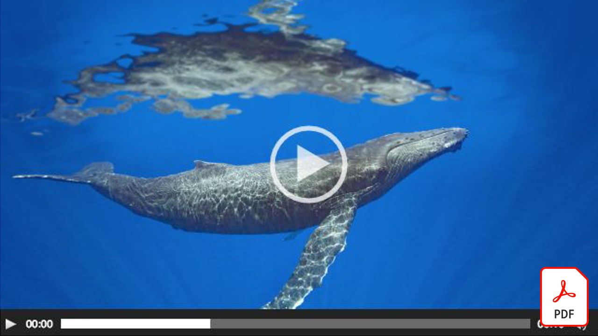
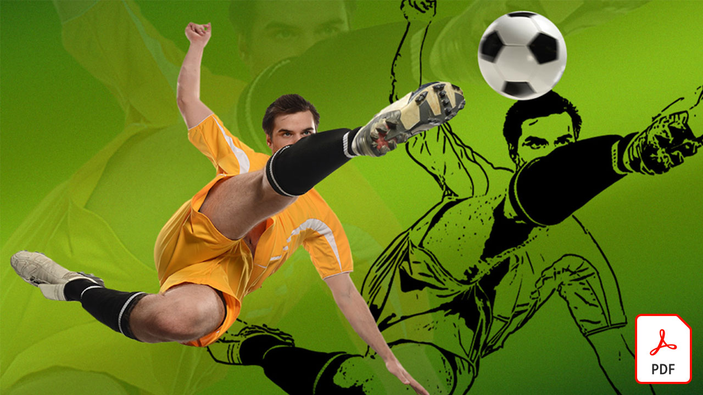
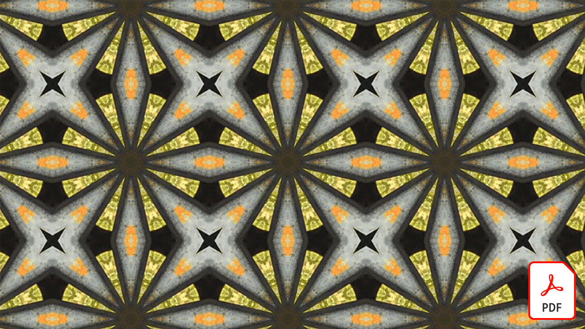
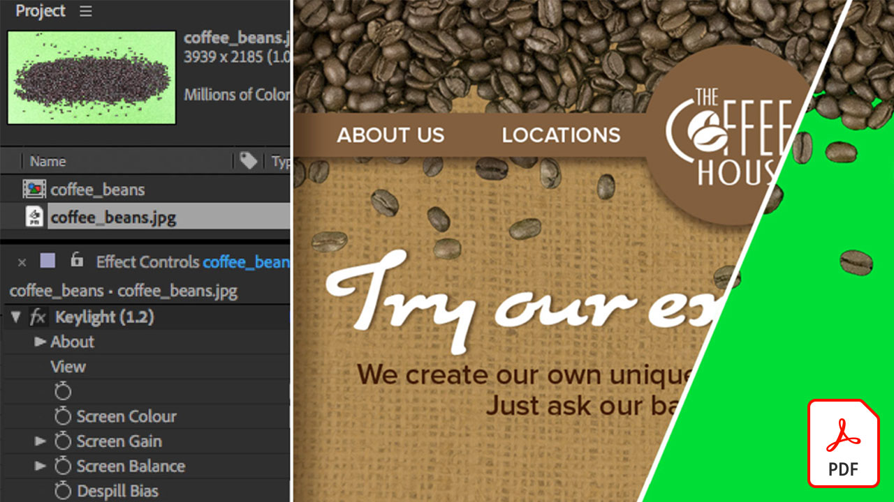
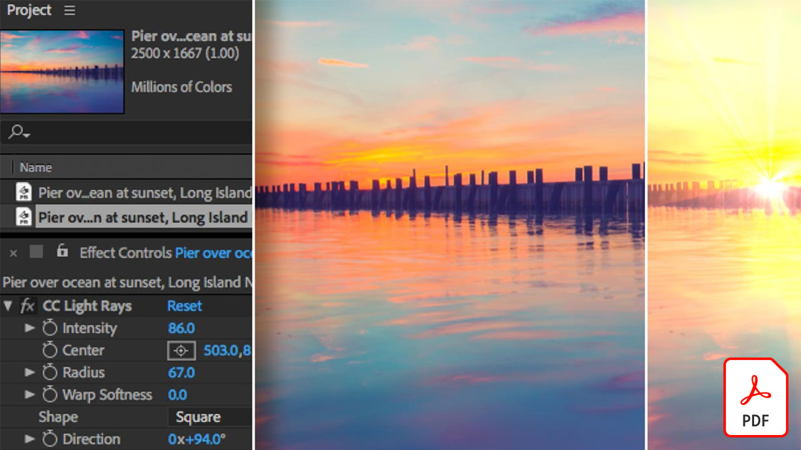
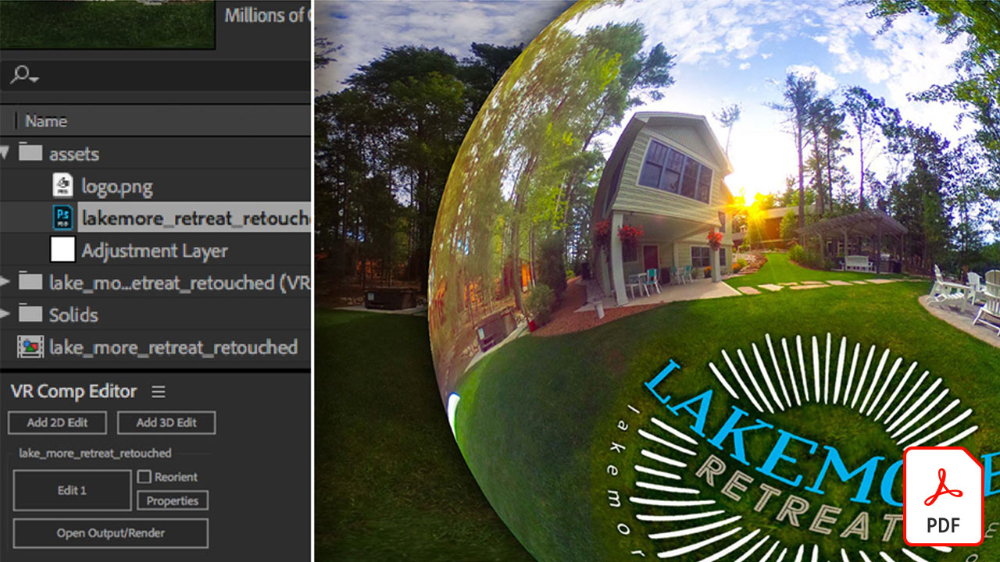
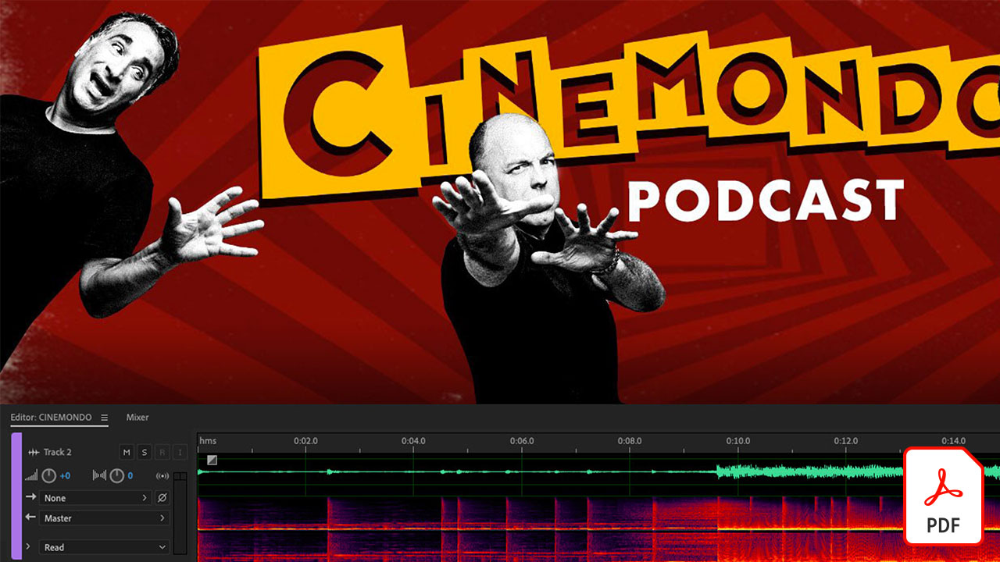
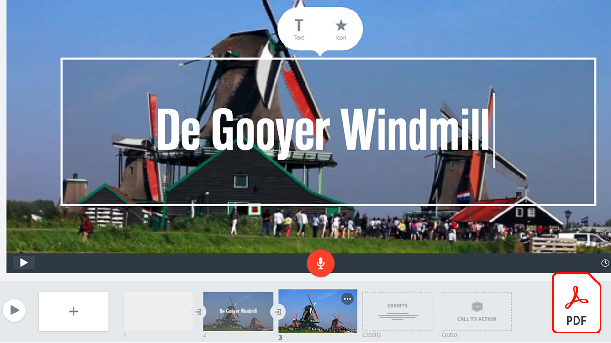
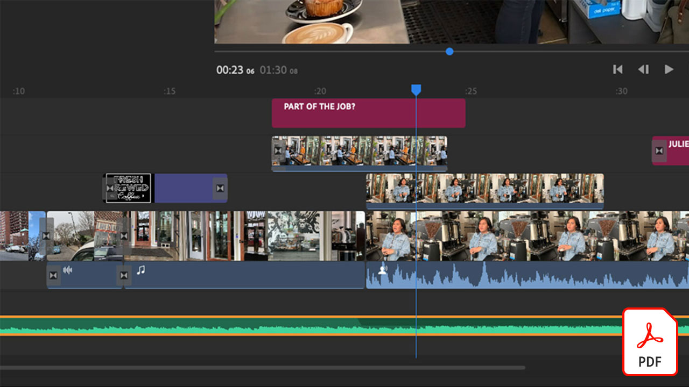

# Adobe视频教程

借助用于视频编辑、动态图形、视觉效果、动画等的Adobe软件和应用程序，让您的想法变为现实。

## 单击以查看Adobe视频教程

<table>
<tr>
 <td>
   
    

   <a href="assets/AfterEffectsforPhotography.pdf"><strong>After Effects for Photography(PDF)</strong></a>
    

    <em>了解如何使用After Effects中的神奇效果来增强您的照片</em>
     
  </td>
  <td>
   
    

   <a href="assets/CinemagraphsTheMesmerizingPlaceBetweenaPhotoandaVideo.pdf"><strong>电影胶片：照片和视频之间的迷人的位置(PDF)</strong></a>
    

    <em>进一步了解cinemagraphs，这是一种存在于照片和视频之间的引人注目的混合格式</em>
     
  </td>
  <td>
   
    

   <a href="assets/CreateanIllustrationfromanAdobeStockPhotowithAfterEffects.pdf"><strong>从Adobe创建插图 [!DNL Stock] 带有After Effects的照片(PDF)</strong></a>
    

    <em>在After Effects中将色相/饱和度和色阶与卡通效果相结合，以从Adobe创建独特的风格化插图 [!DNL Stock] 照片</em>
     
  </td>
</tr>
<tr>
 <td>
   
    

   <a href="assets/CreateAnimatedTitlesUsingMotionGraphicsTemplatesinAdobePremiereRush.pdf"><strong>在Adobe Premiere中使用动态图形模板创建动画字幕 [!DNL Rush] (PDF)</strong></a>
    

    <em>添加符合您的故事或符合您个人品牌的专业设计动态图形模板，让您的视频更加出色</em>
     
  </td>
  <td>
   
    

   <a href="assets/CreateBeautifulKaleidoscopePatternswithAfterEffects.pdf"><strong>使用After EffectsPDF创建精美的万花筒图案</strong></a>
    

    <em>使用Adobe After Effects中的CC万花筒效果从任何图像创建数量众多的图案和纹理</em>
     
  </td>
  <td>
   
    

   <a href="assets/CreateIntricateTransparencyinyourPhotographswithKeyinginAfterEffects.pdf"><strong>使用After Effects中的键控功能在照片中创建复杂的透明度(PDF)</strong></a>
    

    <em>抠像主要用于视频，当设计项目需要您的照片时，它也可以提供很大的帮助</em>
     
  </td>
</tr>
<tr>
 <td>
   
    

   <a href="assets/DazzlingLightEffectsforPhotographywithAfterEffects.pdf"><strong>借助After Effects实现炫目的摄影光线效果(PDF)</strong></a>
    

    <em>Adobe After Effects中的光照效果可以显著更改照片的外观</em>
     
  </td>
  <td>
   
    

   <a href="assets/EditingVRPhotography360photoswithAfterEffects.pdf"><strong>使用After Effects编辑VR摄影（360度照片）(PDF)</strong></a>
    

    <em>虽然更加引人入胜的交互式游戏和体验并不那么常见，但360度摄影已经出现</em>
     
  </td>
  <td>
   
    

   <a href="assets/QuicklyRemoveUnwantedAudioContentwiththeSpotHealingBrushinAdobeAudition.pdf"><strong>使用Adobe Audition中的污点修复画笔快速移除不需要的音频内容(PDF)</strong></a>
    

    <em>您是否知道Adobe Photoshop污点修复画笔可以让您从Adobe Audition中的音频文件中去除干扰声音？</em>
     
  </td>
</tr>
<tr>
   <td>
   
    

   <a href="assets/ShowcaseyourSparkVideoinyourSparkPage.pdf"><strong>在您的Spark Page中展示Spark Video(PDF)</strong></a>
    

    <em>Adobe Spark Page允许您从各种来源加载视频，包括您使用Spark Video创建的视频！</em>
     
  </td>
  <td>
   
    

   <a href="assets/SmoothlyCombineMusicandDialogueorNarrationwithAutoduckinginAdobePremiereRush.pdf"><strong>在Adobe Premiere中通过自动闪避平滑地组合音乐与对话或旁白 [!DNL Rush] Adobe(PDF)</strong></a>
    

    <em>Adobe Premiere [!DNL Rush] 在一个简单易用的应用程序中提供高级视频编辑功能，使任何人都可以在几分钟内创建专业品质的视频</em>
     
  </td>
</tr>
</table>
