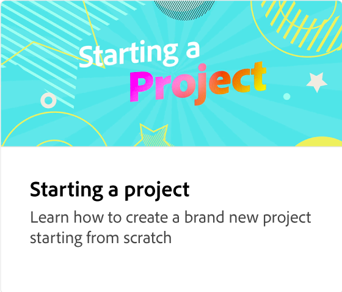
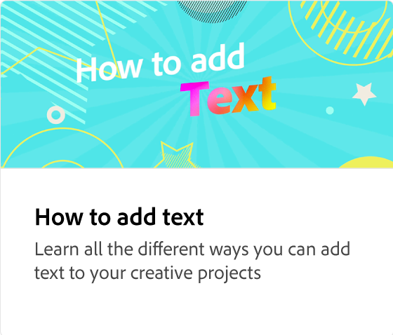
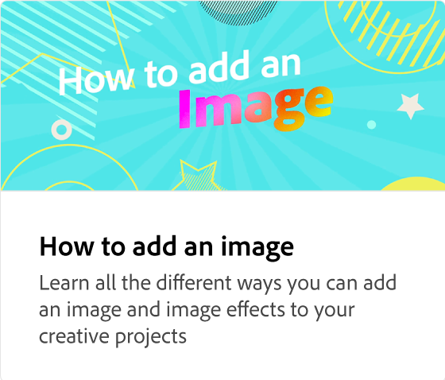
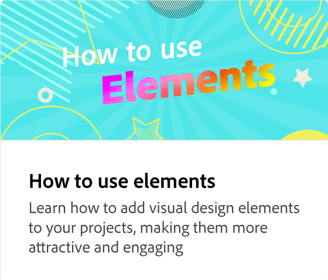
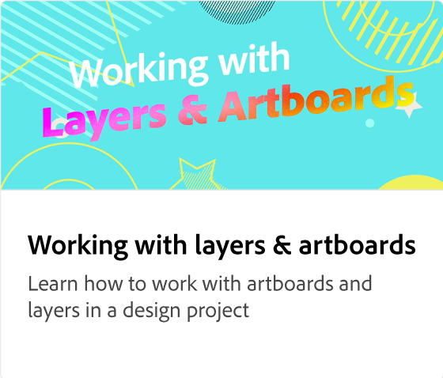

# 如何添加通用AI图像

了解如何将Adobe Firefly支持的生成式AI图像添加到您的创意项目。 通过基于文本提示生成图像（包含用于不同样式和内容类型的选项），使您的内容个性化。

>[!VIDEO](https://video.tv.adobe.com/v/3426933?quality=12&learn=on&hidetitle=true)

## 此系列中的其他视频

<table style="table-layout:fixed">
<tr>
 <td>
      
  </td>
   <td>
      
  </td>
   <td>
      
  </td>
  <td>
      
  </td>
</tr>
<tr>
   <td>
      
  </td>
  <td>
      
  </td>
   <td>
         
   </td>
    <td>
         
   </td>
</tr>
<tr>
   <td>
   
   </td>
   <td>
   
   </td>
   <td>
   
   </td>
   <td>
      
      

       
   </td>
</tr>
</table>
