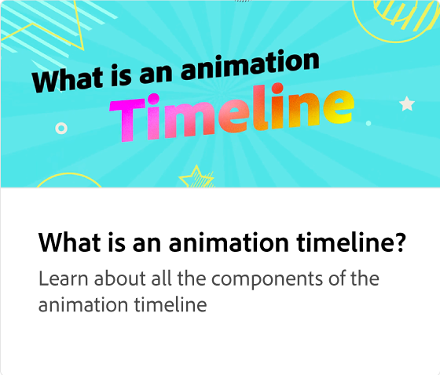
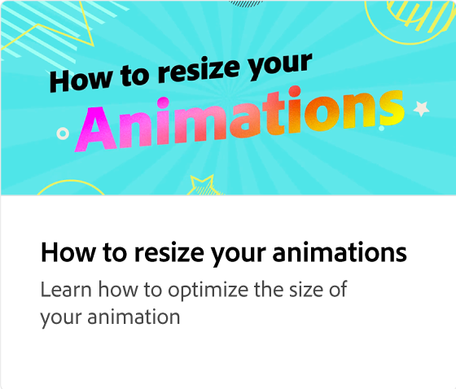

# 向动画添加部分

通过将图像和标题等元素添加到动画中，提升动画水平。 了解如何在保持动画完整性的同时添加、复制、重新排列或替换场景中的元素。

>[!VIDEO](https://video.tv.adobe.com/v/3426982?quality=12&learn=on&hidetitle=true)

## 此系列中的其他视频

<table style="table-layout:fixed">
<tr>
   <td>
         
   </td>
  <td>
         
   </td>
   <td>
         
   </td>
   <td>
         
   </td>
</tr>
<tr>
    <td>
         
   </td>
   <td>
         
   </td>
   <td>
         
   </td>
   <td>
         
   </td>
</tr>
</table>

