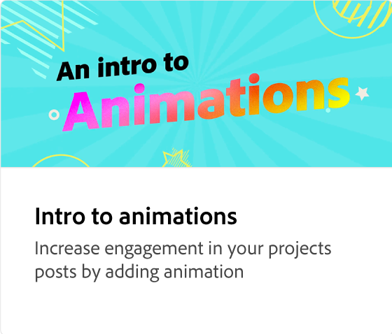
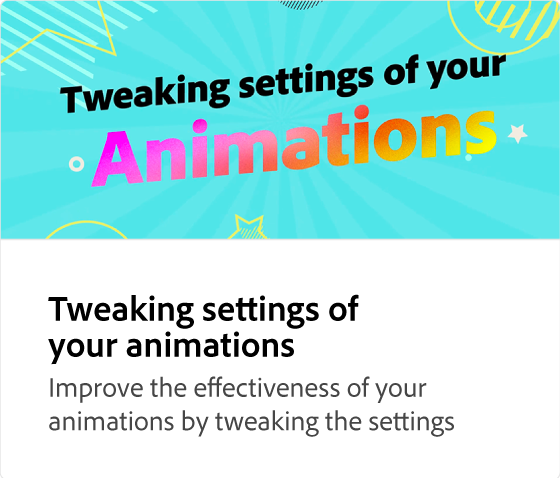

# 向动画添加音频

了解如何通过添加音频（包括Express提供的免版税素材库音频文件）来创建吸引人且令人难忘的项目。

>[!VIDEO](https://video.tv.adobe.com/v/3426983?quality=12&learn=on&hidetitle=true)

## 此系列中的其他视频

<table style="table-layout:fixed">
<tr>
   <td>
         
   </td>
  <td>
         
   </td>
   <td>
         
   </td>
   <td>
         
   </td>
</tr>
<tr>
    <td>
         
   </td>
   <td>
         
   </td>
   <td>
         
   </td>
   <td>
         
   </td>
</tr>
</table>