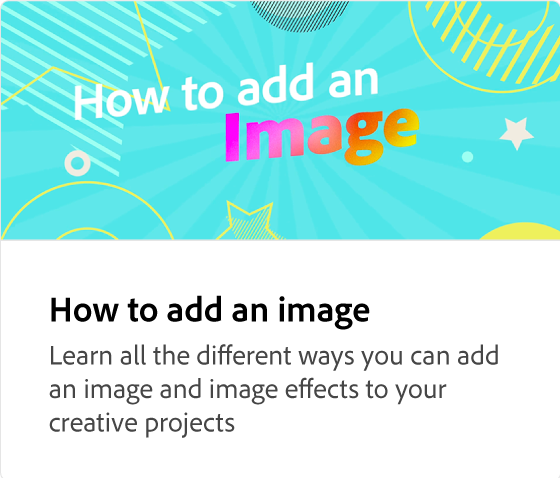
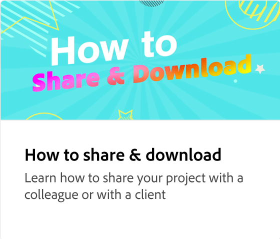

# 设置品牌套件

了解如何创建品牌资源收藏集，以为您的企业或个人项目创建一致且专业的设计。 品牌工具包是一个品牌资产的集合，如徽标、颜色、字体、图形和模板。 他们可以从头开始创建，也可以从现有库创建，然后与具有编辑或查看权限的同事共享。

>[!VIDEO](https://video.tv.adobe.com/v/3420218?quality=12&learn=on&hidetitle=true)

## 此系列中的其他视频

<table style="table-layout:fixed">
<tr>
  <td>
      
  </td>
   <td>
      
  </td>
  <td>
      
  </td>
 <td>
      
  </td>
</tr>
<tr>
   <td>
      
  </td>
   <td>
      
  </td>
   <td>
         
   </td>
   <td>
         
   </td>
</tr>
<tr>
    <td>
   
   </td>
   <td>
   
   </td>
   <td>
   
   </td>
   <td>
      
      

       
   </td>
</tr>
</table>
