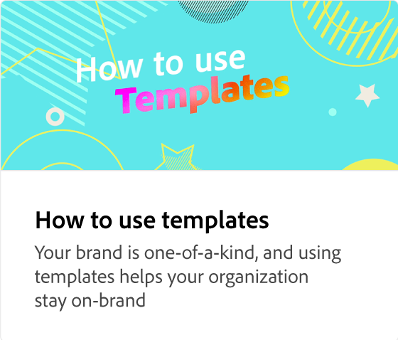

# 创建模板

了解如何创建模板，其中某些图层已锁定，而其他图层处于解锁状态，可供团队进行更改。 您还可以包含有关使用此模板的团队说明。

>[!VIDEO](https://video.tv.adobe.com/v/3420208?quality=12&learn=on&hidetitle=true)

## 此系列中的其他视频

<table style="table-layout:fixed">
<tr>
    <td>
            
    </td>
    <td>
            
    </td>
    <td>
            
    </td>
    <td>
      
      

       
    </td>
</tr>
</table>
