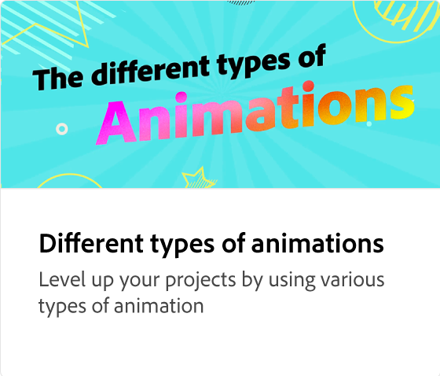

# 导出动画

了解如何邀请他人参与编辑、发布到Web、安排社交帖子或下载您的动画。 “Adobe Express”会根据您的情况建议导出为哪种文件格式。

>[!VIDEO](https://video.tv.adobe.com/v/3426985?quality=12&learn=on&hidetitle=true)

## 此系列中的其他视频

<table style="table-layout:fixed">
<tr>
   <td>
         
   </td>
  <td>
         
   </td>
   <td>
         
   </td>
   <td>
         
   </td>
</tr>
<tr>
    <td>
         
   </td>
   <td>
         
   </td>
   <td>
         
   </td>
   <td>
         
   </td>
</tr>
</table>
