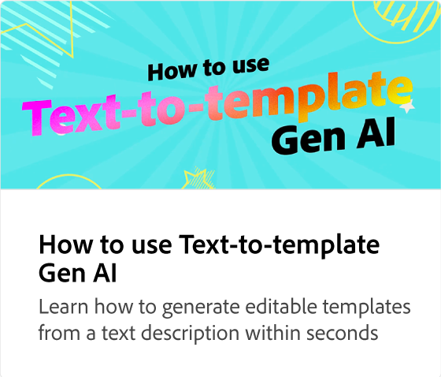

# 使用Gen AI改进文本设计

了解如何使用由Adobe Firefly支持的文本效果创建有影响力的设计。 使用文本提示，您可以生成卓越的文本效果，并对其进行优化和装饰。

>[!VIDEO](https://video.tv.adobe.com/v/3427021?quality=12&learn=on&hidetitle=true)

## 此系列中的其他视频

<table style="table-layout:fixed">
<tr>
   <td>
         
   </td>
   <td>
         
   </td>
   <td>
         
   </td>
   <td>
         
   </td>      
</tr>
<tr>
   <td>
      
   </td>
   <td>
      
   </td>
   <td>
      
   </td>
   <td>
      
   </td>
</tr>
</table>
