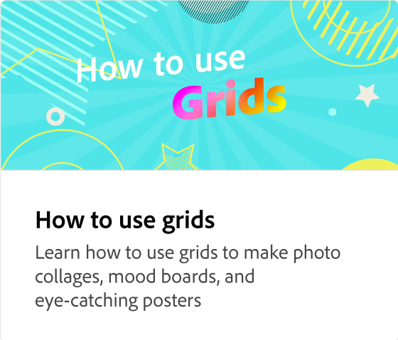

# 如何添加图像

了解将图像和图像效果添加到创意项目的所有不同方法。 用更合适的Adobe Stock图形替换模板图像。 使用“图层”面板重新排列图层、搜索新图像以及更改裁剪。 裁剪具有非破坏性，允许您随时更改裁剪的形状。

>[!VIDEO](https://video.tv.adobe.com/v/3420226?quality=12&learn=on&hidetitle=true)

## 此系列中的其他视频

<table style="table-layout:fixed">
<tr>
 <td>
      
  </td>
   <td>
      
  </td>
   <td>
      
  </td>
  <td>
      
  </td>
</tr>
<tr>
  <td>
      
  </td>
   <td>
      
  </td>
   <td>
         
   </td>
   <td>
         
   </td>
</tr>
<tr>
   <td>
   
   </td>
   <td>
   
   </td>
   <td>
   
   </td>
   <td>
      
      

       
   </td>
</tr>
</table>