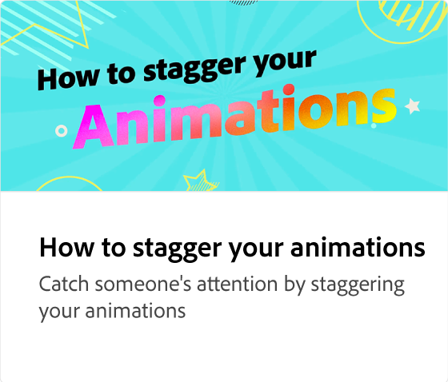

# 动画简介

了解如何在社交媒体帖子中添加动画以提高参与度。 通过选择页面上的任意元素（如图像），并应用各种类型的动画，可访问“动画”面板。

>[!VIDEO](https://video.tv.adobe.com/v/3426975?quality=12&learn=on&hidetitle=true)

## 此系列中的其他视频

<table style="table-layout:fixed">
<tr>
   <td>
         
   </td>
   <td>
         
   </td>
   <td>
         
   </td>
   <td>
         
   </td>
</tr>
<tr>
   <td>
         
   </td>
   <td>
         
   </td>
   <td>
         
   </td>
   <td>
         
   </td>
</tr>
</table>

