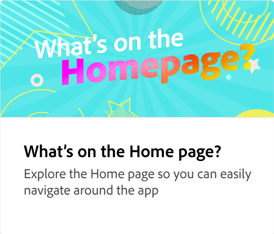
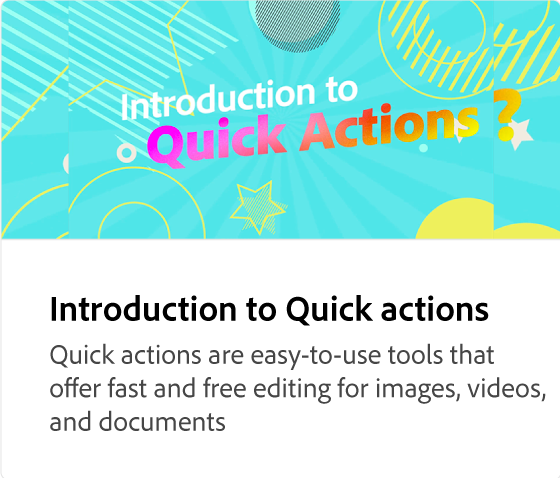

# 模板简介

探索数千个专业设计的模板，满足您的所有社交媒体和营销需求。 使用模板，可以通过合成您自己的文字和照片，快速创建自定义内容。

>[!VIDEO](https://video.tv.adobe.com/v/3426927?quality=12&learn=on&hidetitle=true)

## 此系列中的其他视频

<table style="table-layout:fixed">
<tr>
 <td>
      
 </td>
 <td>
      
 </td>
 <td>
      
      

       
   </td>
    <td>
      
      

       
   </td>
</tr>
</table>
