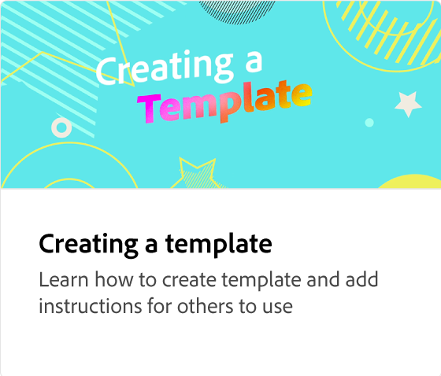
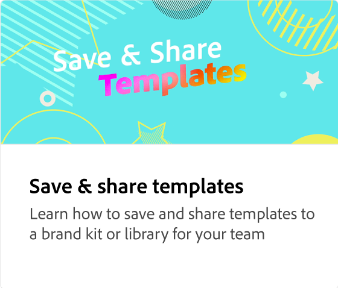

# 如何以及为何锁定图层

了解为什么锁定模板的各种元素很重要，这样才能更改它们。 不应更改某些元素（例如徽标），因此可在共享模板之前锁定这些元素。

>[!VIDEO](https://video.tv.adobe.com/v/3427095?quality=12&learn=on&hidetitle=true)

## 此系列中的其他视频

<table style="table-layout:fixed">
<tr>
   <td>
         
   </td>
   <td>
         
   </td>
   <td>
         
   </td>
   <td>
      
      

       
   </td>
</tr>
</table>
