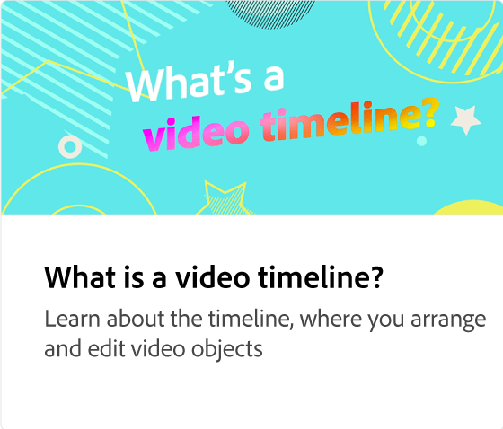

# 使用多个剪辑

了解如何向时间轴添加新视频剪辑、调整其长度、添加过渡和拆分剪辑以创建新场景。

>[!VIDEO](https://video.tv.adobe.com/v/3427091?quality=12&learn=on&hidetitle=true)

<table style="table-layout:fixed">
<tr>
   <td>
         
   </td>
  <td>
         
   </td>
   <td>
         
   </td>
   <td>
         
   </td>
</tr>
<tr>
    <td>
         
   </td>
   <td>
    
    

     
   </td>
   <td>
    
    

     
   </td>
   <td>
    
    

     
   </td>
</tr>
</table>
