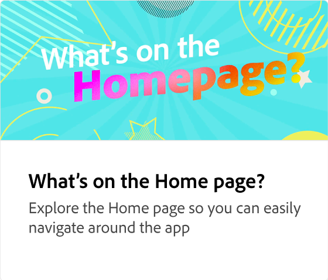
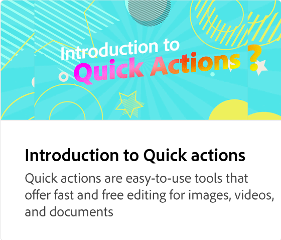
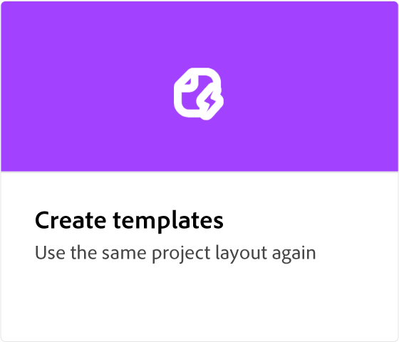

# Adobe [!DNL Express] 操作方法教程

使用由Adobe Firefly提供支持的生成式AI，开始创作令人惊叹的作品。 利用Adobe Express设计传单、TikTok、简历和作品集。

<table style="table-layout:fixed">
<tr>
 <td>
      
 </td>
 <td>
      
 </td>
 <td>
      
 </td>
 <td>
      
  </td>
</tr>
<tr>
  <td>
   
  </td>
  <td>
      
  </td>
  <td>
   
  </td>
 <td>
         
 </td>
</tr>
<tr>
  <td>
         
   </td>
  <td>
         
   </td>
  <td>
      
  </td>
  <td>
      
   </td>
</tr>
<tr>
  <td>
      
  </td>
   <td>
      
  </td>
   <td>
      
  </td>
  <td>
      
  </td>
  </tr>
<tr>
  <td>
      
  </td>
  <td>
      
  </td>
  <td>
         
   </td>
  <td>
      
      

       
   </td>
</tr>
</table>
