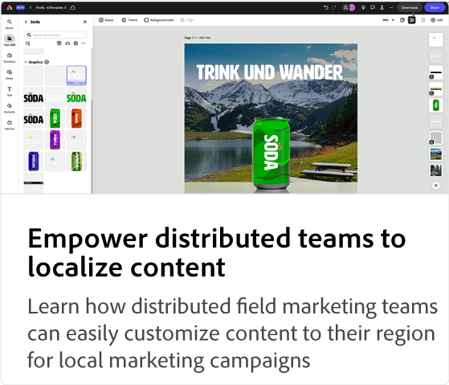

# Adobe [!DNL Express] 用例教程

了解组织中的各个团队如何能够从Adobe Express中受益。

## 新增功能

* [创建引人入胜的促销内容](compelling-merchandise.md)
了解商业团队如何在其在线商店中轻松地为新库存创建引人注目的图像
* [使营销团队能够创建多渠道内容](multi-channel-marketing-content.md)
了解活动营销团队如何创建独特的内容以吸引在线活动的观众
* [使分散的团队能够本地化内容](localized-marketing-content.md)
了解分散的现场营销团队如何轻松定制适合其所在区域的内容，以开展当地营销活动

## Adobe Express用例教程

<table style="table-layout:fixed">
<tr>
   <td>
      
  <td>
      
  <td>
      
  </td>
  <td>
      
   </td>
</tr>
<tr>
   <td>
      
   </td>
   <td>
      
   </td>
   <td>
      
   </td>
   <td>
      
   </td>
</tr>
<tr>
      <td>
      
   </td>
<td>
      
      

       
   </td>
   <td>
      
      

       
   </td>
   <td>
      
      

       
   </td>
</tr>
</table>
