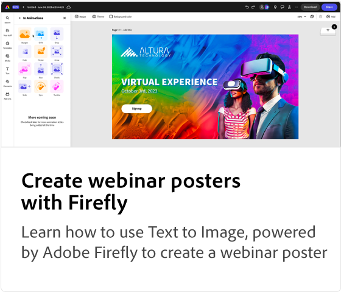

# Adobe [!DNL Express] 用例教程

了解组织中的各个团队如何能够从Adobe Express中受益。

## Adobe Express用例教程

<table style="table-layout:fixed">
<tr>
   <td>
      
  <td>
      
  </td>
  <td>
      
   </td>     
   <td>
      
   </td>
</tr>
<tr>
   <td>
      
   </td>
   <td>
      
   </td>
   <td>
      
   </td>
   <td>
      
   </td>
</tr>
</table>
