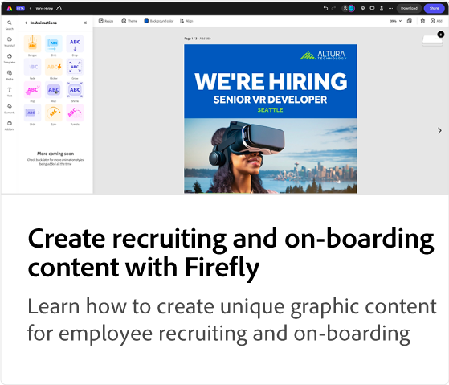
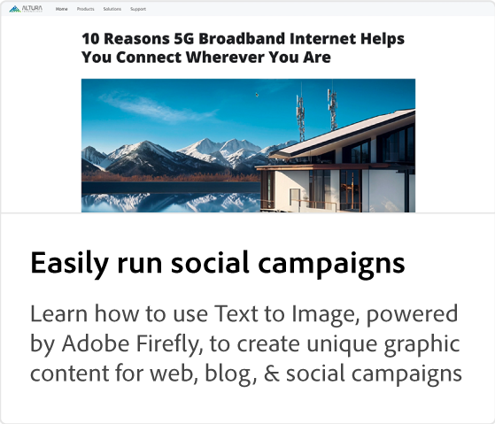

# Adobe [!DNL Express] 用例教程

了解组织中的各个团队如何能够从Adobe Express中受益。

## 新增功能

* [创建在线学习课程的促销视觉效果](promo-visual.md)
了解如何为在线学习课程创建引人入胜的视觉效果
* [制作年终视频](end-of-year-video.md)
了解如何制作鼓舞人心的年终视频
* [如何创建新闻稿](newsletter.md)
了解如何创建可用于打印、发送电子邮件或发布到Web的新闻稿首页

<table style="table-layout:fixed">
<tr>
   <td>
      
   </td>
   <td>
      
   </td>
   <td>
      
   </td>
   <td>
      
   </td>
</tr>
<tr>
   <td>
      
   </td>
   <td>
      
   </td>
   <td>
      
   </td>
   <td>
      
   </td>
</tr>
<tr>
   <td>
      
   </td>
   <td>
      
   </td>
   <td>
      
   </td>
   <td>
      
   </td>
</tr>
<tr>
   <td>
      
   </td>
   <td>
      
   </td>
   <td>
      
   </td>
   <td>
      
      

       
   </td>
</tr>
</table>
