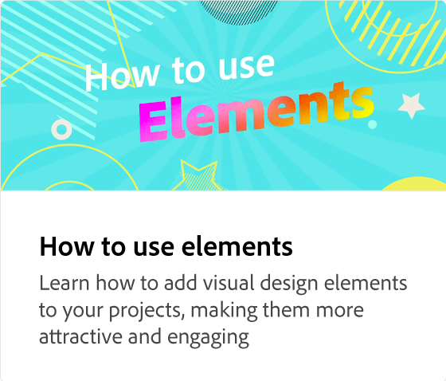

# Adobe [!DNL Express] 概述

Adobe Express是一种简单易用的创意工具，无需经验。

  

## 开始使用Adobe Express

  

>[!VIDEO](https://video.tv.adobe.com/v/3420204?quality=12&learn=on&hidetitle=true)

## Adobe Express教程

<table>
<tr>
   <td>
      
      

      <a href="get-started.md"><strong>开始使用Adobe Express</strong></a>
      

      <em>了解基本Adobe Express</em>
       
  </td>
  <td>
      
      

      <a href="adobe-express-beginners.md"><strong>Adobe Express初学者</strong></a>
      

      <em>通过学习如何创建您的第一个设计来表达自己</em>
       
  </td>
  <td>
      
      

      <a href="get-inspiration.md"><strong>快速获取灵感</strong></a>
      

      <em>不是设计师？ 没关系。 了解如何快速获得灵感Adobe Express</em>
       
  </td>
  <td>
   
    

   <a href="create-templates.md"><strong>创建模板</strong></a>
    

    <em>了解如何再次使用同一项目布局</em>
     
  </td>
</tr>
<tr>
   <td>
      
      

      <a href="add-design-assets.md"><strong>添加设计资源</strong></a>
      

      <em>了解如何自定义Instagram贴纸和帖子</em>
       
  </td>
  <td>
      
      

      <a href="group-objects.md"><strong>编组对象</strong></a>
      

      <em>了解如何调整文本和图像的大小</em>
       
  </td>
  <td>
      
      

      <a href="layers.md"><strong>选择和移动图层</strong></a>
      

      <em>对贴纸和文本与图层进行移动、重新排序或重叠</em>
       
  </td>
  <td>
      
      

      <a href="multiple-pages.md"><strong>创建多个页面</strong></a>
      

      <em>了解如何向项目中添加多个页面</em>
       
  </td>
</tr>
<tr>
   <td>
      
      

      <a href="undo-redo.md"><strong>撤消和重做</strong></a>
      

      <em>了解如何撤消和重做动作</em>
       
  </td>
  <td>
      
      

      <a href="cc-libraries.md"><strong>使用CC Libraries</strong></a>
      

      <em>了解如何与团队共享CC Library资源</em>
       
  </td>
  <td>
      
      

      <a href="brand.md"><strong>应用您的品牌</strong></a>
      

      <em>了解如何向任何模板添加徽标和品牌颜色</em>
       
  </td>
  <td>
      
      

      <a href="google-drive.md"><strong>Google Drive集成</strong></a>
      

      <em>了解如何从Google Drive导入图像</em>
       
  </td>
</tr>
<tr>
    <td>
      
      

      <a href="remove-background.md"><strong>删除背景</strong></a>
      

      <em>了解如何从照片中删除背景</em>
       
  </td>
  <td>
      
      

      <a href="refine-cutout.md"><strong>优化木刻</strong></a>
      

      <em>了解如何优化您的剪切块</em>
       
  </td>
  <td>
      
      

      <a href="text-effects.md"><strong>使用文本效果</strong></a>
      

      <em>了解如何添加投影、形状和轮廓化文本</em>
       
  </td>
  <td>
      
      

      <a href="image-effects.md"><strong>使用图像效果</strong></a>
      

      <em>了解如何使图像变亮和变暗</em>
       
  </td>
  <td>
      
      

      <a href="create-curved-text.md"><strong>创建曲线文本</strong></a>
      

      <em>了解如何在项目中创建曲线文本</em>
       
  </td>
</tr>
</table>
