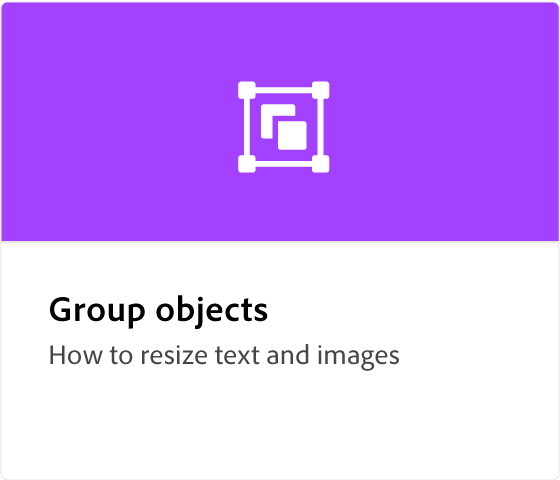
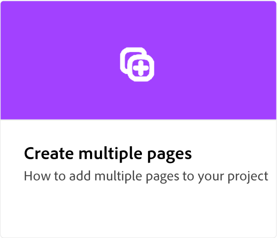
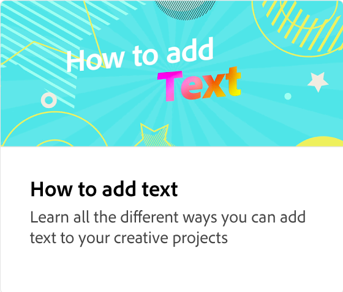

# Adobe [!DNL Express] 概述

Adobe Express是一种易于使用的创意工具，无需经验。

  

## 使用Adobe Express创建您的第一个设计

  

>[!VIDEO](https://video.tv.adobe.com/v/3420225?quality=12&learn=on&hidetitle=true)

## Adobe Express教程

<table style="table-layout:fixed">
<tr>
   <td>
      
  </td>
  <td>
      
  <td>
      
  <td>
      
  </td>
</tr>
<tr>
 <td>
      
  </td>
  <td>
      
  </td>
  <td>
      
  </td>
 <td>
   
  </td>
</tr>
<tr>
   <td>
      
  </td>
   <td>
   
  </td>
   <td>
         
   </td>
   <td>
         
   </td>
</tr>
<tr>
  <td>
         
   </td>
  <td>
      
  </td>
  <td>
      
   </td>
 <td>
      
  </td>
</tr>
<tr>
  <td>
      
  </td>
   <td>
      
  </td>
  <td>
      
  </td>
  <td>
      
  </td>
</tr>
<tr>
 <td>
      
  </td>
  <td>
      
  </td>
   <td>
      
   </td>
   <td>
      
      

       
   </td>
</tr>
</table>
