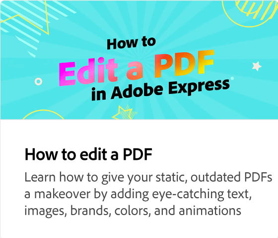

# 如何移除任何图像的背景

了解如何使用快速操作一键移除图像中的背景。 删除背景后，即可下载您的图像并将其用于多种用途。

>[!VIDEO](https://video.tv.adobe.com/v/3420220?quality=12&learn=on&hidetitle=true)

## 此系列中的其他视频

<table style="table-layout:fixed">
<tr>
   <td>
         
   </td>
   <td>
         
   </td>
   <td>
         
   </td>
   <td>
      
   </td>   
</tr>
<tr>
    <td>
      
   </td>
   <td>
      
   </td>
   <td>
      
   </td>
   <td>
      
   </td>
</tr>
</table>
