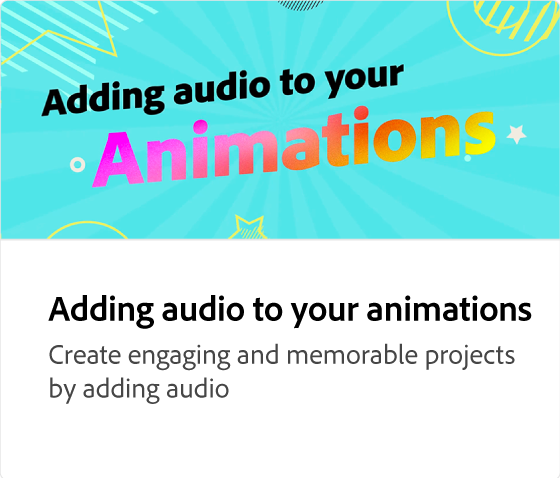

# 如何调整动画大小

了解如何使用适用于社交媒体帖子(例如Instagram)的内置预设优化动画的大小。 无论如何调整动画大小，设置都会保留，因此您无需重新生成它们。

>[!VIDEO](https://video.tv.adobe.com/v/3426984?quality=12&learn=on&hidetitle=true)

## 此系列中的其他视频

<table style="table-layout:fixed">
<tr>
   <td>
         
   </td>
  <td>
         
   </td>
   <td>
         
   </td>
   <td>
         
   </td>
</tr>
<tr>
    <td>
         
   </td>
   <td>
         
   </td>
   <td>
         
   </td>
   <td>
         
   </td>
</tr>
</table>
