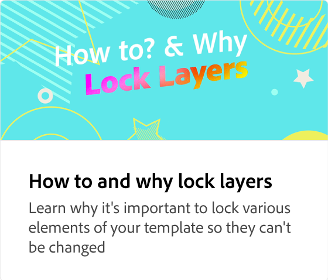

# 保存和共享模板

了解如何保存模板并将其共享到团队的品牌套件或库中。

>[!VIDEO](https://video.tv.adobe.com/v/3427098?quality=12&learn=on&hidetitle=true)

## 此系列中的其他视频

<table style="table-layout:fixed">
<tr>
    <td>
            
    </td>
    <td>
         
    </td>
    <td>
            
    </td>
    <td>
      
      

       
    </td>
</tr>
</table>
