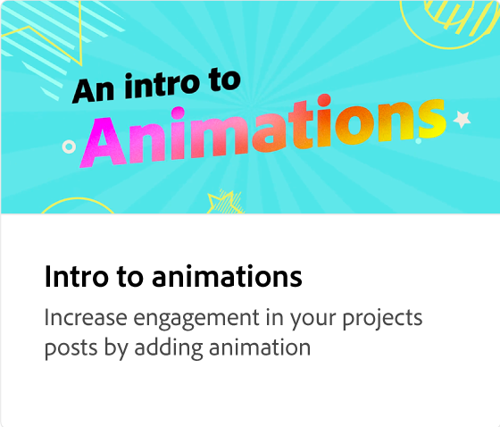
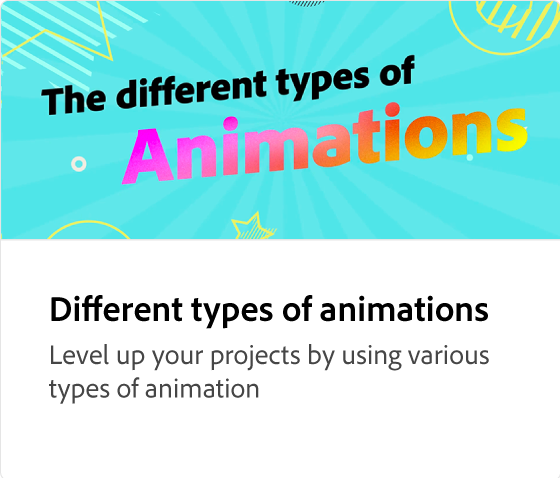
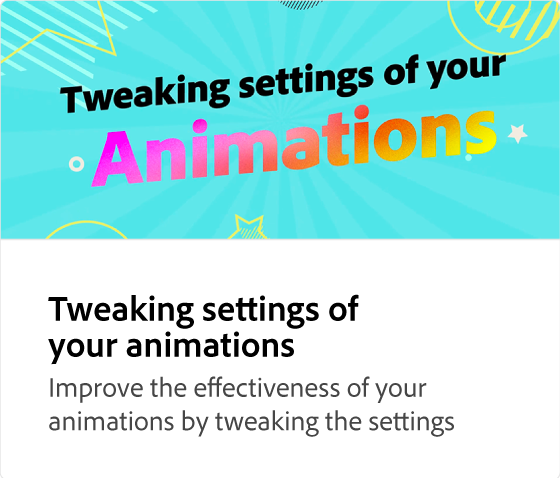
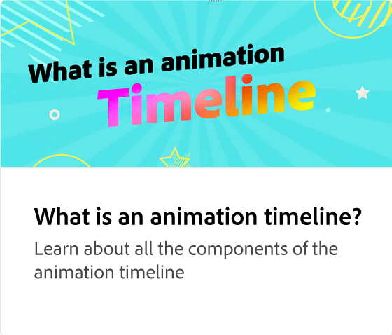
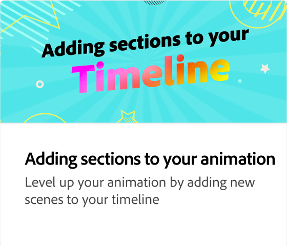
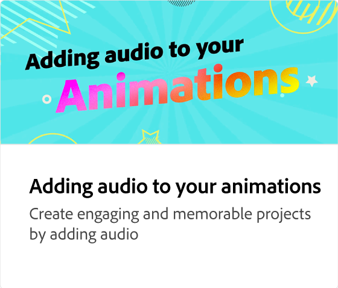
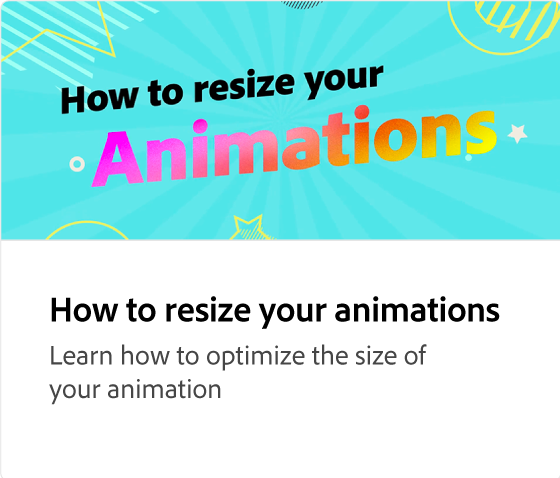
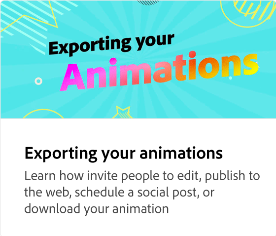

# 如何错开动画

了解如何错开动画，以得到理想的行为来吸引某人的注意力。 调整不同元素的时机，以便更轻松地阅读消息。

>[!VIDEO](https://video.tv.adobe.com/v/3426981?quality=12&learn=on&hidetitle=true)

## 此系列中的其他视频

<table style="table-layout:fixed">
<tr>
   <td>
         
   </td>
   <td>
         
   </td>
   <td>
         
   </td>
   <td>
         
   </td>
</tr>
<tr>
   <td>
         
   </td>
   <td>
         
   </td>
   <td>
         
   </td>
   <td>
         
   </td>
</tr>
</table>
