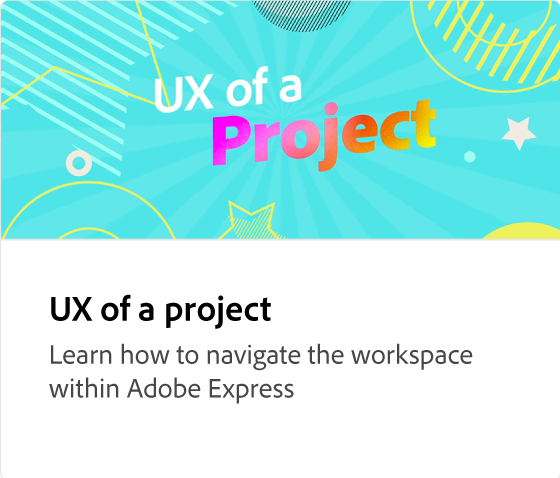
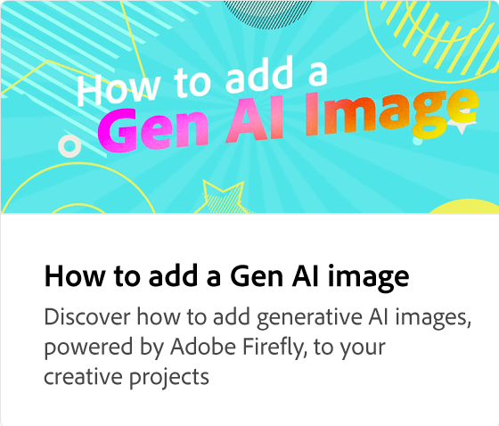

# 如何添加文本

了解向创意项目添加文本的所有不同方法，包括编辑、移动和删除文本图层、更改字体、调整文本大小和版面、对齐文本、更改填充颜色和轮廓、添加投影以及使用形状和剪切文本。 推荐的字体旨在激发灵感。

>[!VIDEO](https://video.tv.adobe.com/v/3420222?quality=12&learn=on&hidetitle=true)

## 此系列中的其他视频

<table style="table-layout:fixed">
<tr>
 <td>
      
  </td>
   <td>
      
  </td>
   <td>
      
  </td>
  <td>
      
  </td>
</tr>
<tr>
   <td>
      
  </td>
   <td>
      
  </td>
   <td>
         
   </td>
    <td>
         
   </td>
</tr>
<tr>
   <td>
   
   </td>
   <td>
   
   </td>
   <td>
   
   </td>
   <td>
      
      

       
   </td>
</tr>
</table>