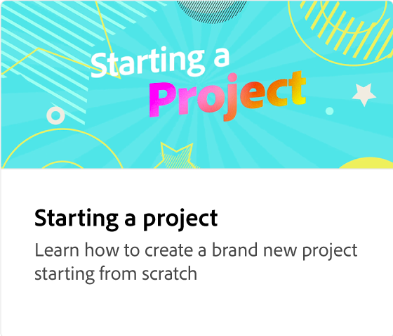

# 项目的UX

了解如何在Adobe Express中导航工作区。 工作区包含强大的搜索功能，可用于查找背景、音频模板和照片。 您可以访问自己的品牌和模板，并搜索特定主题。 可以从设备上传媒体或从Adobe Stock collection中选择媒体。 设计资源、背景、形状和图标可在项目中使用。 此外，您还可以邀请同事协作处理项目设计。

>[!VIDEO](https://video.tv.adobe.com/v/3426932?quality=12&learn=on&hidetitle=true)

## 此系列中的其他视频

<table style="table-layout:fixed">
<tr>
 <td>
      
  </td>
   <td>
      
  </td>
   <td>
      
  </td>
   <td>
      
  </td>
</tr>
<tr>
   <td>
      
  </td>
   <td>
      
  </td>
   <td>
         
   </td>
    <td>
         
   </td>
</tr>
<tr>
    <td>
   
   </td>
   <td>
   
   </td>
   <td>
   
   </td>
    <td>
      
      

       
   </td>
</tr>
</table>