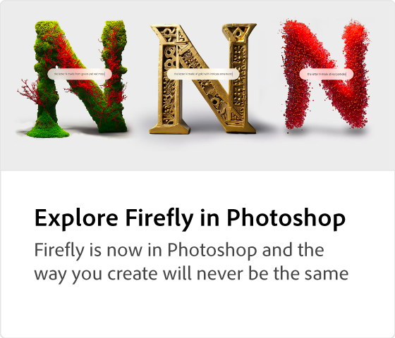

# Adobe [!DNL Firefly] 概述

萤火虫是新一代有创造力的AI模型，即将推出Adobe产品，最初侧重于图像和文本效果的生成。 Firefly提供了新方式来创意、创建和沟通，同时显著改善了创意工作流程。

  

## 看看你能用Adobe Firefly

  

>[!VIDEO](https://video.tv.adobe.com/v/3416970t1?quality=12&learn=on&hidetitle=true)

## 了解有关Adobe萤火虫的更多信息

<table style="table-layout:fixed">
<tr>
   <td>
      
  </td>
  <td>
      
  </td>
  <td>
      
  </td>
  <td>
    
    

     
  </td>
</tr>
</table>

## Firefly教程

<table style="table-layout:fixed">
<tr>
  <td>
      
  </td>
   <td>
      
  </td>
  <td>
    
    

     
  </td>
  <td>
    
    

     
  </td>
</tr>
</table>
