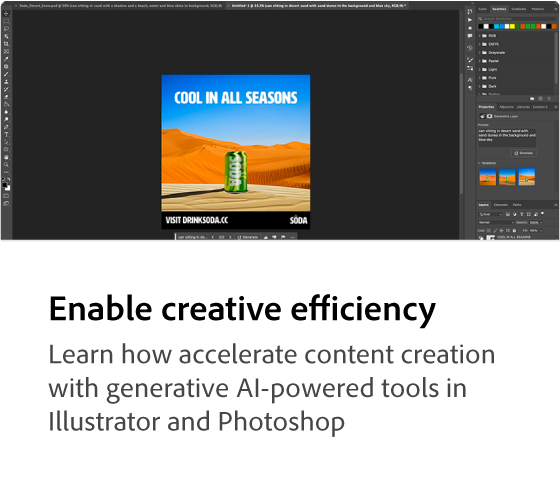
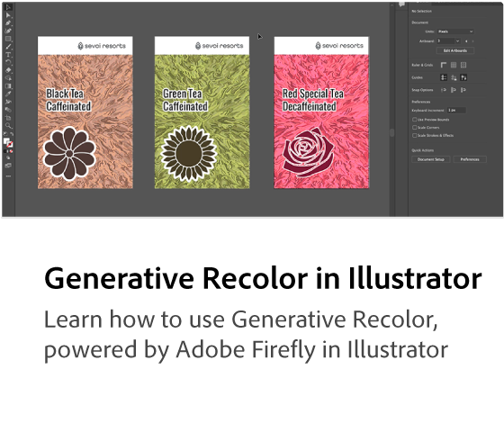

# Adobe [!DNL Firefly] 概述

Firefly是Adobe产品中提供的新一代创意生成式AI模型，最初侧重于图像和文本效果的生成。 Firefly提供了构思、创建和沟通的新方法，同时显着改进了创意工作流程。

  

## 看看您可以使用Adobe Firefly做些什么

  

>[!VIDEO](https://video.tv.adobe.com/v/3416970t1?quality=12&learn=on&hidetitle=true)

## 了解有关Adobe Firefly的更多信息

<table style="table-layout:fixed">
<tr>
   <td>
      
  </td>
  <td>
      
  </td>
  <td>
      
  </td>
  <td>
    
    

     
  </td>
</tr>
</table>

## Firefly教程

<table style="table-layout:fixed">
<tr>
   <td>
      
   </td>
   <td>
      
   </td>
   <td>
      
   </td>
  <td>
      
  </td>
</tr>
<tr>
<td>
      
  </td>
<td>
      
  </td>
  <td>
    
    

     
  </td>
  <td>
    
    

     
  </td>
</tr>
</table>
