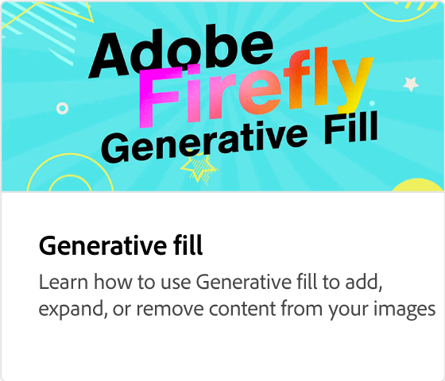

# Adobe [!DNL Firefly] 概述

萤火虫是新一代有创造力的AI模型，即将推出Adobe产品，最初侧重于图像和文本效果的生成。 Firefly提供了新方式来创意、创建和沟通，同时显著改善了创意工作流程。

  

## 看看你能用Adobe萤火

  

>[!VIDEO](https://video.tv.adobe.com/v/3416970t1?quality=12&learn=on&hidetitle=true)

## 了解有关Adobe萤火虫的更多信息

<table>
<tr>
   <td>
      
      

      <a href="https://firefly.adobe.com/" target="_blank"><strong>Adobe Firefly（测试版）</strong></a>
      

      <em>加入Adobe萤火虫测试版计划。</em>
       
  </td>
  <td>
      
      

      <a href="https://www.adobe.com/sensei/generative-ai/firefly.html" target="_blank"><strong>在Photoshop中探索萤火虫</strong></a>
      

      <em>萤火虫现在在Photoshop中，你创建的方式将一去不复返</em>
       
  </td>
  <td>
      
      

      <a href="webinar-experimenting.md"><strong>尝试Firefly网络研讨会</strong></a>
      

      <em>加入Howard Pinsky的行列，因为他将在本网络研讨会深入了解Firefly测试版</em>
       
  </td>
  <td>
      
      

      <a href="generative-fill.md"><strong>Photoshop中的生成型填充</strong></a>
      

      <em>了解如何使用由Adobe Firefly提供支持的生成填充</em>
       
  </td>
</tr>
<tr>
   <td>
      
      

      <a href="web-banner-ad.md"><strong>Photoshop中的横幅广告变体</strong></a>
      

      <em>了解如何使用创成式填充加快Web广告横幅的创建</em>
       
  </td>
  <td>
    
    

     
  </td>
  <td>
    
    

     
  </td>
  <td>
    
    

     
  </td>
</table>
