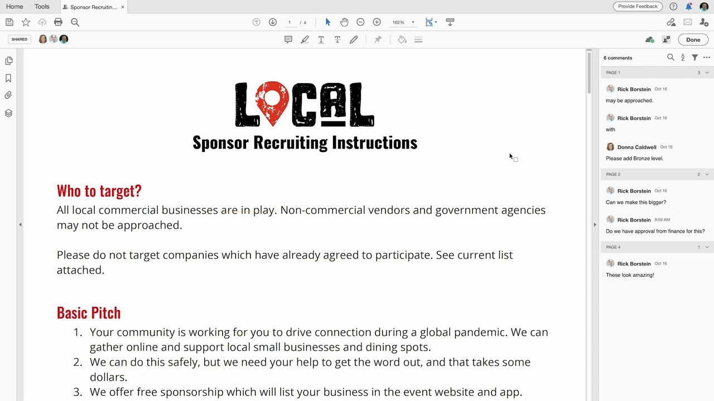
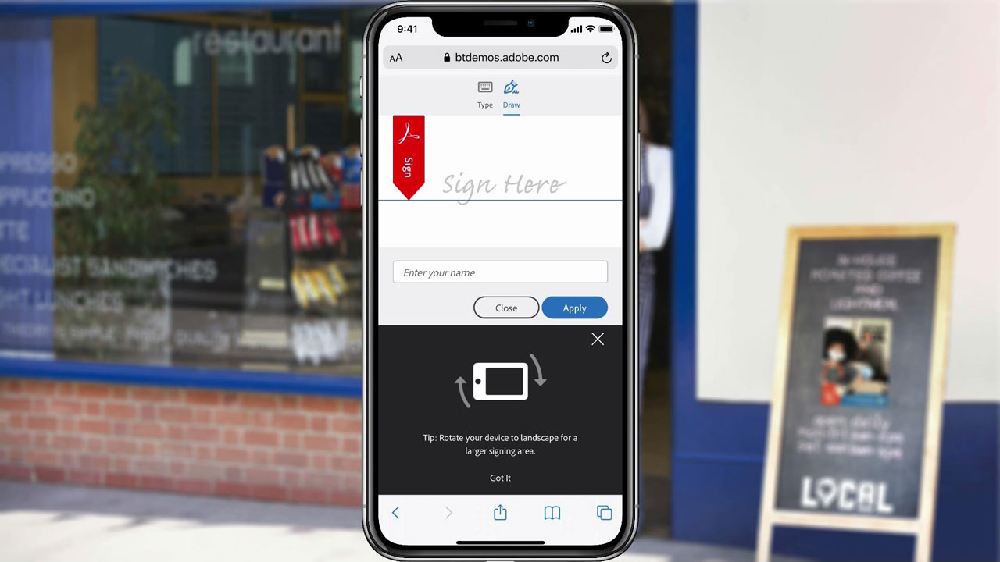
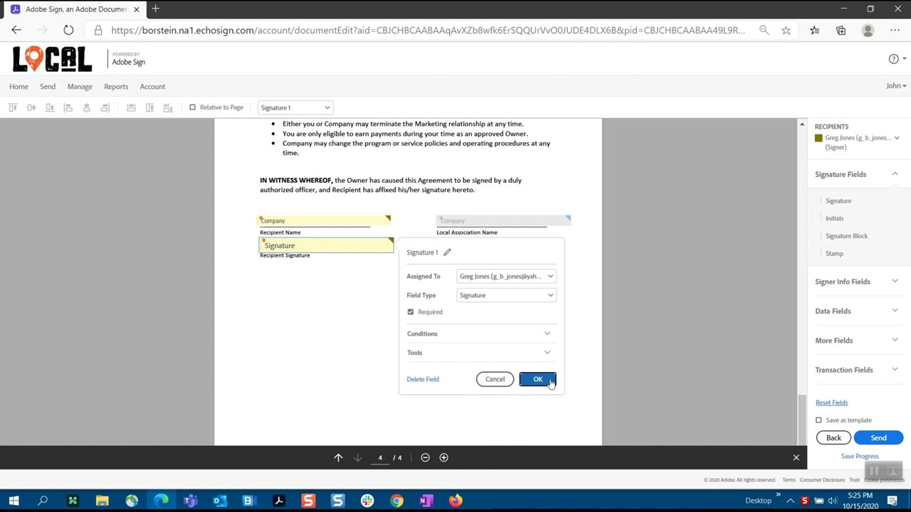
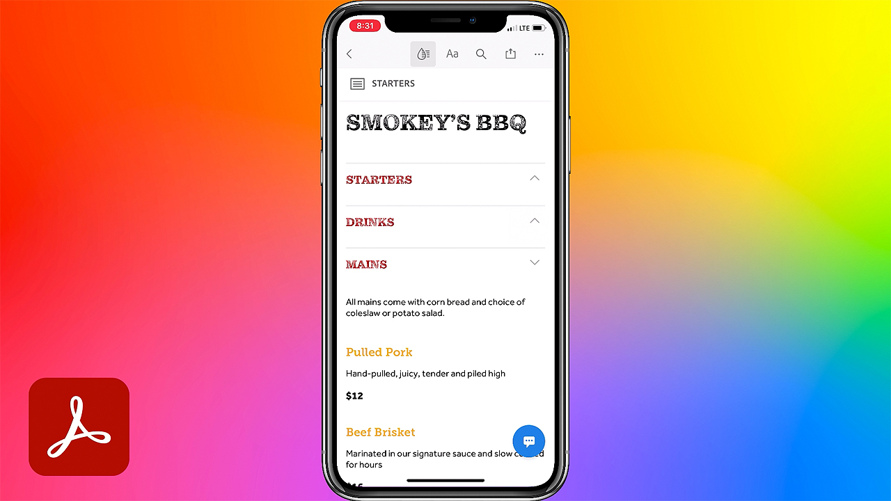
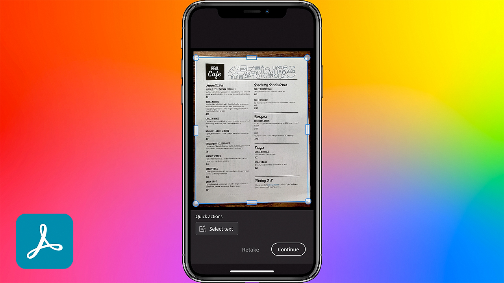

# Acrobat &amp; Sign

借助Adobe Document Cloud(包括世界领先的PDF和电子签名解决方案)，您可以将手动文档流程转变为有效的数字流程。 现在，您的团队可以随时随地在您喜爱的Microsoft和企业应用程序中，跨多个屏幕和设备，对文档、工作流和任务执行快速操作。

## 浏览产品Tutorials

<table style="table-layout:fixed">
<tr>
 <td>
   
    

   <a href="acrobat-sign.md#tutorial1"><strong>发起Acrobat共享审阅</strong></a>
    

    <em>邀请审阅人将其注释添加到PDF文档</em>
     
  </td>
  <td>
    
    

    <a href="acrobat-sign.md#tutorial2"><strong>使用Adobe Sign创建在线弃权Forms</strong></a>
    

    <em>将文档快速转换为在线表单并将其发布到网上，供需要它们的任何人填写和签名</em>
     
  </td>
  <td>
   
    

    <a href="acrobat-sign.md#tutorial3"><strong>请求使用Adobe Sign签名</strong></a>
    

    <em>从Word转到PDF并发送以供使用Adobe Sign签名</em>
     
  </td>
</tr>
<tr>
 <td>
   
    

   <a href="acrobat-sign.md#tutorial4"><strong>使用Liquid Mode在移动设备上查看菜单</strong></a>
    

    <em>使用Liquid Mode增强在移动设备上PDF的阅读体验</em>
     
  </td>
  <td>
    
    

    <a href="acrobat-sign.md#tutorial5"><strong>从手机将文档扫描为PDF</strong></a>
    

    <em>借助Adobe Scan，轻松捕获文档、表单、名片和白板并将其转换为高质量的AdobePDF</em>
     
  </td>
  <td>
    
    

     
  </td>
</tr>
</table>

## 发起Acrobat共享审阅(3:49) {#tutorial1}

>[!VIDEO](https://video.tv.adobe.com/v/326777?hidetitle=true)

**说明**
邀请审阅人将其注释添加到PDF文档。

在本教程中，您将学习如何：
* 托管PDF在Document Cloud中添加注释
* 在一个位置收集注释
* 同时注释鼓励协作

**Adobe审阅和注释选项比较PDF**

**提供者：**
Dan Armstrong，解决方案顾问（数字媒体）Rick Borstein，解决方案咨询高级经理（数字媒体）

## 使用Adobe Sign创建在线弃用Forms(5:19) {#tutorial2}

>[!VIDEO](https://video.tv.adobe.com/v/326776?hidetitle=true)

**说明**
将文档快速转换为在线表单并将其发布到网上，供需要它们的任何人填写和签名。

在本教程中，您将学习如何：
* 将纸质表单转换为数字文档，实现数字化
* 将数字表单发布到您的网站，以便客户可以从自己的设备访问这些表单
* 已填写完的表单将自动存档以供您记录

**提供者：**
Taylor Kobey，解决方案顾问（数字媒体）Emily Palmer，解决方案顾问（数字媒体）

## 请求使用Adobe Sign签名(3:21) {#tutorial3}

>[!VIDEO](https://video.tv.adobe.com/v/326801?hidetitle=true)

**说明**
从Word转到PDF并发送以请求使用Adobe Sign签名。

在本教程中，您将学习如何：
* 利用您每天使用的工具来发送数字文档以供签名

**提供者：**
Rick Borstein，解决方案咨询高级经理（数字媒体）

## 使用Liquid Mode在移动设备上查看菜单(2:57) {#tutorial4}

>[!VIDEO](https://video.tv.adobe.com/v/327093?hidetitle=true)

**说明**
使用Liquid Mode增强在移动设备上PDF的阅读体验。

在本教程中，您将学习如何：
* 使PDF文件响应移动设备
* 增强您的PDF布局
* 即时添加功能以帮助您在手机和平板电脑上轻松阅读文档

**提供者：**
Emilie Enke，联合解决方案顾问（数字媒体）

## 从手机将PDF扫描文档(5:53) {#tutorial5}

>[!VIDEO](https://video.tv.adobe.com/v/327094?hidetitle=true)

**说明**
借助Adobe Scan，轻松捕获文档、表单、名片和白板并将其转换为高质量的AdobePDF。

在本教程中，您将学习如何：
* 使用手机捕获文档、表单、名片和白板并将其转换为高质量的AdobePDF
* 自动识别和锐化手写或打印的文本，同时删除不需要的元素，如眩光和阴影
* 在Acrobat Reader中打开扫描的PDF，以添加注释、批注并与团队审阅

**提供者：**
Emilie Enke，联合解决方案顾问（数字媒体）

**Acrobat和Adobe Sign资源**

[学习和支持](https://helpx.adobe.com/support/document-cloud.html) 是更多教程的中心， [新增功能](https://helpx.adobe.com/acrobat/using/whats-new.html)、以及社区论坛链接。

**2020年10月版**

开始使用这些功能（等等！） 从您的Creative Cloud桌面应用程序下载最新更新。
