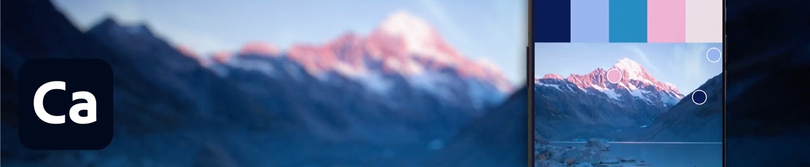

# [!DNL Capture]

Adobe [!DNL Capture] 将手机和平板电脑转变为设计收藏工具。 用户可以创建许多不同类型的资源（图稿的单个数字元素）。   这些资源会自动与其他桌面和移动Adobe应用程序同步。 用户可以将其导入到其创意项目中，或轻松地与协作者共享。

## 浏览产品Tutorials

<table style="table-layout:fixed">
<tr>
 <td>
   
    

   <a href="capture.md#tutorial1"><strong>从周围的世界捕捉灵感</strong></a>
    

    <em>使用Adobe Capture中强大的选择和颜色编辑工具来显着更改图像，以满足您的企业品牌推广需求</em>
     
  </td>
  <td>
    
    

     
  </td>
  <td>
    
    

     
  </td>
</tr>
</table>

## 从周围的世界捕捉灵感(2:56) {#tutorial1}

>[!VIDEO](https://video.tv.adobe.com/v/326825?hidetitle=true)

**描述**
将移动设备上的图像和视频转换为适合您所有设计的创意构建块。

在本教程中，您将了解如何：
* 随时随地设计
* 通过CC库与桌面应用程序集成
* 访问数千个Adobe Fonts

**呈列方式：**
解决方案顾问Emily Palmer （数字媒体）

**[!DNL Capture]资源**

[学习和支持](https://helpx.adobe.com/mobile-apps/help/capture-faq.html) 是其他教程和社区论坛链接的中心。

**2020年十月版**

开始使用这些功能（以及更多功能！） 从Creative Cloud桌面应用程序下载最新更新。
