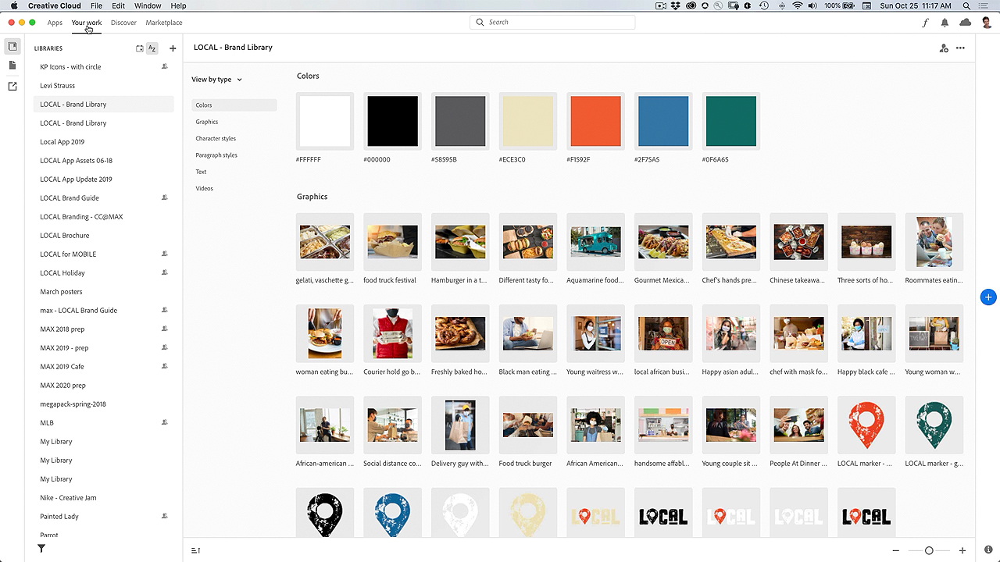

# Creative Cloud 桌面应用程序

Creative Cloud桌面应用程序是您管理CC应用程序、服务和协作等的中心！

## 浏览产品Tutorials

<table style="table-layout:fixed">
<tr>
 <td>
   
    

   <a href="creativeclouddesktopapp.md#tutorial1"><strong>探索CC桌面应用程序：您的Creative Cloud中心</strong></a>
    

    <em>Creative Cloud桌面应用程序是您管理CC应用程序、服务和协作等的中心！</em>
     
  </td>
  <td>
    
    

     
  </td>
  <td>
    
    

     
  </td>
</tr>
</table>

## 探索CC桌面应用程序：您的Creative Cloud中心(2:50) {#tutorial1}

>[!VIDEO](https://video.tv.adobe.com/v/327095?hidetitle=true)

**描述**
Creative Cloud桌面应用程序是您管理CC应用程序、服务和协作等的中心！

在本教程中，您将了解如何：
* 启动和更新桌面应用程序
* 查找移动和Web应用程序
* 管理和共享资源
* 访问Adobe Fonts
* 发现教程
* 在 Behance 上共享您的作品。

**呈列方式：**
Patti Sokol，首席解决方案顾问（数字媒体）
