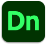

# [!DNL Dimension]

使用高质量的模型、素材和光源，更快地3D创建引人入胜的内容。 [!DNL Dimension] 可以轻松构建品牌可视化效果、插图、产品模型、包装设计和其他创意作品。

## 浏览产品Tutorials

<table style="table-layout:fixed">
<tr>
 <td>
   
    

   <a href="dimension.md#tutorial1"><strong>将Substance素材应用于3D模型</strong></a>
    

    <em>Substance素材在单一素材中支持数千种图案和设计变化</em>
     
  </td>
  <td>
    
    

     
  </td>
  <td>
    
    

     
  </td>
</tr>
</table>

## 将Substance素材应用于3D模型(11:42) {#tutorial1}

>[!VIDEO](https://video.tv.adobe.com/v/326944?hidetitle=true)

**描述**
Substance素材在单一素材中支持数千种不同的图案和设计。

在本教程中，您将了解如何：
* 用高质量的模型、素材和光源，更快地3D创建引人入胜的内容

**呈列方式：**
Jim Babbage，高级解决方案顾问（数字媒体）

**Dimension资源**

[学习和支持](https://helpx.adobe.com/support/dimension.html) 是其他教程的中心， [新增功能](https://helpx.adobe.com/dimension/user-guide.html/dimension/using/whats-new.ug.html)，并提供指向社区论坛的链接。

**2020年十月版**

开始使用这些功能（以及更多功能！） 从Creative Cloud桌面应用程序下载最新更新。
