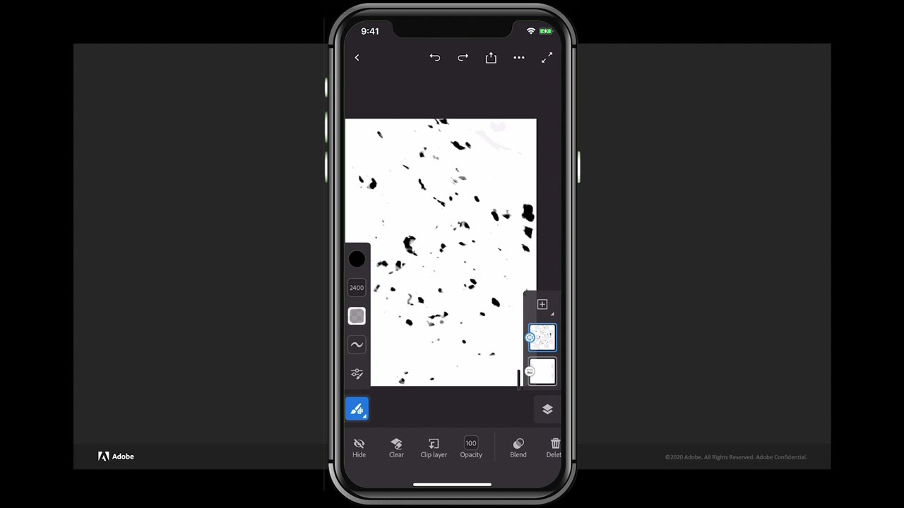

# Fresco

Adobe Fresco是一个跨平台的应用程序，它使用基于画笔的方法将矢量和栅格工作流程与云文档相结合，以创建图画作品。

## 浏览产品Tutorials

<table style="table-layout:fixed">
<tr>
 <td>
   
    

   <a href="fresco.md#tutorial1"><strong>使用Adobe Fresco绘图简介</strong></a>
    

    <em>使用AdobeFresco中强大的选择和颜色编辑工具来显着更改图像，以满足您的企业品牌推广需求</em>
     
  </td>
  <td>
   
    

   <a href="fresco.md#tutorial2"><strong>创建纹理图稿 — Fresco到Illustrator</strong></a>
    

    <em>在Adobe Fresco中绘制纹理，了解如何在Illustrator中使用它们</em>
     
  </td>
  <td>
    
    

     
  </td>
</tr>
</table>

## 使用Adobe Fresco绘图简介(19:07) {#tutorial1}

>[!VIDEO](https://video.tv.adobe.com/v/326946?hidetitle=true)

**描述**
发现Adobe Fresco ，它通过将矢量和栅格工作流程与云文档相结合，使用基于画笔的方法创建绘图和绘画。

在本教程中，您将了解如何：
* 使用独特的模拟水彩和油画的实时画笔，以及您最喜爱的像素和矢量画笔
* 通过分层不同的画笔和利用蒙版创建纹理效果
* 使用适用于iPhone的新Fresco应用程序随时随地创建
* 将您的作品导出为多种格式，以便在其他移动应用程序和桌面应用程序中使用

**呈列方式：**
Liz Tanonis，解决方案顾问（数字媒体）

## 创建纹理图稿 — Fresco到Illustrator (4:10) {#tutorial2}

>[!VIDEO](https://video.tv.adobe.com/v/326947?hidetitle=true)

**描述**
在Adobe Fresco中绘画和绘制纹理，并了解如何在Illustrator中使用它们。

在本教程中，您将了解如何：
* 在Adobe Fresco应用程序中为iPhone创建图稿，并将其导出以在其他Creative Cloud应用程序中使用
* 使用Illustrator中的“图像描摹”工具将图稿转换为矢量
* 在Illustrator中将手工纹理应用于矢量图稿

**呈列方式：**
Liz Tanonis，解决方案顾问（数字媒体）

**Fresco资源**

[学习和支持](https://helpx.adobe.com/support/adobe-fresco.html) 是其他教程的中心， [新增功能](https://helpx.adobe.com/fresco/using/whats-new.html)，并提供指向社区论坛的链接。

**2020年十月版**

开始使用这些功能（以及更多功能！） 从Creative Cloud桌面应用程序下载最新更新。
