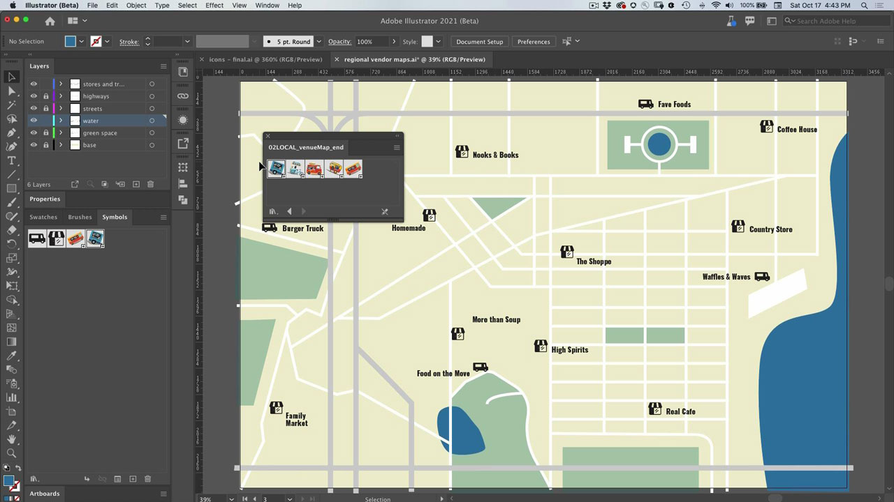
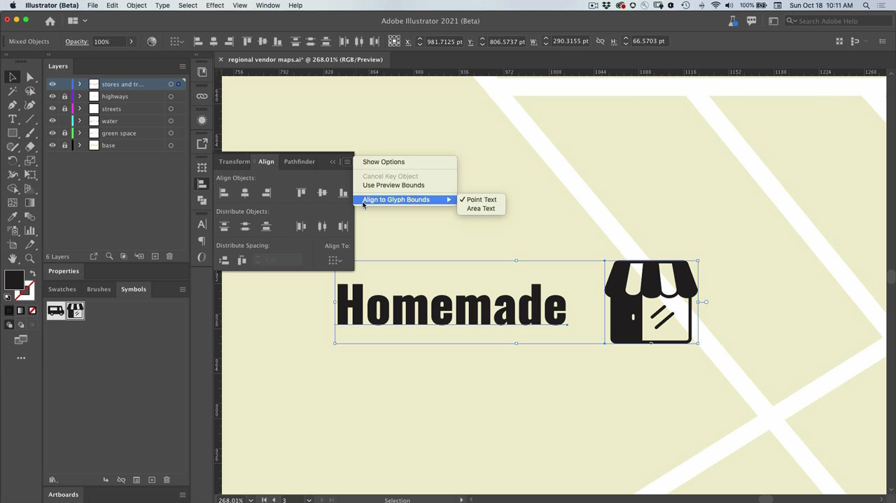

# Illustrator

用于插图和图形的现代应用程序。 创建可以想象的用于Web、移动设备或打印的徽标、图标、插图以及任何其他设计。

## 浏览产品Tutorials

<table style="table-layout:fixed">
<tr>
 <td>
   
    

   <a href="illustrator.md#tutorial1"><strong>使用元件更新多个图标实例</strong></a>
    

    <em>减少手动操作，并与符号保持一致性</em>
     
  </td>
  <td>
    
    

    <a href="illustrator.md#tutorial2"><strong>使用字形对齐功能对齐文本和图像</strong></a>
    

    <em>将字形快速对齐到文档的重要区域</em>
     
  </td>
  <td>
    
    

     
  </td>
</tr>
</table>

## 使用元件更新多个图标实例(5:08) {#tutorial1}

>[!VIDEO](https://video.tv.adobe.com/v/326816?hidetitle=true)

**描述**
减少手动操作，并与符号保持一致性。

在本教程中，您将了解如何：
* 减少手动操作，并与符号保持一致性

**呈列方式：**
Patti Sokol，首席解决方案顾问（数字媒体）

## 使用字形对齐功能对齐文本和图像(6:48) {#tutorial2}

>[!VIDEO](https://video.tv.adobe.com/v/326817?hidetitle=true)

**描述**
将字形快速对齐到文档的重要区域。

在本教程中，您将了解如何：
* 将字形快速对齐到文档的重要区域

**呈列方式：**
Patti Sokol，首席解决方案顾问（数字媒体）

**Illustrator资源**

[学习和支持](https://helpx.adobe.com/support/illustrator.html) 是其他教程和社区论坛链接的中心。

**2020年十月版**

开始使用这些功能（以及更多功能！） 从Creative Cloud桌面应用程序下载最新更新。
