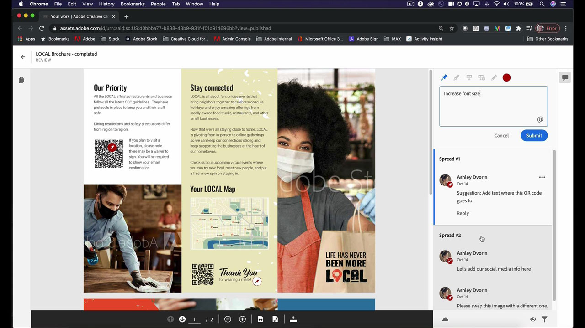
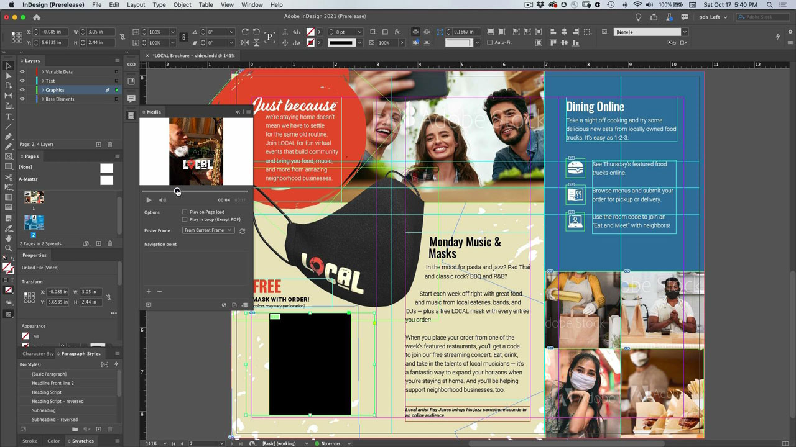
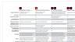

# InDesign

业界标准的应用程序，用于为印刷和数字出版创建精美的文档。 创建丰富的数字和印刷体验，从电子书和电子杂志，到书籍、报告和白皮书。

## 浏览产品Tutorials

<table style="table-layout:fixed">
<tr>
 <td>
    
    

    <a href="indesign.md#tutorial1"><strong>生成二维码</strong></a>
    

    <em>生成链接到网站的二维码</em>
     
  </td>
  <td>
   
    

   <a href="indesign.md#tutorial2"><strong>InDesign的共享以供审阅</strong></a>
    

    <em>为设计人员及其团队成员提供无缝的创意审阅体验</em>
     
  </td>
  <td>
    
    

    <a href="indesign.md#tutorial3"><strong>从PDF审阅导入Document Cloud注释</strong></a>
    

    <em>将PDF中的注释直接导入InDesign，并快速应用请求的更改</em>
     
  </td>
</tr>
<tr>
<td>
   
    

   <a href="indesign.md#tutorial4"><strong>将视频文件添加到InDesign文档</strong></a>
    

    <em>将视频添加到InDesign。 输出到PDF和在线发布</em>
     
  </td>
 <td>
    
    

     
 </td>
 <td>
    
    

     
 </td>
</tr>
</table>

## 生成二维码(2:34) {#tutorial1}

>[!VIDEO](https://video.tv.adobe.com/v/326818?hidetitle=true)

**描述**
生成链接到网站的二维码。

在本教程中，您将了解如何：
* 通过移动设备免费访问Web内容
* 让您的客户感到安全
* 数字意味着可以轻松地使内容保持最新

**呈列方式：**
Patti Sokol，首席解决方案顾问（数字媒体）

## InDesign中的“共享以供审阅”(4:04) {#tutorial2}

>[!VIDEO](https://video.tv.adobe.com/v/326824?hidetitle=true)

**描述**
“InDesign共享以供审阅”可为设计人员及其团队成员提供更加流畅的创意审阅体验。

在本教程中，您将了解如何：
* 直接从InDesign启动审阅，而无需创建PDF
* 在Web浏览器中审阅和添加注释
* 在一个位置收集多个利益相关者的反馈
* 在应用程序内管理反馈，您可以立即进行更改。

**Adobe审阅和注释选项比较PDF**

**呈列方式：**
解决方案顾问Emily Palmer （数字媒体）

## 从PDF审阅导入Document Cloud注释(4:52) {#tutorial3}

>[!VIDEO](https://video.tv.adobe.com/v/326959?hidetitle=true)

**描述**
将PDF中的注释直接导入InDesign，并快速应用请求的更改。

在本教程中，您将了解如何：
* 支持现有PDF注释工作流程
* 适用于从多个源合并的PDF

**Adobe审阅和注释选项比较PDF**

**呈列方式：**
Michael Murphy，高级解决方案顾问（数字媒体）

## 将视频文件添加到InDesign文档(5:58) {#tutorial4}

>[!VIDEO](https://video.tv.adobe.com/v/326757?hidetitle=true)

**描述**
将视频添加到InDesign。 输出到PDF和在线发布。

在本教程中，您将了解如何：
* 向InDesign添加视频
* 输出到PDF和在线发布

**呈列方式：**
Patti Sokol，首席解决方案顾问（数字媒体）

**InDesign资源**

[学习和支持](https://helpx.adobe.com/support/indesign.html) 是其他教程的中心， [新增功能](https://helpx.adobe.com/indesign/user-guide.html/indesign/using/whats-new.ug.html)，并提供指向社区论坛的链接。

**2020年十月版**

开始使用这些功能（以及更多功能！） 从Creative Cloud桌面应用程序下载最新更新。
