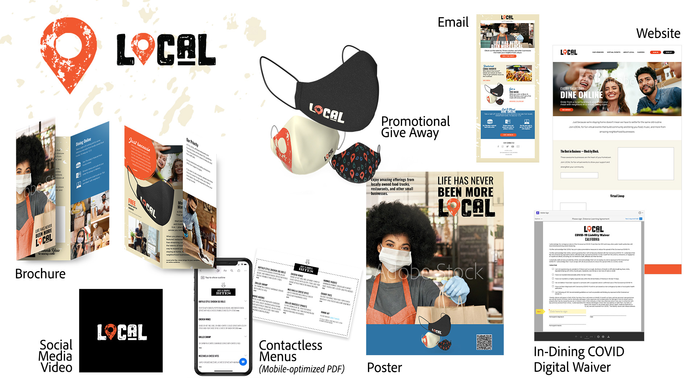

# MAX 2020 — 企业会话

作为企业创意人员，您需要与分散的团队协作，建立可扩展的流程，并遵守公司系统和指导原则。 这些教程将帮助您从企业角度了解Creative Cloud2021版的新增功能。

## 大规模运营 — 利用AEM Assets和InDesign Server的强大功能(26:54)

>[!VIDEO](https://video.tv.adobe.com/v/327112?hidetitle=true)

**说明**

您的创意员工是否花费了太多时间在手动重复性工作上？ 帮助您的组织充分利用创意专业人士。 AEM和InDesign Server等企业系统可以为创意人员和制作人员提供将内容快速推送到目标受众手中的方式。

在此录制的实时会话中，您将看到以下各项中基于模板的工作流程示例：
* Adobe Experience Manager (AEM) Assets是一种数字资源管理(DAM)解决方案，可与Adobe Creative Cloud集成以帮助DAM用户与创意团队合作，从而简化内容创作过程中的协作
* Adobe InDesign Server是一个版面和合成引擎，可通过集成到其他系统中来为自动化出版解决方案提供支持

**呈列方式：**

Eric Rowse，高级解决方案顾问（数字媒体） Derek Lu，首席解决方案顾问（概念验证）

## 新常态下的新工具(29:57)

>[!VIDEO](https://video.tv.adobe.com/v/328232?hidetitle=true)

**说明**

WFH带来了挑战，但也迫使创意人员及其公司尝试新的工具和新的创作方式。 在新的iPad版本中探索熟悉的工具，例如Illustrator和Photoshop，然后在平板电脑(iPad、Microsoft Surface)上以及现在的iPhone上Fresco绘图！

通过此现场录制课程，您将了解如何：
* 在Fresco中使用各种画笔和阴影技术来创建手绘的营销活动图稿
* 在iPad上的Illustrator中创建和共享损坏的图标以匹配品牌推广
* 在iPad上使用Illustrator随时随地合成来自Fresco和iPadPhotoshop的图稿，为我们的社交媒体渠道创建内容

**呈列方式：**

Dave Weinberg，高级解决方案顾问（数字媒体） Liz Tanonis，解决方案顾问（数字媒体） Emilie Enke，解决方案顾问（数字媒体）

## 使用CC Libraries进行协作(27:58)

>[!VIDEO](https://video.tv.adobe.com/v/328199?hidetitle=true)

**说明**

使用Adobe Creative Cloud Libraries，您可以直接从喜爱的Creative Cloud应用程序中管理、整理和访问您的徽标、颜色等。 更高效地工作，确保创意一致性，并轻松地与您的团队保持同步。

在本教程中，您将了解如何：
* 在所有创意应用程序中轻松找到所需的资源
* 使整个组织中的传播者能够在保持控制的同时创建品牌化体验

**呈列方式：**

Ashley Dvorin，高级解决方案顾问（数字媒体） Emily Palmer，解决方案顾问（数字媒体）

## 关于演示资源：本地

团队与企业一样尝试了创建演示资源。 我们设想了营销活动，并为各种渠道创建了资源。 我们还创建了品牌元素的CC库以支持协作和一致性。

为应对COVID-19，一家举办欢乐怪诞节日现场活动的公司LOCAL已转向在线聚会，并与当地小型快餐车和餐厅合作推广其业务，并帮助它们保持营业。

