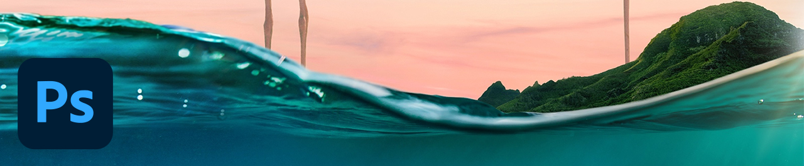

# Photoshop

Photoshop是世界一流的图像处理和图形设计软件，可让专业人士在不同设备上尽情发挥创意。 现在，任何人都可以在灵感迸发时创造自己想象的一切。 如果你能想得到，你就能利用Photoshop。

## 浏览产品Tutorials

<table style="table-layout:fixed">
<tr>
 <td>
   
    

   <a href="photoshop.md#tutorial1"><strong>编辑图像以匹配您的营销活动</strong></a>
    

    <em>使用Adobe Photoshop中功能强大的选择工具和颜色编辑工具显著更改图像，以满足企业品牌推广需求</em>
     
  </td>
  <td>
    
    

    <a href="photoshop.md#tutorial2"><strong>选择并替换天空</strong></a>
    

    <em>自动选择图像中的天空并用您选择的天空替换，自动调整图像的颜色以匹配您的选区</em>
     
  </td>
  <td>
    
    

     
  </td>
</tr>
</table>

## 编辑图像以匹配您的营销活动(5:45) {#tutorial1}

>[!VIDEO](https://video.tv.adobe.com/v/326950?hidetitle=true)

**说明**
使用Adobe Photoshop中功能强大的选择工具和颜色编辑工具显著更改图像，以满足企业品牌推广需求。

在本教程中，您将学习如何：
* 对象选择工具可让选择项目变得更快、更简单
* 内容识别填充可以更好地控制源图像中的样本区域，以便更好地仿制和修补目标区域
* 画笔可以采用不同的形状，以获得更好的效果
* Adobe Sensei帮助将人工智能用于日常任务

**提供者：**
A.J Wood，高级解决方案顾问（数字媒体）

## 选择并替换天空(2:16) {#tutorial2}

>[!VIDEO](https://video.tv.adobe.com/v/326953?hidetitle=true)

**说明**
自动选择图像中的天空并用您选择的天空替换，自动调整图像的颜色以匹配您的选区。

在本教程中，您将学习如何：
* “天空替换”提供了一键式解决方案，可立即替换图像中的天空
* “天空替换”会将其输出连同每个蒙版、调整和图像一起存储为一个图层组，以供进一步调整

**提供者：**
A.J Wood，高级解决方案顾问（数字媒体）

**Photoshop Resources**

[学习和支持](https://helpx.adobe.com/support/photoshop.html) 是更多教程的中心， [新增功能](https://helpx.adobe.com/photoshop/using/whats-new.html)、以及社区论坛链接。

**2020年10月版**

开始使用这些功能（等等！） 从您的Creative Cloud桌面应用程序下载最新更新。
