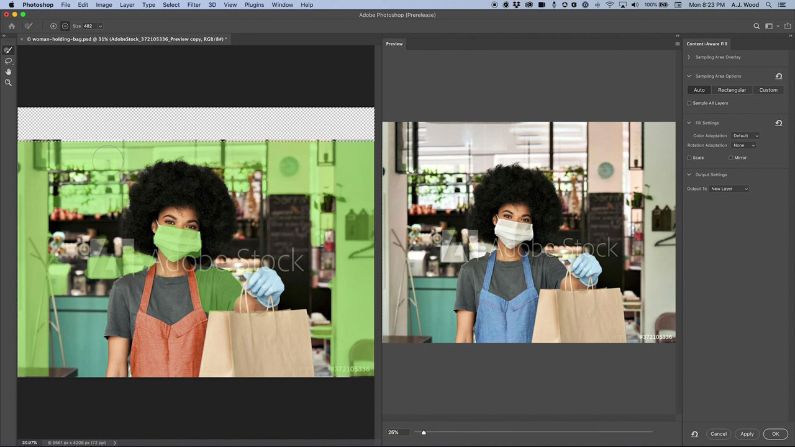
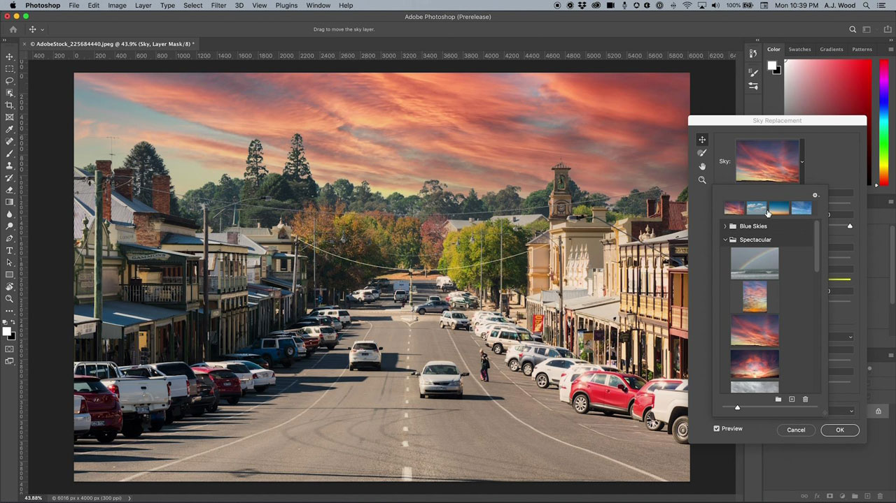

# Photoshop

Photoshop是世界上最好的图像处理和图形设计软件，让专业人士能够跨设备发挥无限的创造力。 现在，任何人都可以随心所欲地创作出自己想象的任何作品，任何地方都能激发灵感。 想想看，用Photoshop就行了。

## 浏览产品Tutorials

<table style="table-layout:fixed">
<tr>
 <td>
   
    

   <a href="photoshop.md#tutorial1"><strong>编辑图像以匹配您的营销活动</strong></a>
    

    <em>使用Adobe Photoshop中强大的选择和颜色编辑工具来显着更改图像，以满足您的企业品牌推广需求</em>
     
  </td>
  <td>
    
    

    <a href="photoshop.md#tutorial2"><strong>选择并替换天空</strong></a>
    

    <em>自动选择图像中的天空，并替换为您选择的天空，自动调整图像的颜色以匹配您的选择</em>
     
  </td>
  <td>
    
    

     
  </td>
</tr>
</table>

## 编辑图像以匹配您的营销活动(5:45) {#tutorial1}

>[!VIDEO](https://video.tv.adobe.com/v/326950?hidetitle=true)

**描述**
使用Adobe Photoshop中强大的选择和颜色编辑工具来显着更改图像，以满足您的企业品牌推广需求。

在本教程中，您将了解如何：
* 使用“对象选择”工具，可以更快速、更轻松地选择项目
* 内容识别填充允许更好地控制源图像中的样本区域，以便更好地仿制和修补目标区域
* 画笔可以是不同的形状，以获得更好的效果
* Adobe Sensei有助于利用人工智能执行普通任务

**呈列方式：**
高级解决方案顾问A.J Wood （数字媒体）

## 选择并替换天空(2:16) {#tutorial2}

>[!VIDEO](https://video.tv.adobe.com/v/326953?hidetitle=true)

**描述**
自动选择图像中的天空，并替换为您选择的天空，自动调整图像的颜色以匹配您的选区。

在本教程中，您将了解如何：
* 天空替换提供了一键式解决方案，可立即替换图像中的天空
* 天空替换会将其输出保存为图层组，其中包含每个蒙版、调整和图像，以供进一步优化

**呈列方式：**
高级解决方案顾问A.J Wood （数字媒体）

**Photoshop资源**

[学习和支持](https://helpx.adobe.com/support/photoshop.html) 是其他教程的中心， [新增功能](https://helpx.adobe.com/photoshop/using/whats-new.html)，并提供指向社区论坛的链接。

**2020年十月版**

开始使用这些功能（以及更多功能！） 从Creative Cloud桌面应用程序下载最新更新。
