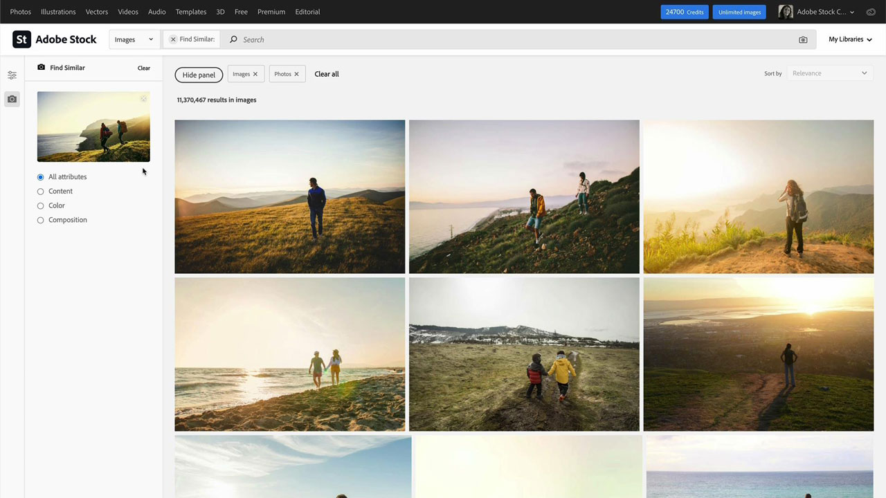
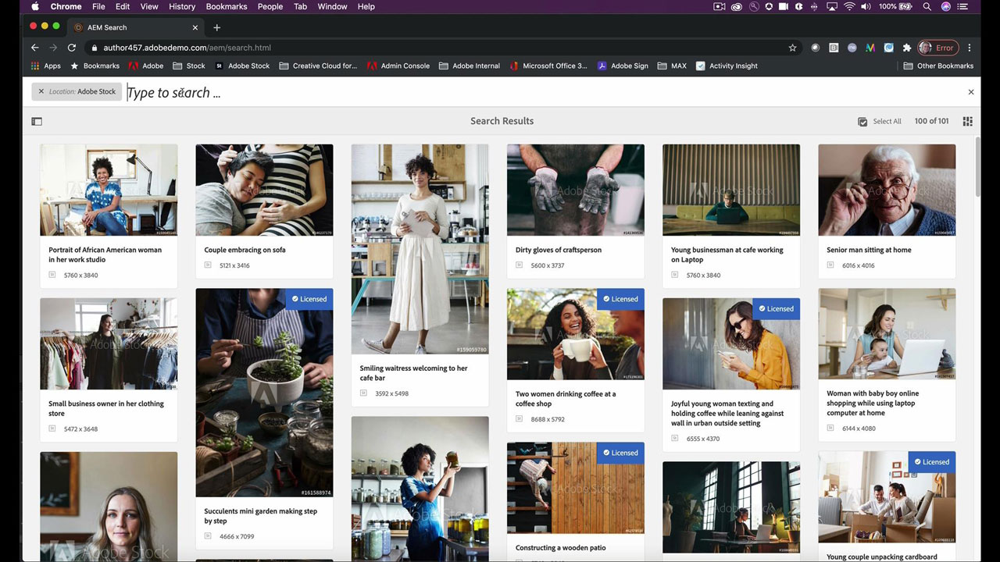

# [!DNL Stock]

创意人员面临着快速提供新的、具有视觉吸引力的内容的压力，这些内容将吸引人们的目光。 Adobe [!DNL Stock] 通过企业版，创意团队可以访问超过2亿张图像、视频、模板、插图、音频文件和3D资源 — 所有这些资源都可从Adobe创意应用程序中获得，并且它们每天都在使用。

## 浏览产品Tutorials

<table style="table-layout:fixed">
<tr>
 <td>
   
    

   <a href="stock.md#tutorial1"><strong>利用Adobe更快地查找最佳资源 [!DNL Stock]</strong></a>
    

    <em>使用由我们的人工智能引擎Adobe Sensei提供支持的更好、更快的搜索结果，查找完美的免版税Stock图像，以增强您的创意项目</em>
     
  </td>
  <td>
   
    

   <a href="stock.md#tutorial2"><strong>搜索和许可 [!DNL Stock] Adobe Experience Manager中的资源</strong></a>
    

    <em>简化上传许可Adobe的过程 [!DNL Stock] 将资源导入数字资源管理系统</em>
     
  </td>
  <td>
    
    

     
  </td>
</tr>
</table>

## 利用Adobe更快地查找最佳资源 [!DNL Stock] (10:49) {#tutorial1}

>[!VIDEO](https://video.tv.adobe.com/v/326951?hidetitle=true)

**描述**
使用由我们的人工智能引擎Adobe Sensei支持的更好、更快的搜索结果，查找完美的免版税Stock图像，以增强您的创意项目。

在本教程中，您将了解如何：
* 在搜索高品质图像和视频时减少时间和压力
* 在企业范围内轻松管理和跟踪资源许可证和使用情况
* 直接在Adobe Creative Cloud应用程序中搜索、预览和授予许可

**呈列方式：**

维多利亚·托雷斯， [!DNL Stock] 解决方案顾问（数字媒体）

## 搜索和许可 [!DNL Stock] AEM中的资源(6:46) {#tutorial2}

>[!VIDEO](https://video.tv.adobe.com/v/326952?hidetitle=true)

**描述**
简化上传许可Adobe的过程 [!DNL Stock] 将资源导入数字资源管理系统。

在本教程中，您将了解如何：
* 执行Adobe [!DNL Stock] 无需离开AEM工作区即可搜索资源
* 在许可时将已许可资源直接保存到AEM文件夹
* 在以下位置查看从AEM许可的资源： [!DNL Stock] 上的许可历史记录 [!DNL Stock] 网站。

**呈列方式：**
解决方案顾问Emily Palmer （数字媒体）

![[!DNL Stock] 徽标](../assets/st_appicon_96.png)

**Adobe [!DNL Stock] 资源**

[学习和支持](https://helpx.adobe.com/support/stock.html) 是其他教程和社区论坛链接的中心。

**2020年十月版**

开始使用这些功能（以及更多功能！） 从Creative Cloud桌面应用程序下载最新更新。
