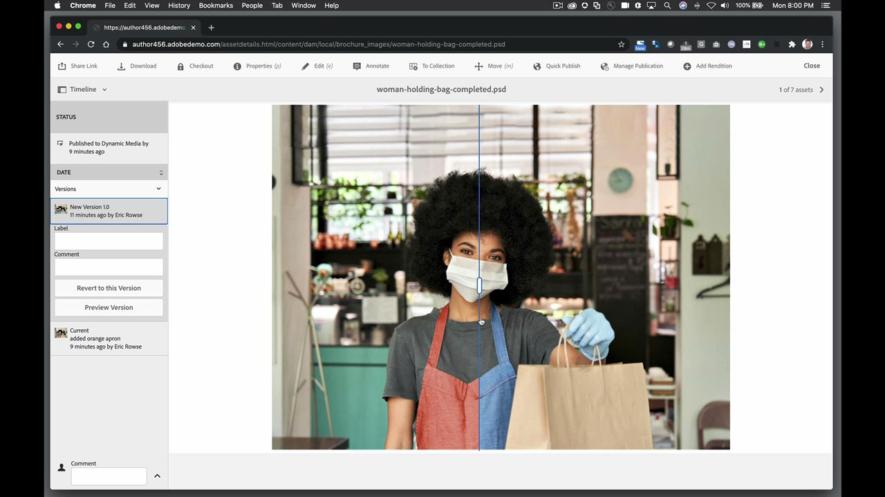
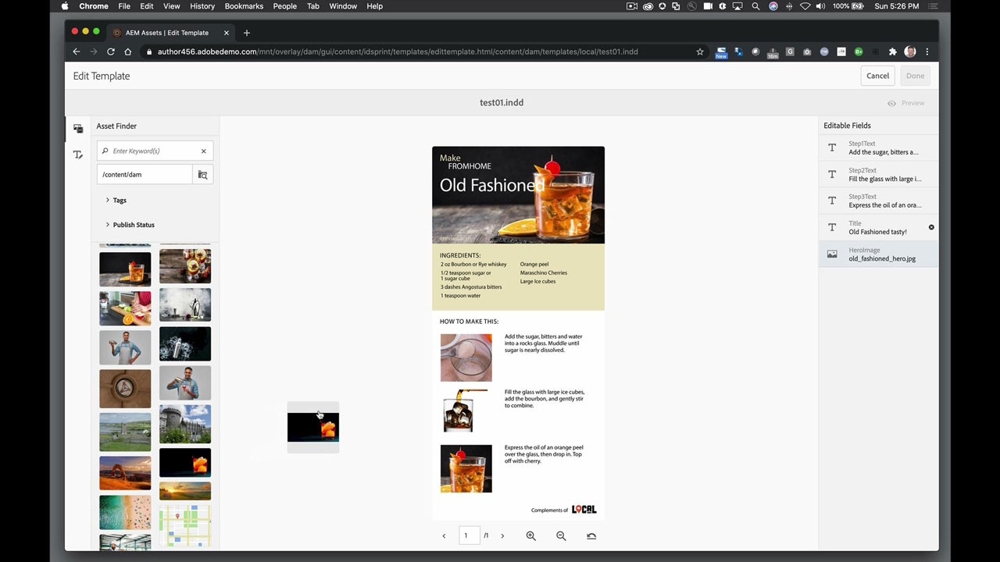
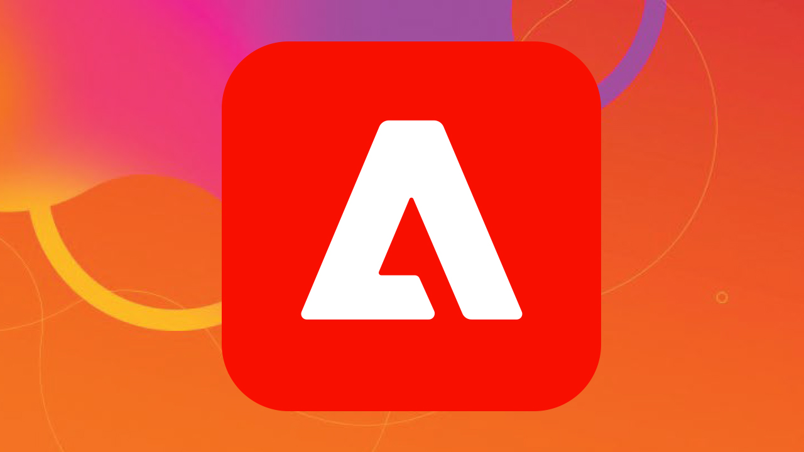

# AEM Assets和资源链接

Adobe Experience Manager是面向企业和中型企业的行业领先的数字体验管理解决方案。 它为提供引人注目的体验提供了一个可扩展的现代基础，这些体验可促进品牌参与、推动需求并提高客户忠诚度。 Experience Manager包括一整套工具，用于创建、管理和提供跨所有渠道的数字体验。

## 浏览产品Tutorials

<table style="table-layout:fixed">
<tr>
 <td>
   
    

   <a href="aem.md#tutorial1"><strong>AEM和资产链接</strong></a>
    

    <em>使用Asset Link对存储在AEM中的资源进行实时更新</em>
     
  </td>
   <td>
   
    

   <a href="aem.md#tutorial2"><strong>InDesign文件托管于AEM中</strong></a>
    

    <em>将InDesign文档托管在AEM中，以便多个用户可以同时创建内容变体</em>
     
  </td>
  <td>
    
    

     
  </td>
</tr>
</table>

## AEM和资产链接(5:45) {#tutorial1}

>[!VIDEO](https://video.tv.adobe.com/v/326828?hidetitle=true)

**描**
述使用Asset Link对存储在AEM中的资源进行实时更新。

在本教程中，您将学习如何：
* 使用专用面板搜索和浏览设计程序内的资源，在需要时找到所需内容
* 直接从您的设计计划轻松上传资源
* 将DAM中的资产登记到您的设计计划中，以进行实时更新

**演示者：Eric**
Rowse，高级解决方案顾问（数字媒体）

## InDesign文件托管在AEM中(3:16) {#tutorial2}

>[!VIDEO](https://video.tv.adobe.com/v/326829?hidetitle=true)

**描**
述在AEM中托管InDesign文档，以便多个用户可以同时创建内容变体。

在本教程中，您将学习如何：
* 将InDesign文件上载到AEM以进行常见存储访问
* 安全地创建变体，而不必担心会破坏源文件
* 文档字段是预先设置的格式，允许快速编辑或更改内容

**演示者：Eric**
Rowse，高级解决方案顾问（数字媒体）

<table style="table-layout:fixed">
<tr>
 <td>
   
    

   <a href="https://www.adobe.com/marketing/experience-manager.html"><strong>Adobe Experience Manager</strong></a>
    

    <em>适合您的内容和数字资产管理需求的强大组合</em>
     
  </td>
  <td>
   
    

   <a href="https://www.adobe.com/marketing/experience-manager-assets.html"><strong>AEM Assets</strong></a>
    

    <em>新一代数字资产管理</em>
     
  </td>
  <td>
   
    

   <a href="https://www.adobe.com/marketing/experience-manager-assets/benefits.html"><strong>AEM Assets:优势</strong></a>
    

    <em>让您的数字资产为您所用</em>
     
  </td>
</tr>
</table>

**资源链接和AEM资源**

[学习和支](https://helpx.adobe.com/support/experience-manager.html) 持是您的中心，可以获取更多教程、新增功能以及社区论坛链接。

**2020年10月版**

开始使用这些功能（等等！） 从Creative Cloud桌面应用程序下载最新更新。
