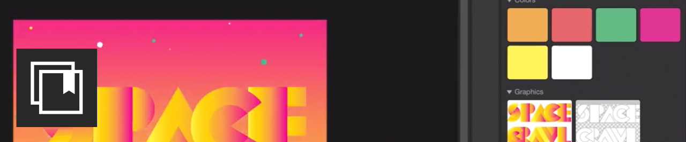
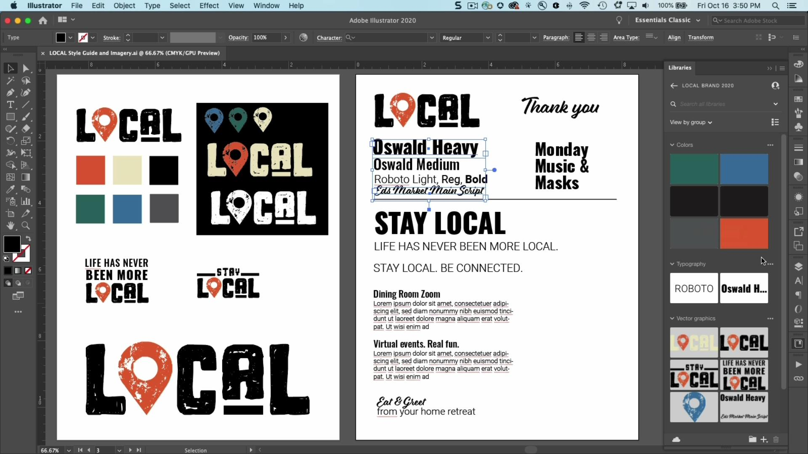
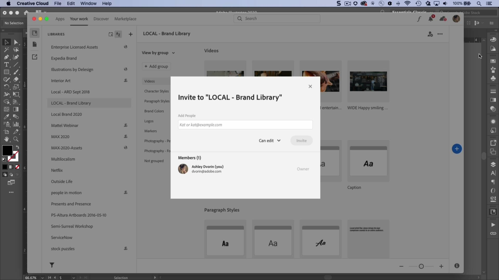

# CC Libraries

让您的资源随时可用，让您的项目始终保持品牌特色。

## 浏览产品Tutorials

<table style="table-layout:fixed">
<tr>
 <td>
   
    

   <a href="cclibraries.md#tutorial1"><strong>创建CC Libraries</strong></a>
    

    <em>借助Adobe Creative Cloud Libraries，您可以在喜爱的Creative Cloud应用程序中管理、组织和访问徽标、颜色等</em>
     
  </td>
   <td>
   
    

   <a href="cclibraries.md#tutorial2"><strong>共享CC Libraries</strong></a>
    

    <em>更高效地工作、确保创意一致性并轻松与团队保持同步</em>
     
  </td>
  <td>
    
    

     
  </td>
</tr>
</table>

## 创建CC Libraries(4:38) {#tutorial1}

>[!VIDEO](https://video.tv.adobe.com/v/326802?hidetitle=true)

**说明**
借助Adobe Creative Cloud Libraries，您可以在喜爱的Creative Cloud应用程序中管理、组织和访问徽标、颜色等。

在本教程中，您将学习如何：
* 让您的资源随时可用，让您的项目保持品牌特色
* 新! 与Adobe XD完全集成

**提供者：**
Ashley Dvorin，高级解决方案顾问（数字媒体）

## 共享CC Libraries(4:14) {#tutorial2}

>[!VIDEO](https://video.tv.adobe.com/v/326803?hidetitle=true)

**说明**
更高效地工作、确保创意一致性并轻松与团队保持同步。

在本教程中，您将学习如何：
* 让您的资源随时可用，让您的项目保持品牌特色
* 直接从您喜爱的应用程序轻松协作处理项目

**提供者：**
Ashley Dvorin，高级解决方案顾问（数字媒体）

**CC Libraries资源**

[学习和支持](https://helpx.adobe.com/creative-cloud/help/libraries.html) 是更多教程、新增功能和社区论坛链接的中心。

**2020年10月版**

开始使用这些功能（等等！） 从您的Creative Cloud桌面应用程序下载最新更新。
