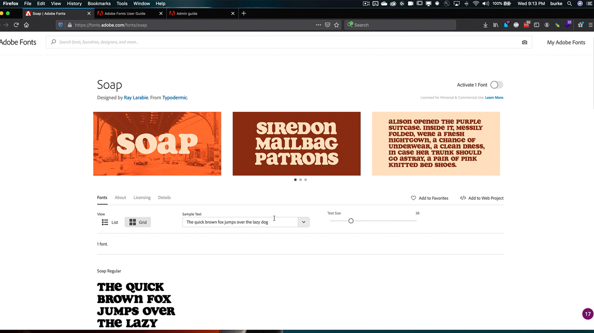

# 企业管理

管理整个组织中的Adobe权利和资源。

## 浏览企业管理Tutorials

<table style="table-layout:fixed">
<tr>
 <td>
   
    

   <a href="enterprise.md#tutorial1"><strong>Adobe Fonts</strong></a>
    

    <em>浏览Adobe Fonts近200个家庭以及Adobe Fonts服务的易用性</em>
     
  </td>
  <td>
    
    

     
  </td>
  <td>
    
    

     
  </td>
</tr>
</table>

## Adobe Fonts(5:20) {#tutorial1}

>[!VIDEO](https://video.tv.adobe.com/v/328226?hidetitle=true)

**说明：**

浏览Adobe Fonts近200个家庭以及Adobe Fonts服务的易用性。

在本教程中，您将学习如何：
* 使用功能强大的浏览界面快速轻松地找到正确的字体
* 使用本机Creative Cloud集成节省时间和资金
* 在Adobe Admin Console的一个位置管理所有字体

**呈列者：**

Todd Burke，首席解决方案顾问(Digital Media)

**企业管理资源：**

[Adobe Fonts用户指南](https://helpx.adobe.com/fonts/user-guide.html)

[企业管理指南](https://helpx.adobe.com/enterprise/admin-guide.html)
