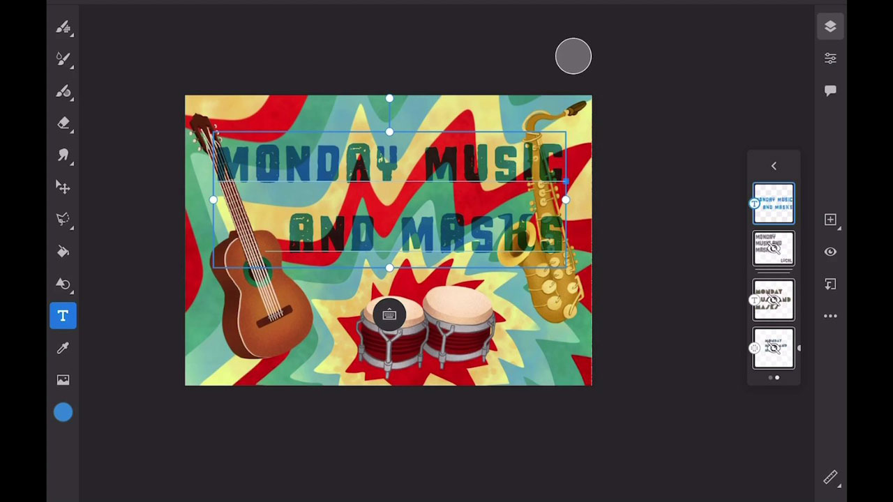
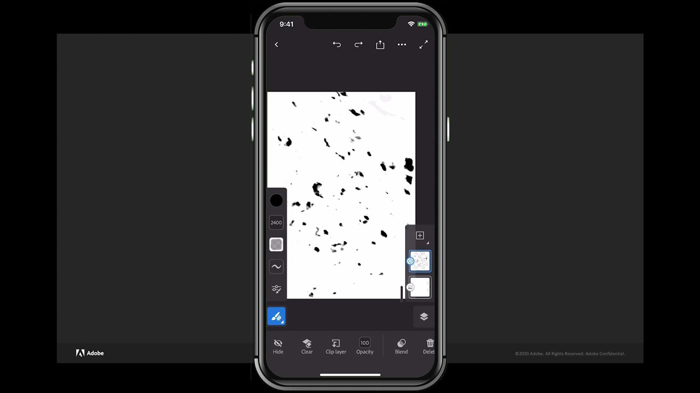

# Fresco

Adobe Fresco是一款跨平台应用程序，用于使用基于画笔的方法创建绘图和画作，这些方法将矢量和栅格工作流程与云文档相结合。

## 浏览产品Tutorials

<table style="table-layout:fixed">
<tr>
 <td>
   
    

   <a href="fresco.md#tutorial1"><strong>使用Adobe Fresco绘图简介</strong></a>
    

    <em>使用Adobe壁画中功能强大的选择和颜色编辑工具显着更改图像以匹配您的企业品牌需求</em>
     
  </td>
  <td>
   
    

   <a href="fresco.md#tutorial2"><strong>创建带纹理的图稿 — Fresco到Illustrator</strong></a>
    

    <em>在Adobe Fresco中绘制和绘制纹理，并了解如何在Illustrator中使用它们</em>
     
  </td>
  <td>
    
    

     
  </td>
</tr>
</table>

## 使用Adobe Fresco绘图简介(19:07) {#tutorial1}

>[!VIDEO](https://video.tv.adobe.com/v/326946?hidetitle=true)

**描**
述使用基于画笔的方法将矢量和栅格工作流程与云文档相结合，发现Adobe Fresco以创建绘图和绘画。

在本教程中，您将学习如何：
* 使用独特的实时画笔，模拟水彩、油画以及您最喜爱的像素画笔和矢量画笔
* 通过分层不同的画笔和利用蒙版来创建纹理效果
* 使用适用于iPhone的新Fresco应用程序随时随地进行创作
* 将您的作品导出为各种格式，以便在其他移动和桌面应用程序中使用

**提供者：**
Liz Tanonis，解决方案顾问(Digital Media)

## 创建带纹理的图稿 — Fresco到Illustrator(4:10) {#tutorial2}

>[!VIDEO](https://video.tv.adobe.com/v/326947?hidetitle=true)

**描**
述在Adobe Fresco中绘画和绘制纹理，并了解如何在Illustrator中使用它们。

在本教程中，您将学习如何：
* 在Adobe Fresco for iPhone应用程序中创建图稿，并将其导出以在其他Creative Cloud应用程序中使用
* 使用Illustrator中的图像描摹工具将图稿转换为矢量
* 在Illustrator中将手工纹理应用于矢量图稿

**提供者：**
Liz Tanonis，解决方案顾问(Digital Media)

**Fresco资源**

[学习和](https://helpx.adobe.com/support/adobe-fresco.html) 支持是您的中心，您可以获取更多教 [程、新增功能](https://helpx.adobe.com/fresco/using/whats-new.html)，以及社区论坛的链接。

**2020年10月版**

开始使用这些功能（等等！） 从Creative Cloud桌面应用程序下载最新更新。
